## 一、k8s集群搭建--笔记及问题记录

### 1. 主机准备

- |  节点名称  |   内网IP   |     外网IP     | 配置 |             系统              |
  | :--------: | :--------: | :------------: | :--: | :---------------------------: |
  | k8s-master | 10.1.20.3 | 134.175.59.94 | 2c4g | Rocky Linux 9.4 |
  | k8s-worker | 10.1.20.14 | 42.194.233.253 | 4c4g | Rocky Linux 9.4 |
#### 1.1 主机名-IP地址解析

针对所有主机，执行

修改hostname

```bash
hostnamectl set-hostname k8s-master
hostnamectl set-hostname k8s-worker
```

所有节点的 IP 地址和主机名添加到 `/etc/hosts` 

  ```bash
  echo "10.1.20.3 k8s-master" | sudo tee -a /etc/hosts
  echo "10.1.20.14 k8s-worker" | sudo tee -a /etc/hosts
  ```

#### 1.2 时间同步

​	针对所有主机，执行

```bash
timedatectl set-timezone Asia/Shanghai
```

​	在每个节点上安装 Chrony

```bash
sudo dnf update -y
sudo dnf install -y chrony
sudo systemctl enable --now chronyd
```

​	云服务器下载后不需要再配置时间服务器，然后验证时间同步

```bash
chronyc sources
chronyc tracking -v
```

#### 1.3 关闭防火墙、Swap、SELinux

针对所有主机，执行

禁用 SELinux

```bash
sudo setenforce 0
sudo sed -i 's/^SELINUX=enforcing$/SELINUX=permissive/' /etc/selinux/config
```

关闭防火墙

```bash
sudo systemctl stop firewalld
sudo systemctl disable firewalld
```

 禁用 Swap

```bash
sudo swapoff -a
sudo sed -i '/ swap / s/^\(.*\)$/#\1/g' /etc/fstab
```

#### 1.4 内核转发、网桥过滤配置

针对所有主机，配置依赖模块到 `/etc/modules-load.d/k8s.conf`

```bash
sudo tee /etc/modules-load.d/k8s.conf <<EOF
overlay
br_netfilter
EOF
```

启动模块

```bash
modprobe overlay
modprobe br_netfilter
```

查看是否启动成功

```bash
lsmod | egrep "overlay"
```

```bash
lsmod | egrep "br_netfilter"
```

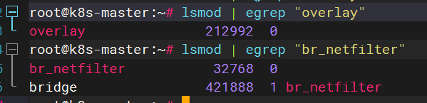

然后把网桥过滤和内核转发追加到 `k8s.conf` 文件中

```bash
sudo tee /etc/sysctl.d/k8s.conf <<EOF
net.bridge.bridge-nf-call-iptables  = 1
net.bridge.bridge-nf-call-ip6tables = 1
net.ipv4.ip_forward                 = 1
EOF
```

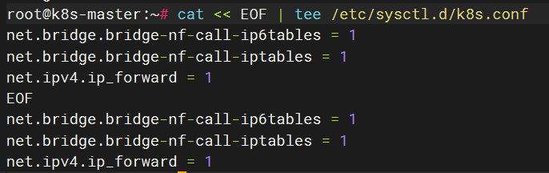

最后加载内核参数：

```bash
sudo sysctl --system
```

用下方命令看下内核的路由转发有没有成功打开

```bash
sysctl -a | grep ip_forward
```

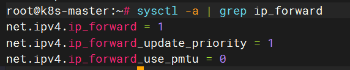

#### 1.5 安装ipset和ipvsadm

针对所有主机,首先安装 `ipset` 和 `ipvsadm` ：

```bash
sudo dnf install ipset ipvsadm -y
```

安装完成后，需要配置 `ipvsadm` 模块加载，添加需要加载的模块：（这样我们后续开机就可以自动加载了）

```bash
sudo tee /etc/modules-load.d/ipvs.conf <<EOF
ip_vs
ip_vs_rr
ip_vs_wrr
ip_vs_sh
nf_conntrack
EOF
```

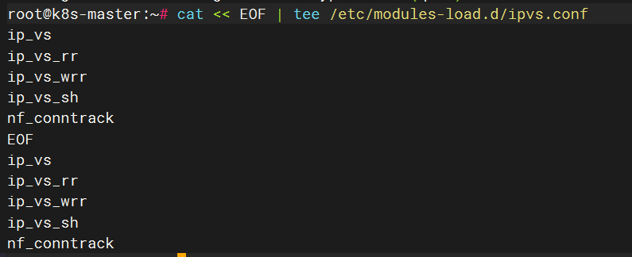

本次使用还需加载

```bash
sudo modprobe ip_vs
sudo modprobe ip_vs_rr
sudo modprobe ip_vs_wrr
sudo modprobe ip_vs_sh
sudo modprobe nf_conntrack
```

查看是否成功加载

```bash
lsmod | grep ip_vs
```

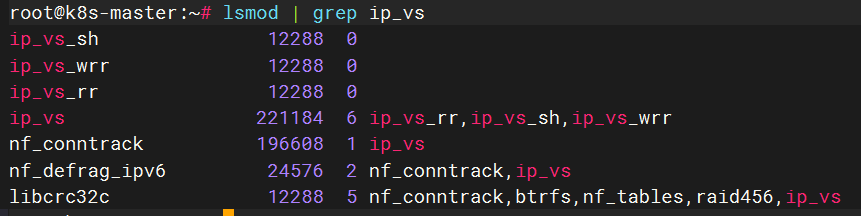


### 2. 容器运行时 Containerd 准备

#### 2.1 安装依赖和 containerd

以下针对所有主机

添加 Docker RPM 仓库

```bash
sudo dnf config-manager --add-repo https://download.docker.com/linux/centos/docker-ce.repo
```

 安装 containerd

```bash
sudo dnf install -y containerd.io
```

验证安装结果：

```bash
containerd --version
```

#### 2.2 创建&修改配置文件

针对所有主机，创建配置文件所在目录

```bash
sudo mkdir -p /etc/containerd
```

生成默认配置文件：（Containerd的配置文件使用TOML格式）

```bash
sudo containerd config default | sudo tee /etc/containerd/config.toml
```

生成以后，我们需要对配置文件进行修改：

```bash
nano /etc/containerd/config.toml
```

```tex
sanbox_image = "registry.k8s.io/pause:3.8"` 改成 `sanbox_image = "registry.aliyuncs.com/google_containers/pause:3.9"


SystemdCgroup = false 改成 SystemdCgroup = true
```

#### 2.3 启动Containerd&开机自启

针对所有主机，设置开机自启，并设置现在就启动

```bash
systemctl enable --now containerd
```

验证一下是否启动

```bash
systemctl status containerd
```


### 3.K8S 1.31集群部署

#### 3.1 软件源准备

添加 Kubernetes`yum`仓库

```bash
cat <<EOF | sudo tee /etc/yum.repos.d/kubernetes.repo
[kubernetes]
name=Kubernetes
baseurl=https://pkgs.k8s.io/core:/stable:/v1.31/rpm/
enabled=1
gpgcheck=1
gpgkey=https://pkgs.k8s.io/core:/stable:/v1.31/rpm/repodata/repomd.xml.key
exclude=kubelet kubeadm kubectl cri-tools kubernetes-cni
EOF
```

安装 kubelet、kubeadm 和 kubectl：

```bash
sudo yum install -y kubelet kubeadm kubectl --disableexcludes=kubernetes
```

验证一下是否安装成功

```bash
kubeadm version
kubelet --version
kubectl version
```

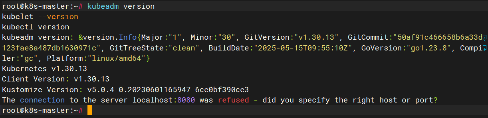

在运行 kubeadm 之前启用 kubelet 服务：

```bash
sudo systemctl enable --now kubelet
```

#### 3.2 集群初始化

仅针对 `master节点` 的主机，首先需要创建 `kubeadm` 配置文件：

```bash
kubeadm config print init-defaults > kubeadm-config.yaml
```

编辑这个配置文件：

```bash
vim kubeadm-config.yaml
```

修改IP地址与名字，ip地址为内网ip

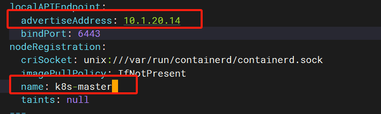

`criSocket` 用的就是 Containerd， 可以不用动，`imageRepository` 可以修改为 `registry.aliyuncs.com/google_containers` `kubernetesVersion` 修改为我们当前的版本 `1.30.13`

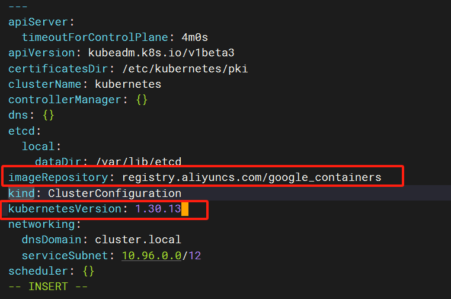

在 `networking` 中的 `serviceSubnet` 后面加上 `podSubnet: 10.244.0.0/16`

在配置文件最后加入以下配置：

```
---
kind: KubeletConfiguration
apiVersion: kubelet.config.k8s.io/v1beta1
cgroupDriver: systemd
```

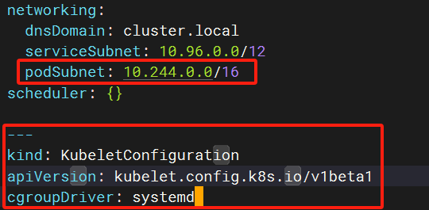

对 k8s 集群初始化,要是报错就重启一下containerd  `systemctl restart containerd`，出现 `initialized successfully` 就代表初始化成功了：

```bash
kubeadm init --config kubeadm-config.yaml
```

如下：

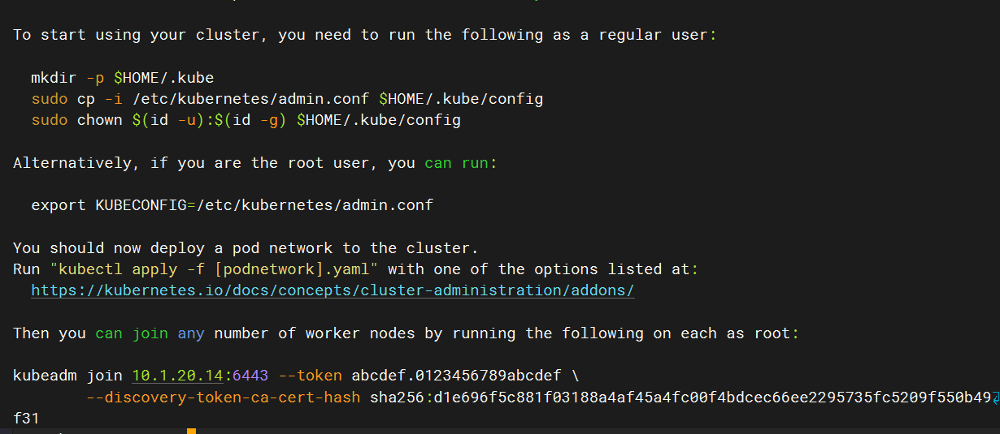

#### 3.3 准备kubectl配置文件

仅针对 `master节点` 的主机，把上面输出内容里提供的命令执行一下

```bash
mkdir -p $HOME/.kube
sudo cp -i /etc/kubernetes/admin.conf $HOME/.kube/config
sudo chown $(id -u):$(id -g) $HOME/.kube/config
```

然后就可以使用以下命令查看节点信息了：

```bash
kubectl get nodes
```

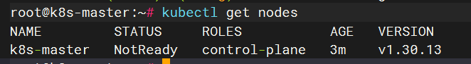

#### 3.4 添加工作节点到集群

将之前的输出内容中的命令复制到工作节点运行即可,

```bash
kubeadm join 10.1.20.3:6443 --token abcdef.0123456789abcdef \
        --discovery-token-ca-cert-hash sha256:d1e696f5c881f03188a4af45a4fc00f4bdcec66ee2295735fc5209f550b49f31 
```

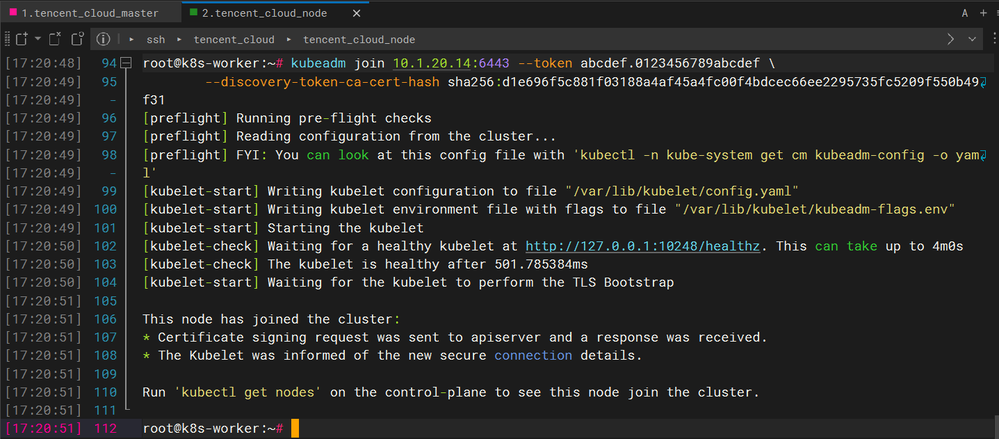

上述token有效期24小时，后续加入节点需在master上执行以下命令

```bash
kubeadm token create --print-join-command
```

可以生成新的token，使用新token可加入新节点

然后就可以使用以下命令查看节点信息了：

```bash
kubectl get nodes
```

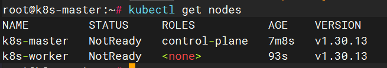

要想在node上也能使用kubectl，在node节点创建./kube

```bash
mkdir -p ~/.kube
```

然后将配置文件移到./kube下

```bash
scp /root/.kube/config root@10.1.20.3:/root/.kube/
```


### 4.K8S集群网络插件 Calico/flannel

#### 4.1安装calico

##### 4.1.1 手动拉取calico需要的镜像

在master和node节点都需要拉去

```
ctr image pull docker.1ms.run/calico/cni:v3.29.2
ctr image pull docker.1ms.run/calico/pod2daemon-flexvol:v3.29.2
ctr image pull docker.1ms.run/calico/node:v3.29.2
ctr image pull docker.1ms.run/calico/kube-controllers:v3.29.2
ctr image pull docker.1ms.run/calico/typha:v3.29.2
ctr image pull docker.1ms.run/calico/node-driver-registrar:v3.29.2
```

##### 4.1.2使用一次性 Manifest 安装

获取yaml文件

```bash
curl -o https://raw.githubusercontent.com/projectcalico/calico/v3.29.2/manifests/calico.yaml
```

修改文件中的镜像地址，将` dock.io` 替换为` docker.1ms.run` 

然后进行安装

```bash
kubectl apply -f calico.yaml 
```

安装完成如下

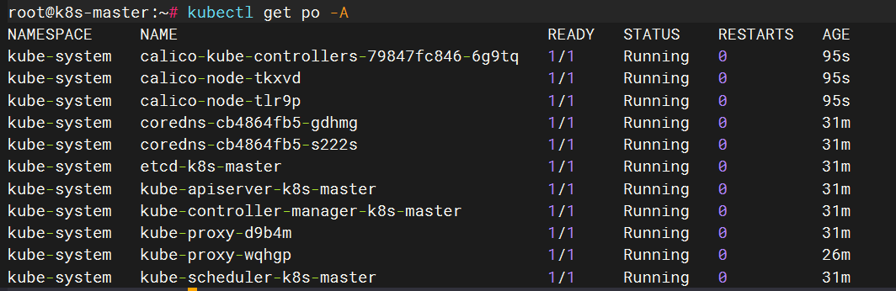

##### 4.1.3 安装calicoctl

```bash
curl -LO https://github.com/projectcalico/calicoctl/releases/download/v3.29.2/calicoctl-linux-amd64
```

#### 4.2 安装flannel

下载安装文件

```
wget https://raw.githubusercontent.com/coreos/flannel/master/Documentation/kube-flannel.yml
```

安装

```
kubectl apply -f kube-flannel.yml
```


### 5. 部署Nginx测试验证K8S集群是否可用

创建一个 `Nginx` 的 `Deployment`：

```bash
vim nginx-deployment.yaml
```

内容如下

```yaml
---
apiVersion: apps/v1
kind: Deployment
metadata:
  name: nginxweb # 部署的名称
spec:
  replicas: 2  # 设置副本数量为2
  selector:
    matchLabels:
      app: nginxweb1 # 用于选择匹配的Pod标签
  template:
    metadata:
      labels:
        app: nginxweb1 # Pod的标签
    spec:
      containers:
      - name: nginxwebc # 容器名称
        image: registry.cn-hangzhou.aliyuncs.com/acs-sample/nginx:latest # 镜像拉取地址，换成阿里云的，不然会拉取失败
        imagePullPolicy: IfNotPresent # 镜像拉取策略，如果本地没有就拉取
        ports:
        - containerPort: 80 # 容器内部监听的端口
---
apiVersion: v1
kind: Service
metadata:
  name: nginxweb-service # 服务的名称
spec:
  externalTrafficPolicy: Cluster # 外部流量策略设置为集群
  selector:
    app: nginxweb1 # 用于选择匹配的Pod标签
  ports:
  - protocol: TCP # 使用TCP协议
    port: 80 # 服务暴露的端口
    targetPort: 80 # Pod中容器的端口
    nodePort: 30080 # 在每个Node上分配的端口，用于外部访问
  type: NodePort # 服务类型，使用NodePort

```

创建一下

```bash
kubectl apply -f nginx-deployment.yaml
```


### 6. 重置k8s

#### 6.1 重置 Kubernetes 集群

```bash
kubeadm reset -f
```

#### 6.2 清理 Calico 网络组件

首先查看ip link

```
ip link show
```

然后删除网络插件相关的

```bash
ip link delete tunl0 #如果删不掉 执行modprobe -r ipip
ip link delete caliXXX
```

删除黑洞路由

```bash
ip r
ip route del blackhole 10.244.254.128/26
```

清除 iptables 规则（Calico 会设置规则）

```bash
sudo iptables -F
sudo iptables -t nat -F
sudo iptables -t mangle -F
sudo iptables -X
```

清除 Calico 配置文件和 CNI 数据

```bash
sudo rm -rf /etc/cni
sudo rm -rf /opt/cni
sudo rm -rf /var/lib/cni/
sudo rm -rf /var/run/calico  #通常会出现无权限，即使是root
```

#### 6.3.删除相关文件和目录

```
sudo rm -rf ~/.kube
sudo rm -rf /etc/kubernetes
sudo rm -rf /var/lib/etcd
sudo rm -rf /var/lib/kubelet
sudo rm -rf /etc/cni
sudo rm -rf /opt/cni
sudo rm -rf /var/lib/cni/
```

#### 6.4重启

重启kubelet

```
systemctl restart kubelet
```

