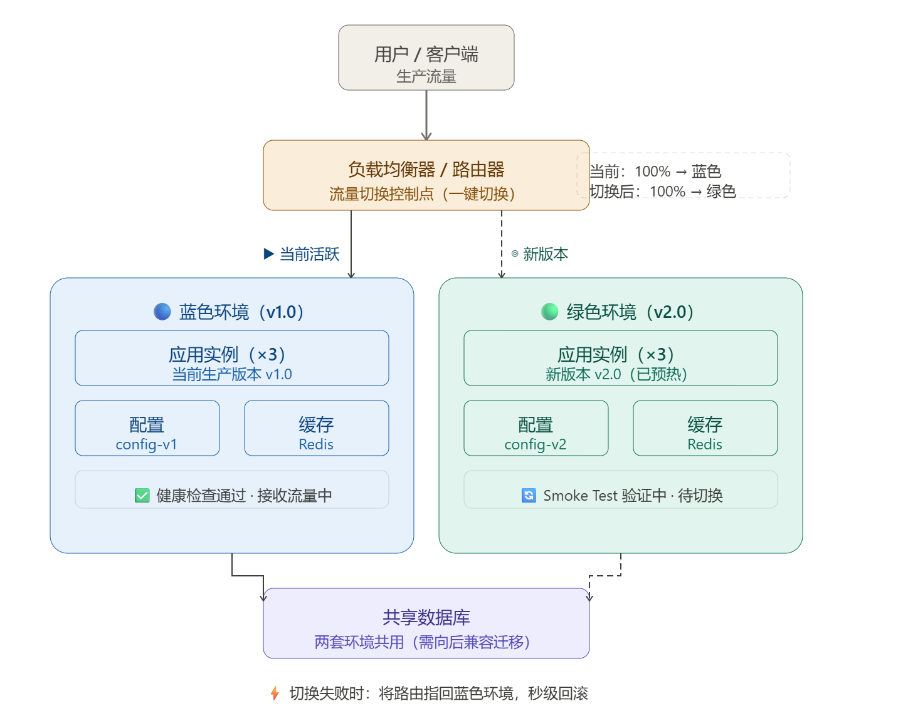
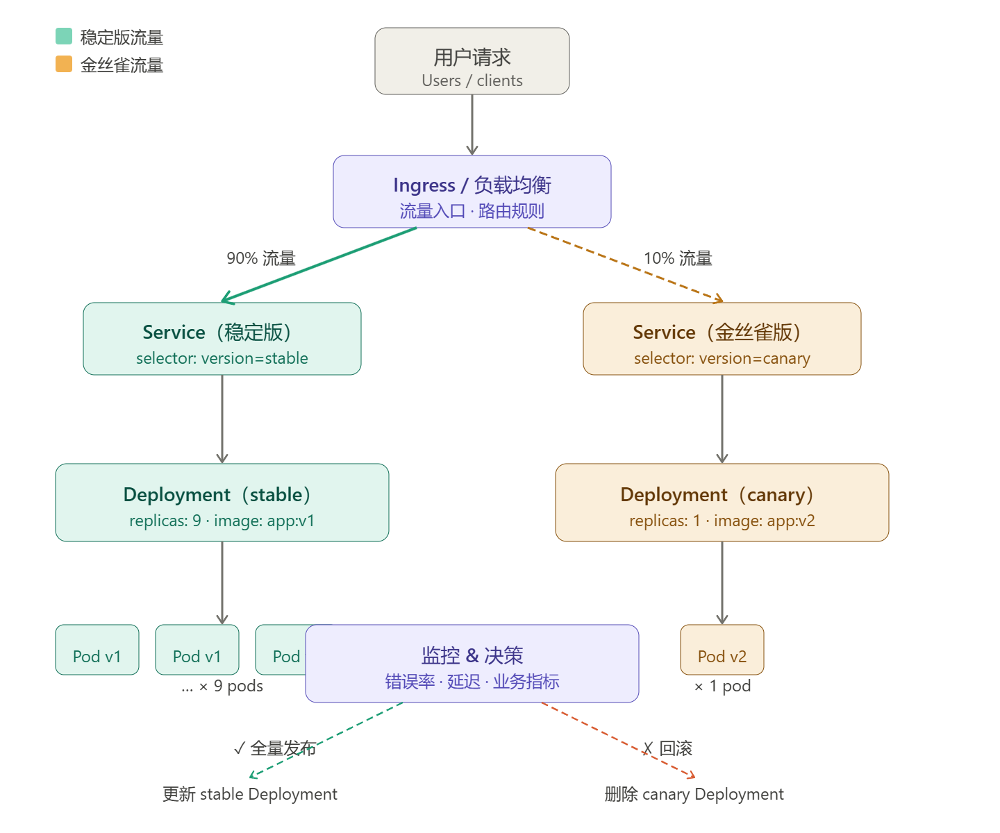

# 十、应用更新策略，实现灰度发布

## 1、Jenkins实现K8s应用安装指定版本回滚

- 关键步骤：

  - 必须先修改Gitee上的源码版本：修改index.html文件内容（如将首页改为"你们好"）会触发镜像重新构建，这是实现回滚的基础条件。
  - 通过Jenkins执行回滚操作：Jenkins+k8s+Harbor+Git构成完整DevOps平台
  - 验证文件指纹确保版本一致性
- 技术组合：Jenkins+k8s+Harbor+Git构成完整DevOps平台

查看指定命名空间下deployment的历史版本

```sh
kubectl rollout history deploy/jenkins-demo -n <namespace>
```

#### 1.1 Jenkins新建回滚任务

新建Jenkins流水线任务

```groovy
node('testhan') {
    // 阶段 1: 克隆代码
    stage('git clone') {
        git url: "https://gitee.com/superxccccc/jenkins-rollout"
        sh "ls -al"
        sh "pwd"
    }

    // 阶段 2: 选择环境
    stage('select env') {
        def envInput = input(
            id: 'envInput',
            message: 'Choose a deploy environment',
            parameters: [
                [
                    $class: 'ChoiceParameterDefinition',
                    choices: "dev\qatest\prod",
                    name: 'Env'
                ]
            ]
        )
        
        echo "This is a deploy step to ${envInput}"
        
        // 替换脚本中的命名空间占位符
        sh "sed -i 's/<namespace>/${envInput}/' getVersion.sh"
        sh "sed -i 's/<namespace>/${envInput}/' rollout.sh"
        
        // 获取版本列表
        sh "bash getVersion.sh"
    }

    // 阶段 3: 选择版本
    stage('select version') {
        // 设置工作目录环境变量
        env.WORKSPACE = pwd()
        
        // 读取由 getVersion.sh 生成的版本列表文件
        def version = readFile "${env.WORKSPACE}/version.csv"
        println version
        
        def userInput = input(
            id: 'userInput',
            message: '选择回滚版本',
            parameters: [
                [
                    $class: 'ChoiceParameterDefinition',
                    choices: "${version}\n",
                    name: 'Version'
                ]
            ]
        )
        
        // 替换回滚脚本中的版本号占位符
        sh "sed -i 's/<version>/${userInput}/' rollout.sh"
    }

    // 阶段 4: 执行回滚部署
    stage('rollout deploy') {
        sh "bash rollout.sh"
    }
}
```

执行流水线可以选择环境及历史镜像，既可以回滚镜像


## 2、Kubernetes 应用更新策略

### 2.1 生产环境实现蓝绿部署

#### 2.1.1 什么是蓝绿部署

蓝绿部署（Blue-Green Deployment）是一种通过同时维护两套完全相同的生产环境来实现应用无中断升级的发布策略。



##### （1）基本原理

蓝绿部署维护两套并行运行的环境：

| 环境                  | 说明                                 |
| --------------------- | ------------------------------------ |
| **蓝色环境（Blue）**  | 当前正在对外提供服务的稳定版本       |
| **绿色环境（Green）** | 新版本的运行环境，用于独立验证与测试 |

用户流量在任意时刻只路由至其中一套环境。当绿色环境通过验证后，通过切换流量入口，将请求从蓝色环境迁移至绿色环境，完成版本升级。

> **核心思想：先部署，先验证，后切流量。**

##### （2）典型应用场景

蓝绿部署适用于对**业务连续性要求高**的系统，例如：

- 电商平台
- 金融交易系统
- 核心业务服务
- 高可用互联网应用

其核心价值在于实现**近零停机时间（Zero Downtime）**的版本升级。

------

#### 2.1.2 绿色环境的作用

绿色环境作为新版本的**预生产验证空间**，在正式承接用户流量前，可以完成以下验收工作：

- 功能回归测试
- 接口兼容性验证
- 性能与压力测试
- 安全漏洞扫描
- 灰度流量验证

为确保测试结果真实可靠，蓝绿两套环境应保持充分隔离，通常包括：

- 独立配置中心
- 独立缓存集群
- 独立消息队列
- 独立数据库实例（或严格的逻辑隔离方案）

> ⚠️ **注意**：若数据层未做隔离，蓝绿环境共享数据库可能引发数据污染风险，需提前制定数据一致性方案。

------

#### 2.1.3 蓝绿部署的优缺点

| 优势             | 说明                                                       |
| ---------------- | ---------------------------------------------------------- |
| ✅ **零停机发布** | 升级过程对用户完全透明，业务连续性高                       |
| ✅ **快速回滚**   | 出现问题时，将流量切回旧版本即可，恢复时间通常在分钟级以内 |
| ✅ **充分验证**   | 新版本可在完整生产级环境中进行压测与验证，有效降低上线风险 |

| 缺点                 | 说明                                                         |
| -------------------- | ------------------------------------------------------------ |
| ❌ **资源成本较高**   | 需同时维护两套生产环境，基础设施成本接近翻倍                 |
| ❌ **数据一致性挑战** | 蓝绿环境若共享业务数据，需额外设计同步与一致性方案           |
| ❌ **运维复杂度增加** | 流量切换、负载均衡与网络策略管理更复杂，配置失误可能引发流量错配、数据污染甚至雪崩效应 |

------

#### 2.1.4 Kubernetes 实现蓝绿部署

##### （1）创建两套 Deployment

分别为蓝色和绿色环境创建对应的 Deployment 配置文件：

| 环境             | 配置文件     | 镜像版本 | Pod 标签                |
| ---------------- | ------------ | -------- | ----------------------- |
| Blue（当前版本） | `blue.yaml`  | `v1`     | `app=myapp, version=v1` |
| Green（新版本）  | `green.yaml` | `v2`     | `app=myapp, version=v2` |

部署两套环境：

```bash
kubectl apply -f blue.yaml
kubectl apply -f green.yaml
```

##### （2）两套 Deployment 的核心差异

蓝绿两个 Deployment 的主要区别体现在以下三点：

1. **镜像版本不同**：Blue 使用 `v1`，Green 使用 `v2`
2. **版本标签不同**：通过 `version` 标签加以区分，供 Service Selector 精确匹配
3. **页面标识不同**：通常以不同背景颜色区分蓝绿环境，便于验证流量走向

------

#### 2.1.5 流量切换

在 Kubernetes 中，流量切换通过**修改 Service 的 Selector** 来实现，无需变更 Deployment 本身。

**切换前（指向蓝色环境）：**

```yaml
selector:
  app: myapp
  version: v1
```

**切换后（指向绿色环境）：**

```yaml
selector:
  app: myapp
  version: v2
```

应用变更：

```bash
kubectl apply -f service_lanlv.yaml
```

**验证流量切换效果**

通过访问 Service 对应的 NodePort 或 Ingress 地址验证：

| 操作       | 预期现象                    |
| ---------- | --------------------------- |
| 切换前访问 | 显示**蓝色页面**（v1 版本） |
| 切换后访问 | 显示**绿色页面**（v2 版本） |

**回滚操作**

若新版本上线后发现异常，只需将 Selector 中的 `version` 字段改回 `v1`，重新 apply 即可完成秒级回滚，无需重新构建或重新部署任何资源。


### 2.2 Kubernetes 实现滚动更新（Rolling Update）

#### 2.2.1 什么是滚动更新

滚动更新（Rolling Update）是 Kubernetes 默认采用的应用发布策略。

与蓝绿部署不同，滚动更新不会一次性替换所有实例，而是按照预设批次逐步完成新旧版本替换，从而保证业务持续可用。

其核心思想是：

> 边提供服务，边完成升级。

------

#### 2.2.2 在k8s中实现滚动更新 

滚动更新只需创建**单个 Deployment 资源**，通过 `spec.strategy` 字段声明更新策略，由 Kubernetes 控制器自动管理 Pod 的替换过程，无需人工干预。

```yaml
spec:
  strategy:
    type: RollingUpdate          # 更新策略类型
    rollingUpdate:
      maxSurge: 1                # 允许超出目标副本数的 Pod 数量
      maxUnavailable: 0          # 更新期间允许不可用的 Pod 数量
```

------

##### （1）更新策略类型

Kubernetes Deployment 支持两种更新策略：

| 策略类型                    | 行为描述                               | 是否中断服务 | 适用场景                 |
| --------------------------- | -------------------------------------- | ------------ | ------------------------ |
| `Recreate`（重建式）        | 先删除**全部**旧 Pod，再批量创建新 Pod | ❌ 会中断     | 开发 / 测试环境          |
| `RollingUpdate`（滚动更新） | 交替替换 Pod，新旧版本短暂共存         | ✅ 不中断     | 生产环境（**默认策略**） |

> ⚠️ **生产环境禁止使用 `Recreate` 策略**。该模式在旧 Pod 全部销毁后才开始创建新 Pod，期间服务完全不可用，会直接影响线上用户。

------

##### （2）滚动更新的核心控制参数

滚动更新的节奏由两个关键参数共同控制：

**`maxSurge`——允许超额的 Pod 数量**

​     指定更新过程中，实际运行的 Pod 总数**最多可以超出** `replicas` 目标值多少。

- 支持**整数**（如 `1`）或**百分比**（如 `25%`）
- 值越大，新版本 Pod 启动越快，但会短暂占用更多资源
- 设为 `0` 时，必须先删除旧 Pod 才能创建新 Pod

**`maxUnavailable`——允许不可用的 Pod 数量**

​    指定更新过程中，最多允许多少个 Pod 处于不可用状态。

- 同样支持**整数**或**百分比**
- 值越小，服务稳定性越高，但更新速度越慢
- 设为 `0` 时，始终保持全量可用 Pod，实现真正的无损更新

##### （3）典型参数组合参考

| 场景                 | `maxSurge` | `maxUnavailable` | 效果说明                                      |
| -------------------- | ---------- | ---------------- | --------------------------------------------- |
| 保守更新（稳定优先） | `1`        | `0`              | 始终保持满额服务能力，每次仅多创建 1 个新 Pod |
| 快速更新（效率优先） | `25%`      | `25%`            | 更新速度快，允许一定比例的短暂不可用          |
| 资源受限环境         | `0`        | `1`              | 不额外占用资源，先腾空旧 Pod 再补充新 Pod     |

> **最佳实践**：生产环境推荐将 `maxUnavailable` 设为 `0`，确保更新全程服务不降级；`maxSurge` 根据集群资源余量适当调整。

根据上文风格续写：

------

#### 2.2.3 触发滚动更新

Kubernetes 的滚动更新由 **Pod Template 变更**驱动——只要 `spec.template` 下的任意字段发生变化（镜像版本、环境变量、配置挂载等），Deployment Controller 就会自动触发一次滚动更新。

以下是三种常用的触发方式：

------

**方式一：`kubectl set image`（最常用）**

直接通过命令行更新容器镜像，无需修改任何文件，适合 CI/CD 流水线中的自动化发布场景。

**示例：**

```bash
kubectl set image deployment/myapp \
  myapp=myapp:v2
```

> **适用场景**：自动化流水线、快速镜像升级。操作简洁但变更不留痕迹，不便于版本追溯。

------

**方式二：修改 YAML 后 `kubectl apply`（最规范）**

直接编辑 Deployment 的 YAML 配置文件，修改镜像版本或其他 Pod Template 字段后重新应用，是**生产环境推荐的标准做法**。

```yaml
# deployment.yaml
spec:
  template:
    spec:
      containers:
        - name: myapp
          image: myapp:v2    # 修改此处版本号
kubectl apply -f deployment.yaml
```

> **适用场景**：生产环境标准变更流程。配置文件纳入 Git 版本控制，变更有据可查，支持 Code Review 与审计。

------

**方式三：`kubectl edit`（调试用）**

直接在终端内联编辑线上 Deployment 资源，保存后立即生效，无需任何文件操作。

```bash
kubectl edit deployment/<deployment-name>
```

执行后会打开默认编辑器，找到镜像字段并修改：

```yaml
image: myapp:v2    # 修改版本后保存退出即触发更新
```

> ⚠️ **注意**：`kubectl edit` 直接修改集群中的运行态配置，变更不会同步回本地 YAML 文件，易造成配置漂移（Configuration Drift）。**仅建议用于临时调试，生产环境应避免使用。**

------

**三种方式对比**

| 触发方式                    | 是否修改本地文件 | 变更可追溯 | 推荐场景             |
| --------------------------- | ---------------- | ---------- | -------------------- |
| `kubectl set image`         | ❌                | ❌          | CI/CD 自动化流水线   |
| 修改 YAML + `kubectl apply` | ✅                | ✅          | **生产环境标准流程** |
| `kubectl edit`              | ❌                | ❌          | 临时调试 / 紧急修复  |


### 2.3、自定义滚动更新策略

通过maxSurge和 maxUnavailable用来控制滚动更新的更新策略

#### 2.3.1. 金丝雀发布 



------

**发布策略**

金丝雀发布的核心在于**用少量真实流量验证新版本**，将风险控制在最小范围内再逐步扩大。

**比例控制**

生产环境通常先发布极小比例的实例作为金丝雀，常见配置如下：

| 阶段       | 稳定版（v1）副本数 | 金丝雀版（v2）副本数 | 实际流量占比 |
| ---------- | ------------------ | -------------------- | ------------ |
| 初始灰度   | 9                  | 1                    | 新版约 10%   |
| 小范围验证 | 19                 | 1                    | 新版约 5%    |
| 扩大灰度   | 3                  | 7                    | 新版约 70%   |
| 全量发布   | 0                  | 10                   | 新版 100%    |

> **注意**：副本数之比即近似流量之比。若需更精细的百分比控制（如精确 2%），应配合 Ingress 注解或 Istio 流量权重规则实现。

**验证方式**

根据业务复杂度选择合适的验证手段：

| 场景         | 验证方式                                         |
| ------------ | ------------------------------------------------ |
| 简单功能变更 | 人工访问金丝雀实例，核验页面与接口响应           |
| 核心业务变更 | 接入监控系统，持续观察错误率、延迟、成功率等指标 |
| 高风险变更   | 结合日志平台 + APM + 告警规则，设定自动回滚阈值  |

**阶段一：部署金丝雀版**

保留全量稳定版 Pod，同时创建少量金丝雀版 Pod：

```bash
# 保留旧版本（8 个 Pod 继续承载主流量）
kubectl scale deployment myapp-stable --replicas=8

# 部署金丝雀版（2 个 Pod 承载约 20% 的灰度流量），标签要包含在 Service 的 Selector 内。
kubectl apply -f canary-deployment.yaml
kubectl scale deployment myapp-canary --replicas=2
```

**阶段二：监控验证**

通过以下渠道持续观测金丝雀版的运行状态：

```bash
# 实时查看 Pod 日志
kubectl logs -l version=canary -f

# 查看 Pod 运行状态
kubectl get pods -l version=canary

# 查看近期事件（排查异常）
kubectl describe deployment myapp-canary
```

同时在监控平台重点关注：**HTTP 错误率、接口 P99 延迟、JVM 内存、业务成功率**等核心指标。

**阶段三：决策与收尾**

```bash
# ✅ 验证通过 → 全量升级（将稳定版镜像更新为 v2）
kubectl set image deployment/myapp-stable myapp=myapp:v2
# 等待主 Deployment 滚动完成（关键！）
kubectl rollout status deployment/myapp-stable
# 确认主版本稳定后，再删除金丝雀
kubectl delete deployment myapp-canary

# ❌ 验证失败 → 快速回滚（直接删除金丝雀 Deployment）
kubectl delete deployment myapp-canary
```

------

#### 2.3.4 关键参数配置

金丝雀 Deployment 的 `strategy` 字段建议配置如下：

```yaml
spec:
  strategy:
    type: RollingUpdate
    rollingUpdate:
      maxSurge: 1        # 最多允许超出目标副本数 1 个，控制资源占用
      maxUnavailable: 0  # 更新期间不允许任何 Pod 不可用，保障服务连续性
```

| 参数             | 值   | 作用                                                |
| ---------------- | ---- | --------------------------------------------------- |
| `maxSurge`       | `1`  | 控制滚动过程中最多额外启动 1 个新 Pod，避免资源突增 |
| `maxUnavailable` | `0`  | 确保始终有足量 Pod 提供服务，更新过程零中断         |

> **最佳实践**：金丝雀 Deployment 的副本数通常较少（1～2 个），`maxUnavailable: 0` 可防止在唯一的金丝雀 Pod 重启期间出现短暂服务空窗。
