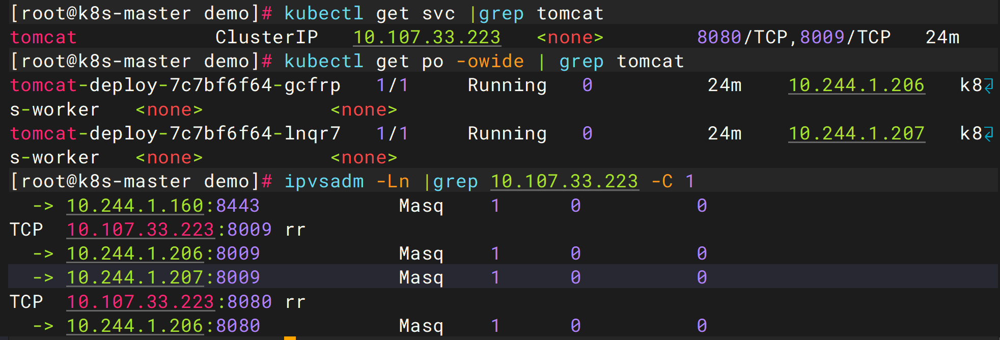
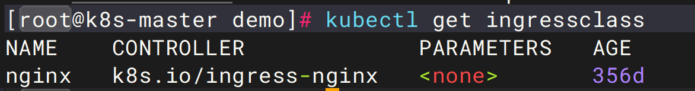
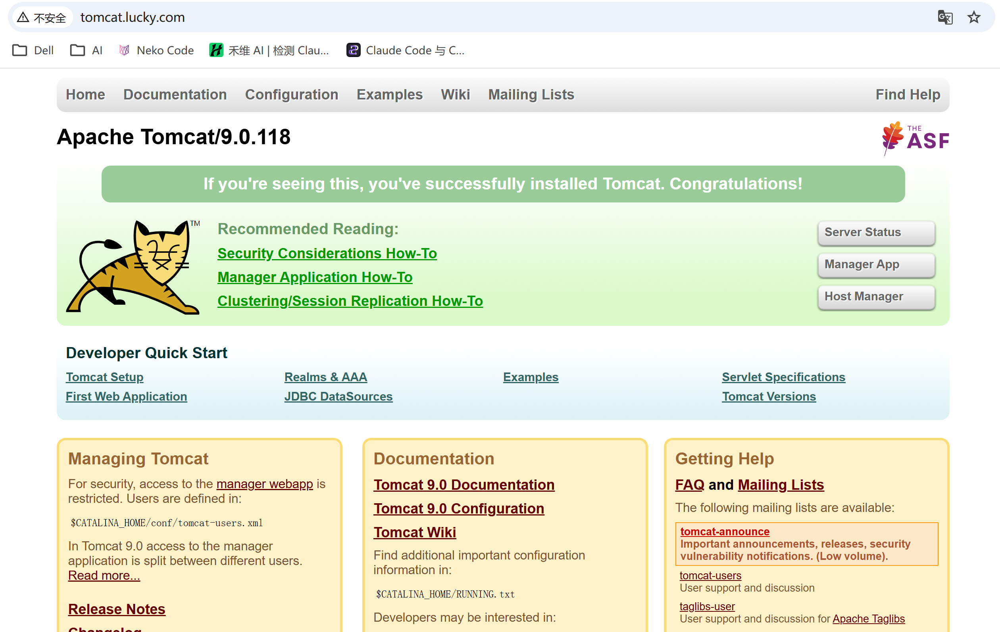
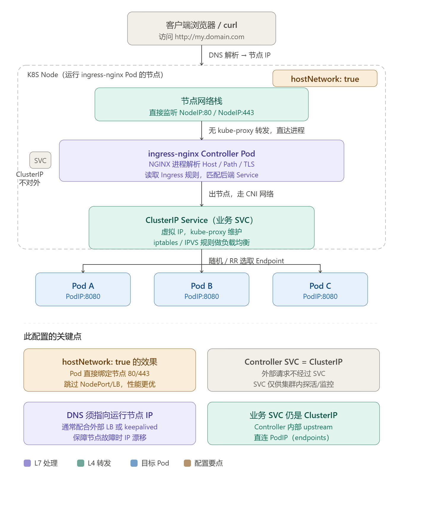
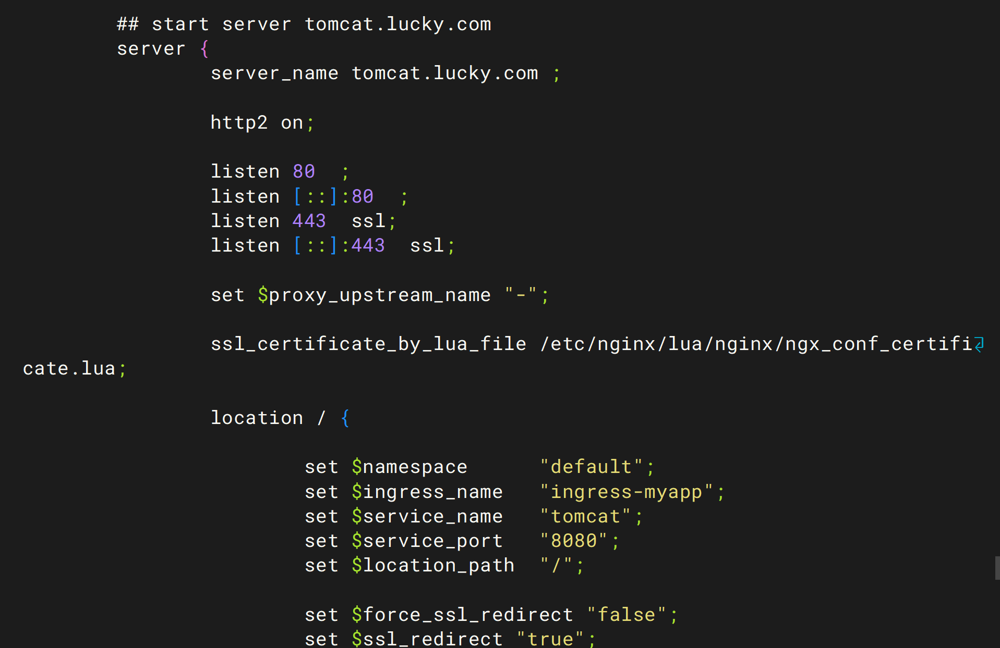
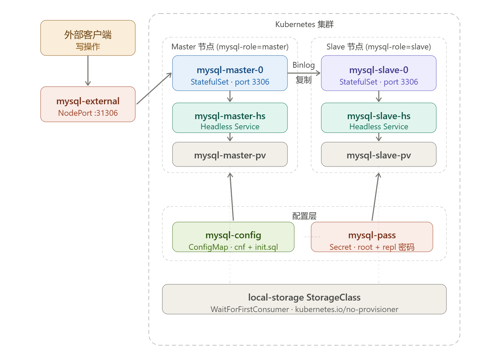
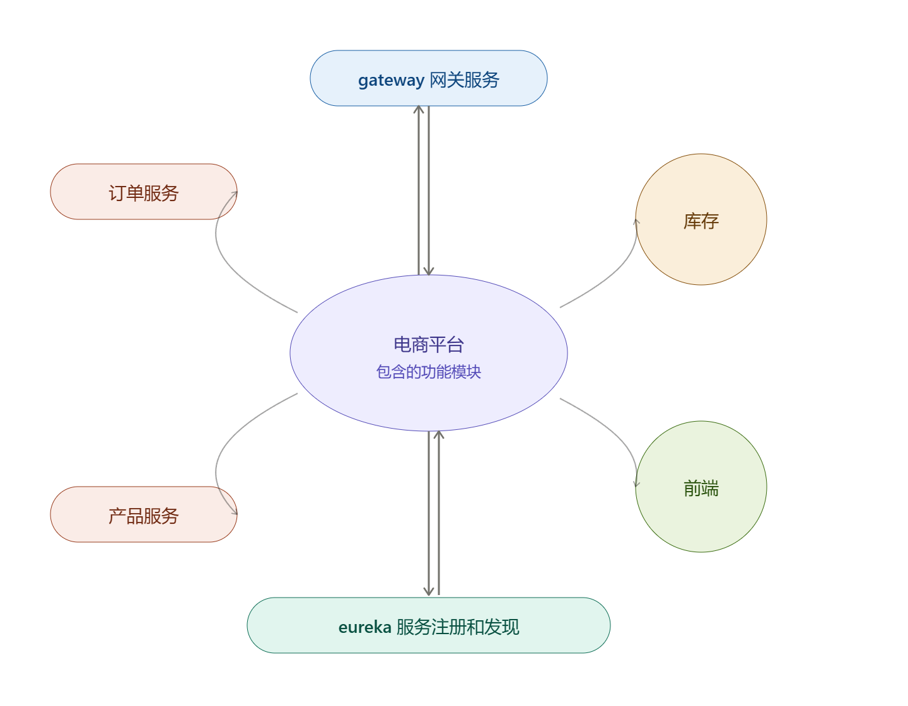
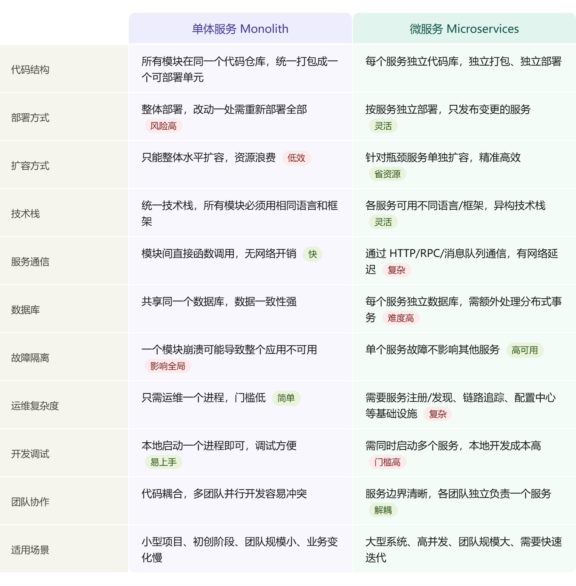
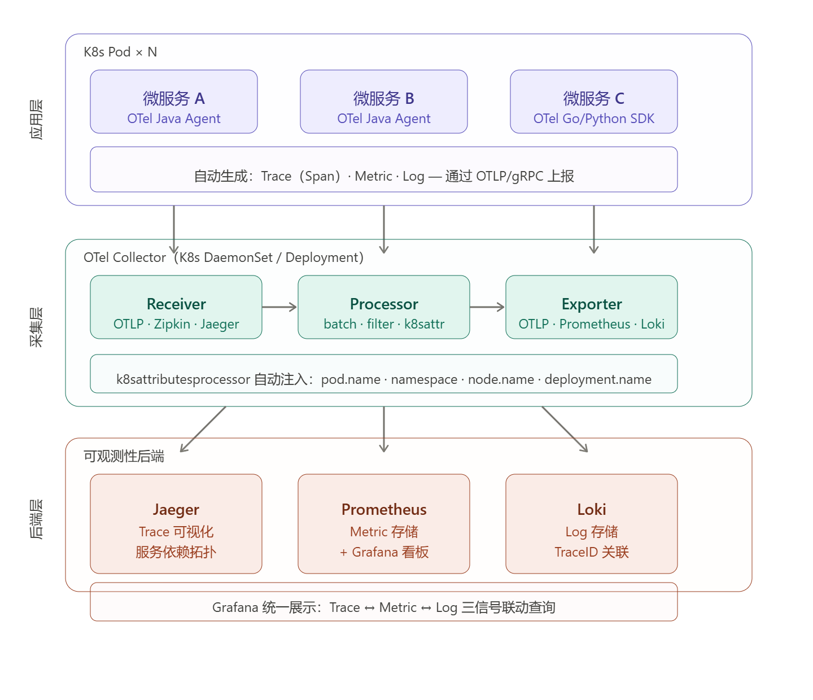
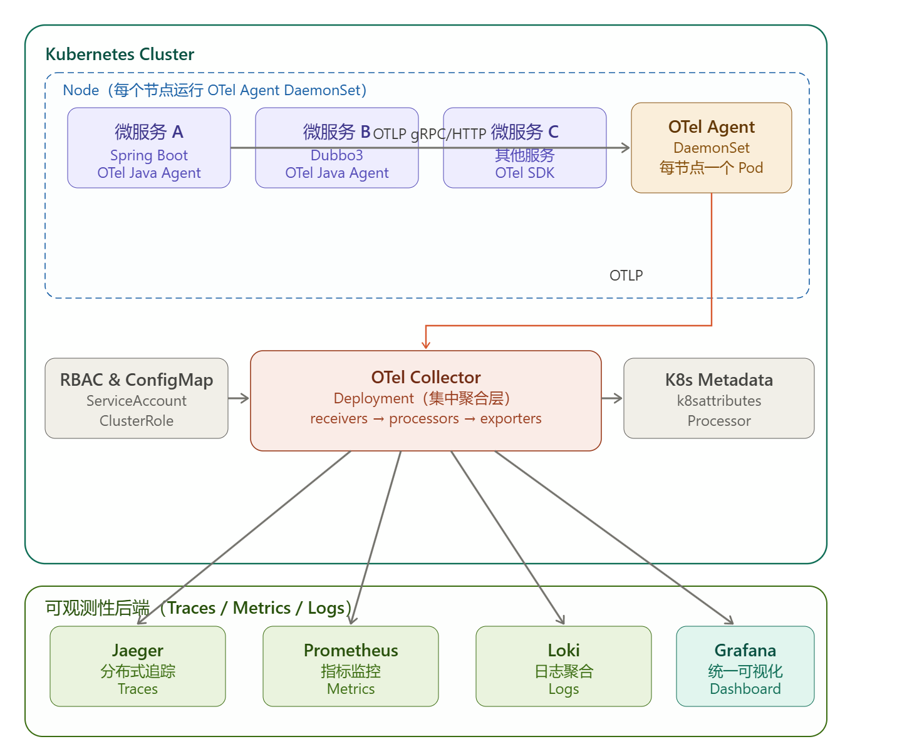

# 十、在k8s平台部署SpringCLoud电商项目.md

## 1、准备工作

### 1.1、Ingress 与 Ingress Controller 概述

**部署顺序**

1. 部署 Ingress Controller（使用 Nginx 实现）
2. 创建 Pod 应用（可通过控制器创建）
3. 创建 Service 对 Pod 进行分组
4. 创建 Ingress 规则，测试 HTTP 访问
5. 创建 Ingress 规则，测试 HTTPS 访问

**为什么使用 Nginx Ingress Controller 而非直接运行 Nginx Pod？**

使用 Ingress Controller 的核心优势在于**配置自动化**：当 Ingress 资源发生变更时，Controller 会自动检测并热重载 Nginx 配置，无需人工介入，避免了手动管理配置文件的繁琐与风险。

### 1.2、安装Nginx Ingress Controller 

- 安装步骤：

  - 获取官方yaml文件（https://github.com/kubernetes/ingress-nginx/）

  ```bash
  curl -O https://raw.githubusercontent.com/kubernetes/ingress-nginx/controller-v1.12.3/deploy/static/provider/cloud/deploy.yaml
  ```

  - 修改yaml文件适配当前环境
  - 使用kubectl apply -f deploy.yaml创建资源

- 创建资源：

  - 包含namespace、service account、config map等多种资源
  
  - 会自动创建ingress-nginx名称空间
  
  - 资源创建后可通过kubectl get ns查看验证
  

**注意**

**Ingress Controller 必须设置 `hostNetwork: true`**
这样 controller Pod 会直接使用宿主机网络，在节点上监听 `80/443`，外部访问节点公网 IP 时才能直接进入 Ingress。

**Ingress Controller 的 Service 类型改为 `ClusterIP`**
不走 `NodePort` 时，Service 只保留集群内访问能力即可。改成 `ClusterIP` 后要删除 `externalTrafficPolicy`、`nodePort`、`healthCheckNodePort` 这类只适用于外部暴露 Service 的字段。

**关闭VPN，不然不会走本地解析**

### 1.3 测试ingress HTTP代理tomcat

部署tomcat

```yaml
apiVersion: v1
kind: Service
metadata:
  name: tomcat
  namespace: default
spec:
  selector:
    app: tomcat
    release: canary
  ports:
    - name: http
      targetPort: 8080
      port: 8080
    - name: ajp
      targetPort: 8009
      port: 8009
---
apiVersion: apps/v1
kind: Deployment
metadata:
  name: tomcat-deploy
  namespace: default
spec:
  replicas: 2
  selector:
    matchLabels:
      app: tomcat
      release: canary
  template:
    metadata:
      labels:
        app: tomcat
        release: canary
    spec:
      initContainers:
        - name: init-tomcat-webapps
          image: harbor.cn/library/tomcat:9.0-jdk11-temurin
          imagePullPolicy: IfNotPresent
          command:
            - sh
            - -c
            - cp -a /usr/local/tomcat/webapps.dist/* /webapps/
          volumeMounts:
            - name: tomcat-webapps
              mountPath: /webapps

      containers:
        - name: tomcat
          image: harbor.cn/library/tomcat:9.0-jdk11-temurin
          imagePullPolicy: IfNotPresent
          ports:
            - name: http
              containerPort: 8080
            - name: ajp
              containerPort: 8009
          volumeMounts:
            - name: tomcat-webapps
              mountPath: /usr/local/tomcat/webapps

      volumes:
        - name: tomcat-webapps
          emptyDir: {}
```

四层代理原

 - 转发机制：通过IPVS防火墙规则实现流量转发

    - 规则查看：

      - 使用ipvsadm -Ln命令查看转发规则
      - service IP与pod IP的映射关系保存在IPVS规则中
      - 采用轮询(rr)算法进行负载均衡
      
    - 组件作用：kube-proxy负责维护各节点上的IPVS规则




七层代理-ingress配置

ingress默认类查看



创建ingress

```yaml
apiVersion: networking.k8s.io/v1
kind: Ingress
metadata:
  name: ingress-myapp
  namespace: default
spec:
  ingressClassName: nginx
  rules:
    - host: tomcat.lucky.com
      http:
        paths:
          - path: /
            pathType: Prefix
            backend:
              service:
                name: tomcat
                port:
                  number: 8080
```

- 整体架构：
  - 七层代理(ingress)依赖四层代理(service)
  - ingress controller需要与后端service在同一个namespace
  - 域名解析的IP必须是可路由的(公网IP或节点IP)

- 规则限制：必须通过域名访问而非IP地址，因为Ingress规则中配置的是域名解析

  C:\Windows\System32\drivers\etc\hosts文件配置域名解析

- 测试方法：在浏览器直接输入域名tomcat.lucky.com进行连通性验证

域名访问结果




流量路径



nginx-controller pod的配置文件已经更新




测试结束删除demo

```yaml
kubectl delete -f ingress.yaml
kubectl delete -f tomcat.yaml 
```


### 1.4 Mysql部署

```yaml
apiVersion: apps/v1
kind: StatefulSet
metadata:
  name: mysql-master
spec:
  serviceName: mysql-master-hs
  replicas: 1
  selector:
    matchLabels:
      app: mysql-master
  template:
    metadata:
      labels:
        app: mysql-master
    spec:
      nodeSelector:
        mysql-role: master
      tolerations:
      - key: "node-role.kubernetes.io/control-plane"
        operator: "Exists"
        effect: "NoSchedule"
      containers:
      - name: mysql
        image: harbor.cn/library/mysql:8.0.34
        env:
        - name: MYSQL_ROOT_PASSWORD
          valueFrom:
            secretKeyRef:
              name: mysql-pass
              key: password
        ports:
        - containerPort: 3306
        livenessProbe:
          tcpSocket:
            port: 3306
          initialDelaySeconds: 30
          periodSeconds: 10
        readinessProbe:
          tcpSocket:
            port: 3306
          initialDelaySeconds: 30
          periodSeconds: 10
        volumeMounts:
        - name: data
          mountPath: /var/lib/mysql
        - name: config
          mountPath: /etc/mysql/conf.d/master.cnf
          subPath: master.cnf
        - name: init-sql
          mountPath: /docker-entrypoint-initdb.d
      volumes:
      - name: config
        configMap:
          name: mysql-config
      - name: init-sql
        configMap:
          name: mysql-config
          items:
          - key: init-master.sql
            path: init-master.sql
  volumeClaimTemplates:
  - metadata:
      name: data
    spec:
      accessModes: [ "ReadWriteOnce" ]
      storageClassName: local-storage
      resources:
        requests:
          storage: 10Gi
     
---
apiVersion: apps/v1
kind: StatefulSet
metadata:
  name: mysql-slave
spec:
  serviceName: mysql-slave-hs
  replicas: 1
  selector:
    matchLabels:
      app: mysql-slave
  template:
    metadata:
      labels:
        app: mysql-slave
    spec:
      nodeSelector:
        mysql-role: slave
      containers:
      - name: mysql
        image: harbor.cn/library/mysql:8.0.34
        env:
        - name: MYSQL_ROOT_PASSWORD
          valueFrom:
            secretKeyRef:
              name: mysql-pass
              key: password
        ports:
        - containerPort: 3306
        livenessProbe:
          tcpSocket:
            port: 3306
          initialDelaySeconds: 30
          periodSeconds: 10
        readinessProbe:
          tcpSocket:
            port: 3306
          initialDelaySeconds: 30
          periodSeconds: 10
        volumeMounts:
        - name: data
          mountPath: /var/lib/mysql
        - name: config
          mountPath: /etc/mysql/conf.d/slave.cnf
          subPath: slave.cnf
      volumes:
      - name: config
        configMap:
          name: mysql-config
  volumeClaimTemplates:
  - metadata:
      name: data
    spec:
      accessModes: [ "ReadWriteOnce" ]
      storageClassName: local-storage
      resources:
        requests:
          storage: 10Gi
          
---          
apiVersion: v1
kind: Service
metadata:
  name: mysql-master-hs
spec:
  clusterIP: None
  selector:
    app: mysql-master
  ports:
  - port: 3306
---
apiVersion: v1
kind: Service
metadata:
  name: mysql-slave-hs
spec:
  clusterIP: None
  selector:
    app: mysql-slave
  ports:
  - port: 3306
---
# --- 3. External Service: 集群外访问 (NodePort) ---
apiVersion: v1
kind: Service
metadata:
  name: mysql-external
spec:
  type: NodePort
  selector:
    app: mysql-master # 外部写操作指向 Master
  ports:
  - port: 3306
    targetPort: 3306
    nodePort: 31306

---
apiVersion: v1
kind: PersistentVolume
metadata:
  name: mysql-master-pv
spec:
  capacity:
    storage: 10Gi
  accessModes: [ "ReadWriteOnce" ]
  storageClassName: local-storage
  persistentVolumeReclaimPolicy: Retain # 关键：PVC删除后PV不被自动销毁
  local:
    path: /data/mysql/master # 建议加上子目录
  nodeAffinity:
    required:
      nodeSelectorTerms:
      - matchExpressions:
        - key: mysql-role
          operator: In
          values: [ "master" ]
---
apiVersion: v1
kind: PersistentVolume
metadata:
  name: mysql-slave-pv
spec:
  capacity:
    storage: 10Gi
  accessModes: [ "ReadWriteOnce" ]
  storageClassName: local-storage
  persistentVolumeReclaimPolicy: Retain
  local:
    path: /data/mysql/slave # 建议加上子目录
  nodeAffinity:
    required:
      nodeSelectorTerms:
      - matchExpressions:
        - key: mysql-role
          operator: In
          values: [ "slave" ]
  
---
apiVersion: storage.k8s.io/v1
kind: StorageClass
metadata:
  name: local-storage
provisioner: kubernetes.io/no-provisioner
volumeBindingMode: WaitForFirstConsumer

---

apiVersion: v1
kind: ConfigMap
metadata:
  name: mysql-config
data:
  master.cnf: |
    [mysqld]
    server-id=1
    log-bin=mysql-bin
    binlog_format=ROW
    gtid_mode=ON
    enforce_gtid_consistency=ON
    default-authentication-plugin=mysql_native_password

  slave.cnf: |
    [mysqld]
    server-id=2
    relay-log=relay-bin
    read_only=1
    gtid_mode=ON
    enforce_gtid_consistency=ON
    default-authentication-plugin=mysql_native_password

  # 自动初始化 Master 的同步账号
  init-master.sql: |
    CREATE USER IF NOT EXISTS 'repl'@'%' IDENTIFIED WITH mysql_native_password BY 'repl_user_pass';
    GRANT REPLICATION SLAVE ON *.* TO 'repl'@'%';
    FLUSH PRIVILEGES;
    
---
apiVersion: v1
kind: Secret
metadata:
  name: mysql-pass
type: Opaque
stringData:
  password: root123
  repl-password: repl_user_pass
```

#### 第一步：给节点打标签

```bash
# 找出你的节点名
kubectl get nodes
# Master MySQL 跑在哪个节点就打 master，Slave 跑在哪个节点打 slave
kubectl label node <master节点名> mysql-role=master
kubectl label node <slave节点名>  mysql-role=slave
```

注意：Master 的 StatefulSet 还加了对 `control-plane` 节点的容忍（`tolerations`），说明它可以调度到控制平面节点，这在单节点或资源紧张的集群里常见。如果不想这样，可以把 `tolerations` 那段删掉。

#### 第二步：在物理节点上建目录

因为用的是 `local-storage`（本地存储），PV 绑定的是宿主机目录，必须手动创建：

```bash
# 在 Master 和Slave 节点上执行
mkdir -p /data/mysql/master
```

#### 第三步：部署 YAML

把整个文件保存为 `mysqlDeploy.yaml`，然后apply：

```bash
kubectl apply -f mysqlDeploy.yaml

```

------

#### 第四步：部署后：手动配置主从同步

这是最关键的一步，**YAML 里没有自动完成同步配置**，init-master.sql 只创建了复制账号，还需要手动在 Slave 上执行 `CHANGE MASTER TO`。

**进入 Master，获取同步位点**

```bash
kubectl exec -it mysql-master-0 -- mysql -uroot -proot123
-- 在 MySQL 内执行
SHOW MASTER STATUS\G
```

由于配置开启了 **GTID 模式**（`gtid_mode=ON`），用 GTID 方式：

```bash
kubectl exec -it mysql-slave-0 -- mysql -uroot -proot123
```

```sql
-- 在 Slave 的 MySQL 内执行
-- Master 的 DNS 是 StatefulSet Pod 的稳定域名
CHANGE MASTER TO
  MASTER_HOST='mysql-master-0.mysql-master-hs.default.svc.cluster.local',
  MASTER_USER='repl',
  MASTER_PASSWORD='repl_user_pass',
  MASTER_AUTO_POSITION=1;   -- GTID 模式用这个，不用指定 File/Position

START SLAVE;

-- 验证状态，两个 Yes 代表成功
SHOW SLAVE STATUS\G
```

架构图如下：



新建数据库

```sql
CREATE DATABASE IF NOT EXISTS tb_product;
CREATE DATABASE IF NOT EXISTS tb_stock;
CREATE DATABASE IF NOT EXISTS tb_order;
```

插入数据

```sql
USE `tb_order`;
-- 创建订单表
CREATE TABLE `orders` (
  `id` int(11) NOT NULL AUTO_INCREMENT,
  `order_number` varchar(36) DEFAULT NULL COMMENT '订单号',
  `order_product_name` varchar(250) DEFAULT NULL COMMENT '订单商品名称',
  `order_price` double(15,3) DEFAULT NULL COMMENT '订单价格',
  `count` int(11) DEFAULT NULL COMMENT '商品数量',
  `buy_date` datetime DEFAULT NULL COMMENT '购买时间',
  PRIMARY KEY (`id`)
) ENGINE=InnoDB DEFAULT CHARSET=utf8mb4;

USE `tb_stock`;
-- 创建库存表
CREATE TABLE `stock` (
  `id` int(11) NOT NULL AUTO_INCREMENT,
  `prod_id` int(11) NOT NULL COMMENT '商品id',
  `sales_stock` int(11) DEFAULT NULL COMMENT '销售库存',
  `real_stock` int(11) DEFAULT NULL COMMENT '真实库存',
  PRIMARY KEY (`id`)
) ENGINE=InnoDB AUTO_INCREMENT=5 DEFAULT CHARSET=utf8mb4;

-- 插入初始化数据
INSERT INTO `stock` (`id`, `prod_id`, `sales_stock`, `real_stock`) VALUES 
(1, 1, 99, 99),
(2, 2, 88, 88),
(3, 3, 77, 77),
(4, 4, 66, 66);

USE `tb_product`;
CREATE TABLE `product` (
  `id` int(11) NOT NULL AUTO_INCREMENT,
  `product_name` varchar(100) DEFAULT NULL COMMENT '商品名称',
  `price` double(15,3) DEFAULT NULL COMMENT '商品价格',
  PRIMARY KEY (`id`)
) ENGINE=InnoDB AUTO_INCREMENT=5 DEFAULT CHARSET=utf8mb4;
INSERT INTO `product` (`id`, `product_name`, `price`) VALUES 
(1, '手机', 99.990),
(2, '大彩电', 999.000),
(3, '洗衣机', 100.000),
(4, '超级大冰箱', 9999.000);

```


### 1.5 电商平台架构

#### 1）服务模块架构图



**必备服务：**

| 服务               | 说明             |
| ------------------ | ---------------- |
| MySQL              | 数据库（已部署） |
| Ingress Controller | 七层代理         |
| Harbor             | 私有镜像仓库     |

**Spring Cloud 简介：**

Spring Cloud 是基于 Spring Boot 的微服务治理框架，提供一整套分布式系统开发"工具箱"，帮助开发者快速构建和管理微服务架构中的常见组件。



**核心架构与组件：**

| 序号 | 组件               | 职责                     |
| ---- | ------------------ | ------------------------ |
| 1    | 服务注册与发现     | Service Registry         |
| 2    | 统一 API 网关      | API Gateway              |
| 3    | 分布式配置中心     | Configuration Management |
| 4    | 远程调用与负载均衡 | RPC & Load Balancing     |
| 5    | 服务熔断与降级     | Circuit Breaker          |

---

##### 2）Spring Cloud 项目迁移到 K8s 的原因


**K8s 原生功能可替代 Spring Cloud 组件：**

| Spring Cloud 组件    | K8s 替代方案       |
| -------------------- | ------------------ |
| Eureka（服务发现）   | CoreDNS + Service  |
| Spring Cloud Gateway | Ingress-Nginx      |
| Spring Cloud Config  | ConfigMap / Secret |
| Hystrix（熔断）      | Istio              |

**K8s 核心优势：**

- **轻量化**：通过 API 资源实现功能，避免引入重型组件
- **扩展性**：支持自动扩缩容（HPA）
- **通用性**：可运行任意语言开发的服务

---

##### 3）服务部署到 K8s 的完整流程

**部署步骤：**

| 步骤 | 操作         | 说明                                       |
| ---- | ------------ | ------------------------------------------ |
| 1    | 代码开发     | 基于微服务架构编写业务代码                 |
| 2    | 代码获取     | 从 GitLab / SVN 拉取代码                   |
| 3    | 代码编译     | Java 项目使用 `mvn` 命令编译               |
| 4    | 镜像构建     | 通过 Dockerfile 打包应用                   |
| 5    | 镜像推送     | 上传至 Harbor 私有仓库                     |
| 6    | Pod 创建     | 选择合适控制器（Deployment / StatefulSet） |
| 7    | Service 配置 | 创建四层代理服务                           |
| 8    | Ingress 配置 | 前端服务配置 HTTPS 七层代理                |
| 9    | 数据持久化   | 使用 Ceph / 云存储保障数据安全             |
| 10   | 监控日志     | 部署 Prometheus + EFK 等运维组件           |

**控制器选型：**

| 控制器      | 适用场景                    | 特点                                 |
| ----------- | --------------------------- | ------------------------------------ |
| Deployment  | 无状态服务（如 Tomcat）     | Pod 可随意替换，无需会话保持         |
| StatefulSet | 有状态服务（如 MySQL 主从） | Pod 有序启停，需持久化存储和会话保持 |

##### 4）数据持久化与监控系统搭建


## 2、准备工作

### 2.1生产环境的k8s里部署服务

#### 1）高可用性要求

**K8s 服务高可用配置**

- **最小 Pod 数量**：每个服务至少 2 个 Pod，防止单点故障导致服务中断
- **资源压测要求**：上线前必须对每个服务进行压测，确定单 Pod 的 CPU/内存需求

| 服务     | Pod 数量 | 单 Pod 需求 | 合计              |
| -------- | -------- | ----------- | ----------------- |
| A 服务   | 2        | 2GB + 2vCPU | 4GB + 4vCPU       |
| B 服务   | 10       | 4GB + 4vCPU | 40GB + 40vCPU     |
| C 服务   | 6        | 1GB + 1vCPU | 6GB + 6vCPU       |
| **合计** | **18**   | —           | **50GB + 50vCPU** |

**K8s 节点数量规划**

| 节点类型 | 最低数量  | 说明                                   |
| -------- | --------- | -------------------------------------- |
| 控制节点 | 3（奇数） | 满足 Raft 选主要求                     |
| 工作节点 | 2         | 可随时通过 `kubeadm token create` 扩容 |

**K8s 控制节点高可用配置**

- **ETCD**：必须保持奇数节点（3 或 5 个），基于 Raft 算法实现选主
- **容错能力**：

| 节点总数 | 最多允许故障 | 说明                |
| -------- | ------------ | ------------------- |
| 3        | 1            | 剩余 2 台可正常工作 |
| 5        | 2            | 剩余 3 台可正常工作 |

- **核心组件**：控制节点运行 API Server、Scheduler、Controller Manager 等

---

#### 2）控制节点和工作节点配置

**资源计算步骤：**

1. 统计所有 Pod 资源总和（示例合计：50GB + 50vCPU）
2. 按工作节点数量平均分配（2 节点时各需 25GB + 25vCPU）
3. 实际配置须预留 **20%~30% 缓冲资源**

---

#### 3）计算工作节点数量

**计算公式：**

$$
单节点配置 = \frac{\sum(各服务Pod数 \times 单Pod需求)}{工作节点数}
$$

**示例：**

$$
\frac{50GB}{2节点} = 25GB / 节点
$$

**调度策略：**

- 相同服务的 Pod 应分散在不同节点，避免单节点故障导致服务中断
- 利用 `nodeAffinity` / `podAntiAffinity` 控制 Pod 分布
- 生产环境应保留20-30%的资源余量，防止节点过载


#### 4）控制节点配置

**功能定位：**

- 仅运行核心组件（API Server、Controller Manager、Scheduler 等）
- 通过污点机制（Taint）禁止运行业务 Pod

**最低配置：**

| 场景 | 内存 | vCPU |
|------|------|------|
| 基础需求（单节点） | 4GB | 4 |
| 生产建议（单节点） | 8GB | 12 |
| 生产建议（3 节点合计） | 24GB | 36 |

**配置依据：**

- 现代服务器普遍配置较高（通常不低于 10 核 CPU）
- 需预留资源以应对组件升级和监控需求

### 2.2 Dockerfile文件

### 6.1.2 Dockerfile 中 ENTRYPOINT & CMD 与 K8s Pod command & args 的区别

**ENTRYPOINT 与 CMD 的关系：**

- `ENTRYPOINT`：定义容器启动时执行的**主命令**，不会被 `docker run` 的参数覆盖
- `CMD`：定义容器启动时的**默认参数**，会被 `docker run` 传入的参数覆盖

| Docker     | Kubernetes |
| ---------- | ---------- |
| ENTRYPOINT | command    |
| CMD        | args       |

**组合使用规则：**

| Pod配置            | 最终结果          |
| ------------------ | ----------------- |
| 未定义command/args | ENTRYPOINT + CMD  |
| 只写 args          | ENTRYPOINT + args |
| 只写 command       | command           |
| command + args     | command + args    |


## 3、部署微服务项目到 K8s 集群

### 3.1 编译 Java 程序

**获取源码：**

```bash
git clone <GitLab仓库地址>
```

克隆完成后修改 `application.yml`，更新数据库连接地址。

**执行编译：**

```bash
mvn clean package -Dmaven.test.skip=true
```

| 参数                     | 说明                   |
| ------------------------ | ---------------------- |
| `clean package`          | 清理并打包项目         |
| `-Dmaven.test.skip=true` | 跳过测试阶段，加速编译 |

> 首次编译需下载依赖，耗时约 30 分钟，请保持网络稳定。

**编译结果处理：**

| 状态 | 标志                                                      | 处理方式                                              |
| ---- | --------------------------------------------------------- | ----------------------------------------------------- |
| 成功 | 显示 `BUILD SUCCESS` 及总耗时（如 `Total time: 41.555s`） | —                                                     |
| 失败 | 多因网络问题导致依赖下载不全                              | 重复执行编译命令；多次失败需检查 Maven 配置和网络连接 |

---

### 3.2 镜像打包

**编写 Dockerfile：**

```dockerfile
FROM java:11-jdk                          # 基于 Alpine Linux 的精简镜像

# 时区设置
RUN apk add --no-cache tzdata \
    && ln -sf /usr/share/zoneinfo/Asia/Shanghai /etc/localtime

# 复制应用
COPY target/eureka-service.jar /app.jar

# 启动命令
ENTRYPOINT ["java", "-jar", "/app.jar"]
```

**镜像命名规范：**

```
harbor.cn/microservice/eureka:v1
├── harbor.cn        # Harbor 仓库地址
├── microservice     # 项目名称
├── eureka           # 服务名称
└── v1               # 版本标签
```

**镜像推送：**

```bash
# 登录 Harbor
docker login harbor.cn

# 推送镜像
docker push harbor.cn/microservice/eureka:v1
```

---

### 3.3 服务部署

**创建步骤：**

```bash
# 1. 创建命名空间
kubectl create namespace ms
# 2. 应用资源定义
kubectl apply -f eureka.yaml
```

**域名解析配置（本地 hosts）：**

文件路径：`C:\Windows\System32\drivers\etc\hosts`

```
192.168.40.64   xxx.xxx.xxx
```

---

### 3.4 服务注册验证

**Pod 注册格式：**

```
<pod名称>.xxx.ms.svc.cluster.local:<服务端口>
```

**验证要点：**

| 检查项   | 说明                                              |
| -------- | ------------------------------------------------- |
| 副本数   | 注册数量需与 `replicas` 配置一致                  |
| 注册 IP  | 实际注册使用 Pod IP，而非 Pod 名称                |
| 访问方式 | 服务间通过内部域名调用，浏览器无法直接访问 Pod IP |


## 4.全链路监控系统

全链路监控系统是一种用于监测和管理复杂业务流程的系统，可跟踪整个业务链路中涉及的各个环节与组件，涵盖硬件设备、软件应用、网络连接及数据传输等。

其核心目标是**实时监控整个业务链路**，以便及时发现并解决潜在的问题或故障。系统能够收集和分析性能指标、延迟时间、错误率等多维度数据，支持实时告警，并通过可视化界面帮助用户直观了解业务流程的状态与性能。

## 核心功能

| 功能模块       | 说明                                       |
| -------------- | ------------------------------------------ |
| 数据采集与存储 | 全面收集链路中各环节的运行数据并持久化存储 |
| 监控指标分析   | 对性能、延迟、错误率等关键指标进行多维分析 |
| 实时告警机制   | 异常发生时即时触发告警，缩短故障响应时间   |
| 可视化展示界面 | 以图表等形式直观呈现业务链路的实时状态     |
| 故障排查支持   | 提供链路追踪与日志关联，辅助快速定位根因   |

### 4.1 OpenTelemetry简介

OpenTelemetry（简称 **OTel**）是一个由云原生计算基金会（CNCF）托管的开源可观测性框架，用来统一**分布式追踪（Tracing）+ 指标（Metrics）+ 日志（Logs）**的采集、处理与导出标准。



对比图

| 系统          | 定位                  | 特点               |
| ------------- | --------------------- | ------------------ |
| OpenTelemetry | 标准 + SDK + 数据管道 | “统一规范”         |
| Zipkin        | tracing系统           | 轻量但功能单一     |
| SkyWalking    | APM平台               | Java生态强，功能全 |
| Pinpoint      | APM（偏Java）         | 字节码强侵入       |

### 4.2 部署OpenTelemetry on Kubernetes



OpenTelemetry（OTel）在 K8s 中的监控体系分为三层：**采集层**（SDK/Agent 注入微服务）→ **传输聚合层**（Collector）→ **存储展示层**（Jaeger/Prometheus/Loki/Grafana）。采集的信号包括 Traces（链路追踪）、Metrics（指标）、Logs（日志）。

#### 一、部署步骤

| 组件                           | 部署方式                | 职责                                   |
| ------------------------------ | ----------------------- | -------------------------------------- |
| OTel Java Agent                | 以 JVM 参数注入容器     | 无侵入采集 Spring Boot / Dubbo3 Traces |
| OTel Collector（Agent 模式）   | DaemonSet（每节点一个） | 接收本节点 Pod 数据，减少网络跳数      |
| OTel Collector（Gateway 模式） | Deployment（2～3 副本） | 集中过滤、批处理、扇出到各后端         |
| Jaeger                         | Deployment + Service    | 存储和查询 Traces                      |
| Prometheus                     | StatefulSet             | 存储 Metrics                           |
| Loki                           | StatefulSet             | 存储 Logs                              |
| Grafana                        | Deployment              | 统一 Dashboard                         |

#### 二、微服务接入（Spring Boot / Dubbo3 无侵入方案）

**Dockerfile 注入 OTel Java Agent**

```dockerfile
FROM openjdk:17-jre-slim

# 下载 OTel Java Agent
ADD https://github.com/open-telemetry/opentelemetry-java-instrumentation/releases/latest/download/opentelemetry-javaagent.jar /otel/opentelemetry-javaagent.jar

COPY target/your-service.jar /app/app.jar

ENTRYPOINT ["java", \
  "-javaagent:/otel/opentelemetry-javaagent.jar", \
  "-jar", "/app/app.jar"]
```

