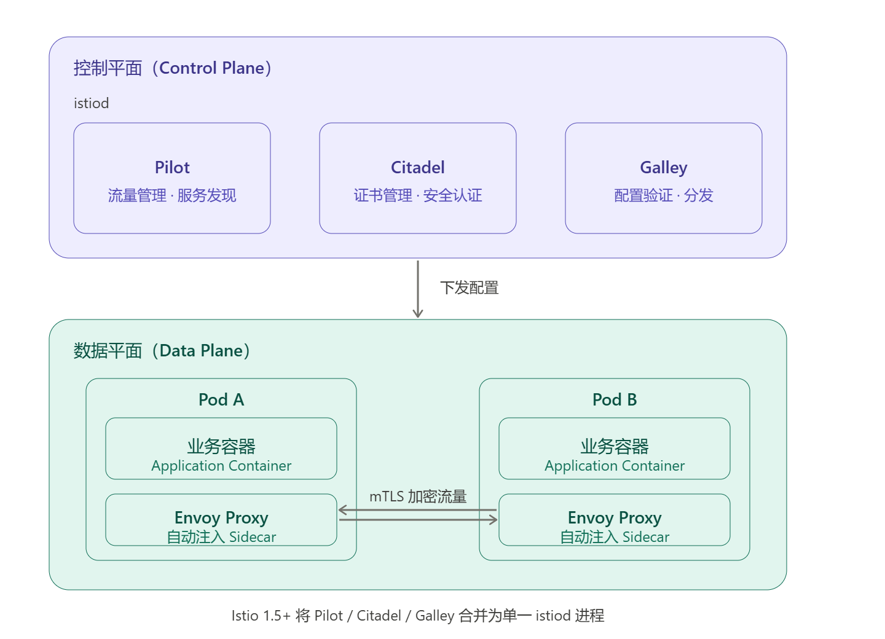

# 十三、微服务治理.md

## 1.微服务与 Istio

### 1.1 微服务架构

**核心思想**：将单体应用拆分为多个**小型独立服务模块**，每个模块单独部署和维护，服务间通过 HTTP 协议通信。

> **典型示例**：电商系统按业务拆分为产品服务、库存服务、订单服务、购物车服务等独立模块，各自拥有独立数据库。

**发展进程**

```
单体架构  →  服务拆分  →  微服务  →  服务治理  →  云原生
```

| 阶段           | 特征                                                     |
| -------------- | -------------------------------------------------------- |
| **单体架构**   | 所有功能编译为单一二进制文件（如传统 Spring Cloud 项目） |
| **服务拆分**   | 按业务功能划分独立服务，各服务拥有独立数据库             |
| **微服务阶段** | 服务间通过 HTTP 协议通信，支持独立开发与部署             |
| **服务治理**   | 引入注册中心、负载均衡、故障自修复等治理机制             |
| **云原生阶段** | 实现自动化部署与运维，与 K8s 深度集成                    |

------

### 1.2  Istio

#### 1） 概念与架构

Istio 是一个**开源服务网格平台**（Service Mesh），本身是一种架构模式而非具体技术。它通过向每个 Pod 自动注入 **Envoy 代理容器**来拦截和管理服务间流量，无需修改业务代码。

**核心功能：**

| 功能域   | 说明                         |
| -------- | ---------------------------- |
| 流量管理 | 流量路由、负载均衡、流量镜像 |
| 可靠性   | 故障注入、熔断、超时、重试   |
| 安全性   | 服务间认证授权（mTLS）       |
| 可观测性 | 监控指标、链路追踪、访问日志 |

------

#### 2 ）核心特性

**断路器（Circuit Breaker）**

类比家庭电路的**保险丝**机制——当服务异常时自动切断调用链，防止故障扩散。

```
正常状态：请求 → 服务A → 服务B → 响应
熔断触发：请求 → 服务A → [熔断器] → 返回降级响应（如"网络繁忙"）
```

| 配置项   | 说明                                             |
| -------- | ------------------------------------------------ |
| 失败阈值 | 如 10% 的请求失败即触发熔断                      |
| 降级响应 | 返回预设页面，避免用户长时间等待                 |
| 雪崩防护 | 未启用熔断时，单点故障可能引发整条调用链全面崩溃 |

------

**超时（Timeout）**

为服务调用设置**最大等待时间**，超时后立即返回错误，结合降级策略提升用户体验。

```
典型场景：Nginx 设置 3 秒超时 → 后端服务响应需 5 秒 → 超时直接返回错误
```

| 设计目的 | 说明                           |
| -------- | ------------------------------ |
| 防止阻塞 | 避免客户端因无响应而长时间挂起 |
| 快速失败 | 及时发现并上报后端服务异常     |
| 体验保障 | 配合降级策略返回友好提示       |

------

**重试（Retry）**

首次请求失败后**自动发起有限次重试**，适用于网络临时波动导致的偶发故障。

```
请求 → 失败 → 重试第1次 → 失败 → 重试第2次 → 成功 → 响应
                                          ↓（超过最大次数）
                                        返回错误
```

> **注意**：必须设置最大重试次数，避免无限重试加剧后端压力。

------

#### 3） Istio 架构

Istio 由**控制平面**和**数据平面**两部分组成：



| 平面         | 组件          | 说明                                           |
| ------------ | ------------- | ---------------------------------------------- |
| **控制平面** | `istiod`      | 以 Pod 形式运行于 K8s 集群，负责配置管理与下发 |
| **数据平面** | `Envoy Proxy` | 自动注入到每个业务 Pod，拦截并处理所有进出流量 |

> **版本说明**：Istio 1.5+ 将 Pilot、Citadel、Galley 合并为单一的 `istiod` 进程，简化了部署和运维复杂度。

### 1.3 安装istio

#### 1）确认版本兼容关系

根据 Istio 官方支持矩阵，K8s v1.31 对应：

| Istio 版本 | 支持的 K8s 版本           | 推荐度 |
| ---------- | ------------------------- | ------ |
| **1.23.x** | 1.29 / 1.30 / 1.31 / 1.32 | ✅ 推荐 |
| **1.22.x** | 1.28 / 1.29 / 1.30 / 1.31 | ✅ 可用 |
| 1.30.x     | 1.32                      | ❌      |

#### 1）下载 Istio 1.23.x

```bash
# 指定版本下载
curl -L https://istio.io/downloadIstio | ISTIO_VERSION=1.23.6 sh -
```

------

#### 2）切换到新版本

```bash
cd ~/istio-1.23.6
export PATH=$PWD/bin:$PATH
# 确认版本
istioctl version
# 期望输出：client version: 1.23.6
```

#### 3）安装

确认 Istio 1.23.x 需要哪些镜像

```bash
# 先不安装，只生成 manifest 看看需要哪些镜像
istioctl manifest generate --set profile=default | grep "image:" | sort -u
```

拉取镜像

```sh
docker pull docker.1ms.run/istio/pilot:1.23.6
docker pull docker.1ms.run/istio/proxyv2:1.23.6
docker pull docker.1ms.run/busybox:1.28
```

拉取成功后打回原始 tag：

```bash
docker tag docker.1ms.run/istio/pilot:1.23.6    harbor.cn/library/pilot:1.23.6
docker tag docker.1ms.run/istio/proxyv2:1.23.6  harbor.cn/library/proxyv2:1.23.6
docker tag docker.1ms.run/busybox:1.28           harbor.cn/library/busybox:1.28
```

然后安装

```bash
istioctl install --set profile=default --set profile=harbor.cn/library -y
```

安装成功验证

```bash
# 查看控制平面 Pod 是否全部 Running
kubectl get pods -n istio-system
# 自检
istioctl analyze
```

#### 4）开启 Sidecar 自动注入

这是使用 Istio 的**前提**，给命名空间打标签后，该空间内新建的 Pod 会自动注入 Envoy Proxy。

```bash
# 对指定命名空间开启（以 default 为例）
kubectl label namespace default istio-injection=enabled
# 验证
kubectl get namespace default --show-labels
```

> 已有的 Pod 不会自动注入，需要重建才能生效：
>
> ```bash
> kubectl rollout restart deployment -n default
> ```

------

#### 5）确认 Sidecar 注入成功

```bash
# READY 列显示 2/2 说明注入成功（1个业务容器 + 1个Envoy）
kubectl get pods -n default

# 查看某个 Pod 的容器列表
kubectl describe pod <pod-name> | grep "Container Name"
```

------

#### 6）按需开启各项功能

**流量管理（VirtualService / DestinationRule）**

```yaml
# 示例：配置超时和重试
apiVersion: networking.istio.io/v1alpha3
kind: VirtualService
metadata:
  name: my-service
spec:
  hosts:
  - my-service
  http:
  - timeout: 3s
    retries:
      attempts: 3
      perTryTimeout: 1s
    route:
    - destination:
        host: my-service
```

**熔断（DestinationRule）**

```yaml
apiVersion: networking.istio.io/v1alpha3
kind: DestinationRule
metadata:
  name: my-service
spec:
  host: my-service
  trafficPolicy:
    outlierDetection:
      consecutive5xxErrors: 5      # 连续 5 次 5xx 触发熔断
      interval: 30s                # 检测间隔
      baseEjectionTime: 30s        # 熔断持续时间
```

**mTLS 加密（PeerAuthentication）**

```yaml
# 对某个命名空间开启严格 mTLS
apiVersion: security.istio.io/v1beta1
kind: PeerAuthentication
metadata:
  name: default
  namespace: default
spec:
  mtls:
    mode: STRICT    # STRICT=仅加密流量 / PERMISSIVE=兼容模式
```

------

#### 7）安装可观测性插件

```bash
cd ~/istio-1.23.6
# 安装 Kiali + Prometheus + Grafana + Jaeger
kubectl apply -f samples/addons/
# 等待就绪
kubectl rollout status deployment/kiali -n istio-system
# 访问 Kiali（会自动端口转发）
istioctl dashboard kiali
```

| 插件       | 功能           | 访问命令                        |
| ---------- | -------------- | ------------------------------- |
| Kiali      | 服务拓扑可视化 | `istioctl dashboard kiali`      |
| Grafana    | 监控指标面板   | `istioctl dashboard grafana`    |
| Jaeger     | 链路追踪       | `istioctl dashboard jaeger`     |
| Prometheus | 指标采集       | `istioctl dashboard prometheus` |

卸载安装

```sh
istioctl uninstall --purge -y
kubectl delete namespace istio-system --ignore-not-found
```

