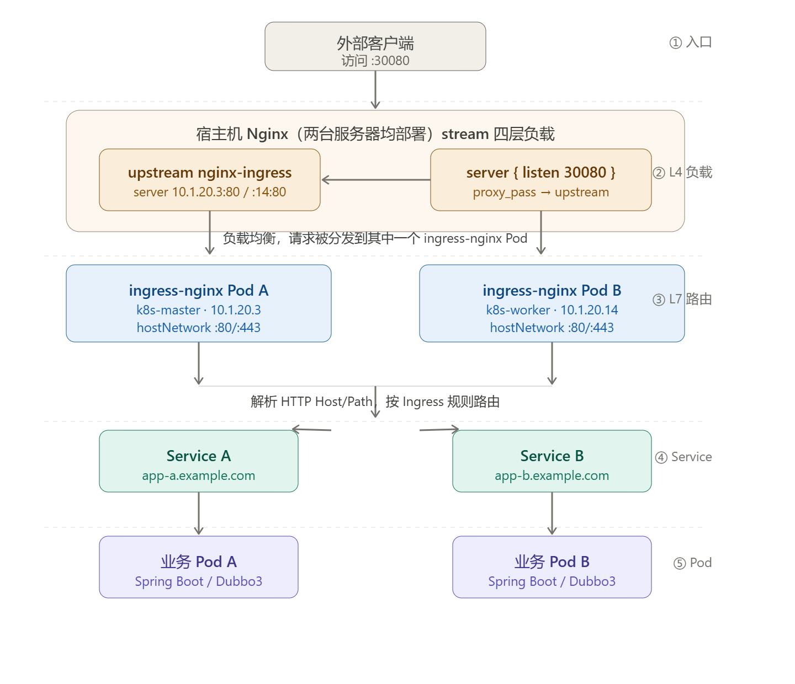

# 十三、微服务治理.md

## 1. 高可用 Ingress Controller 配置

### 1. 1部署步骤

#### 1） 部署前准备：清理旧环境

```bash
# 删除原有单节点 Ingress Controller 的所有资源
kubectl delete -f ingress-controller-deploy.yaml

# 确认 Pod 已完全删除
kubectl get pods -n ingress-nginx
```

> 等待输出为空或 `No resources found` 后再进行下一步。

------

#### 2）高可用部署核心配置

高可用的关键在于以下三点配置，缺一不可：

| 配置项                         | 作用                                                         |
| ------------------------------ | ------------------------------------------------------------ |
| 副本数 `replicas: 2`           | 保证至少两个 Pod 同时运行，单点故障不影响服务                |
| 容忍度 `tolerations`           | 允许 Pod 调度到控制节点（master），充分利用集群资源          |
| Pod 反亲和性 `podAntiAffinity` | 强制两个 Pod 分散到不同节点，避免同节点宕机导致双副本同时失效 |

#### 3） ingress-deploy.yaml 关键片段

```yaml
apiVersion: apps/v1
kind: Deployment
metadata:
  name: ingress-nginx-controller
  namespace: ingress-nginx
spec:
  replicas: 2                        # 关键1：双副本
  selector:
    matchLabels:
      app.kubernetes.io/name: ingress-nginx
  template:
    spec:
      # 关键2：容忍控制节点污点，允许调度到 master
      tolerations:
        - key: node-role.kubernetes.io/control-plane
          operator: Exists
          effect: NoSchedule
      hostNetwork: true
      dnsPolicy: ClusterFirstWithHostNet
      # 关键3：Pod 反亲和性，强制两副本分布在不同节点
      affinity:
        podAntiAffinity:
          preferredDuringSchedulingIgnoredDuringExecution:
          - weight: 90       #
            podAffinityTerm:
			  labelSelector:
             	matchLabels:
                  app.kubernetes.io/name: ingress-nginx
              topologyKey: kubernetes.io/hostname   # 以节点主机名为维度隔离
```

#### 4）部署并验证

```bash
# 应用高可用配置
kubectl apply -f ingress-deploy.yaml
# 查看 Pod 分布情况（重点关注 NODE 列，两个 Pod 应在不同节点）
kubectl get pods -n ingress-nginx -o wide
# 期望输出示例：
# NAME                                  READY  STATUS   NODE
# ingress-nginx-controller-xxx-aaa      1/1    Running  k8s-master
# ingress-nginx-controller-xxx-bbb      1/1    Running  k8s-worker1
```

> **验证高可用**：`NODE` 列显示两个 Pod 分布在不同节点，说明反亲和性生效。若两个 Pod 调度到同一节点，检查 `topologyKey` 是否配置正确。

#### 5）安装 Nginx、Keepalived 以及相关扩展

```sh
yum install epel-release nginx keepalived nginx-mod-stream -y
```

#### 6）负载均衡配置

- nginx配置：
  - 修改/etc/nginx/nginx.conf
  - 配置upstream指向两个ingress controller节点(端口80)
  - 监听30080端口
  - 主备节点配置相同
  
  ```yaml
  user nginx;
  worker_processes auto;
  error_log /var/log/nginx/error.log;
  pid /run/nginx.pid;
  
  include /usr/share/nginx/modules/*.conf;
  
  events {
      worker_connections 1024;
  }
  # 四层负载均衡，为两台Master apiserver组件提供负载均衡
  stream {
  
      log_format main '$remote_addr $upstream_addr - [$time_local] $status $upstream_bytes_sent';
  
      access_log /var/log/nginx/k8s-access.log main;
  
      upstream nginx-ingress {
          server 10.1.20.3:80;
          server 10.1.20.14:80;
      }
  
      server {
          listen 30080;
          proxy_pass nginx-ingress;
      }
  }
  http {
      log_format main '$remote_addr - $remote_user [$time_local] "$request" '
                      '$status $body_bytes_sent "$http_referer" '
                      '"$http_user_agent" "$http_x_forwarded_for"';
  
      access_log /var/log/nginx/access.log main;
  
      sendfile           on;
      tcp_nopush         on;
      tcp_nodelay        on;
      keepalive_timeout  65;
      types_hash_max_size 2048;
  
      include            /etc/nginx/mime.types;
      default_type       application/octet-stream;
  }
  ```
  
  
- keepalived配置：
  - 主节点：优先级100，state为MASTER
  - 备节点：优先级90，state为BACKUP
  - 虚拟IP：192.168.40.199
  - 检测脚本：check_nginx.sh
  
  ```yaml
  global_defs {
      notification_email {
          acassen@firewall.loc
          failover@firewall.loc
          sysadmin@firewall.loc
      }
      notification_email_from Alexandre.Cassen@firewall.loc
      smtp_server 127.0.0.1
      smtp_connect_timeout 30
      router_id NGINX_MASTER
  }
  
  vrrp_script check_nginx {
      script "/etc/keepalived/check_nginx.sh"
  }
  
  vrrp_instance VI_1 {
      state MASTER
      interface ens33  # 修改为实际网卡名
      virtual_router_id 51 # VRRP 路由 ID 实例，每个实例是唯一的
      priority 100      # 优先级，备服务器设置 90
      advert_int 1      # 指定 VRRP 心跳包通告间隔时间，默认 1 秒
      authentication {
          auth_type PASS
          auth_pass 1111
      }
      # 虚拟 IP
      virtual_ipaddress {
          192.168.1.199/24
      }
      track_script {
          check_nginx
      }
  }
  ```
  
  




## 2. Ingress-Nginx 访问链路

### 1）hostNetwork 模式

**关键配置**

```yaml
spec:
  template:
    spec:
      hostNetwork: true
      dnsPolicy: ClusterFirstWithHostNet
```

**流量路径**

```
客户端
  ↓ 域名解析（hosts / DNS）
NodeIP:80 / 443
  ↓ 直接进入 Pod（无 Service 中转）
Ingress-Nginx Controller Pod
  ↓ 按 Ingress Rule 匹配
业务 Service
  ↓
业务 Pod
```

**特点**

- Ingress Controller 直接使用宿主机网络，监听宿主机 80 / 443 端口

- 外部访问无需指定端口：`http://test.example.com`

- 外部流量

  不经过

   Ingress Controller Service，Service 仅用于：

  - 集群内部访问
  - Prometheus 指标采集
  - Admission Webhook 通信

- Service 类型设为 `ClusterIP` 即可

------

### 2）NodePort 模式

**关键配置**

```yaml
spec:
  template:
    spec:
      hostNetwork: false   # 默认值
```

**配套 NodePort Service：**

```yaml
kind: Service
type: NodePort
# 80 -> 30080，443 -> 30443
```

**流量路径**

```
客户端
  ↓
NodeIP:30080
  ↓ 经过 Ingress Service（NodePort）
Ingress-Nginx Controller Pod
  ↓ 按 Ingress Rule 匹配
业务 Service
  ↓
业务 Pod
```

**特点**

- Ingress Controller 不占用宿主机 80 / 443，部署更灵活
- Ingress Controller Service 是外部流量**必经入口**
- 外部访问需指定端口：`http://test.example.com:30080`

------

### 3）两种模式对比

| 项目                              | hostNetwork | NodePort |
| --------------------------------- | ----------- | -------- |
| 占用宿主机 80/443                 | ✅           | ❌        |
| 需要 Ingress Service 转发外部流量 | ❌           | ✅        |
| 需要 NodePort                     | ❌           | ✅        |
| 用户访问需带端口                  | ❌           | ✅        |
| 流量路径长度                      | 短          | 稍长     |
| 裸机/实验环境推荐                 | ✅           | —        |

------

### 4）Ingress 后段流量路径

两种模式进入 Ingress Controller 后，后段路径完全一致：

```
Ingress Controller
  ↓ 匹配 Ingress Rule（host + path）
业务 Service（ClusterIP）
  ↓ kube-proxy / iptables 选 Pod
业务 Pod
```

Ingress 规则示例：

```yaml
apiVersion: networking.k8s.io/v1
kind: Ingress
metadata:
  name: demo
spec:
  rules:
  - host: test.example.com
    http:
      paths:
      - path: /
        pathType: Prefix
        backend:
          service:
            name: demo-svc
            port:
              number: 80
```

------

### 5）场景推荐

**实验 / 裸机测试**：推荐 `hostNetwork: true`

- 配置简单，无需 MetalLB 或额外 NodePort
- hosts 文件直接映射节点 IP 即可：

```
192.168.1.100  test.example.com
```

**生产环境**：推荐 LoadBalancer 方案

```
LoadBalancer（MetalLB / 云厂商 LB / F5 / HAProxy）
  ↓
Ingress Controller
  ↓
业务 Service → 业务 Pod
```

用户始终访问标准端口，无需感知后端节点信息：

```
https://test.example.com
```

------

> **小结**：hostNetwork 模式下流量从 `NodeIP:80/443` 直达 Ingress Controller Pod，Service 不作为外部入口；NodePort 模式下流量先经过 Ingress Controller Service，访问时需指定 NodePort 端口。