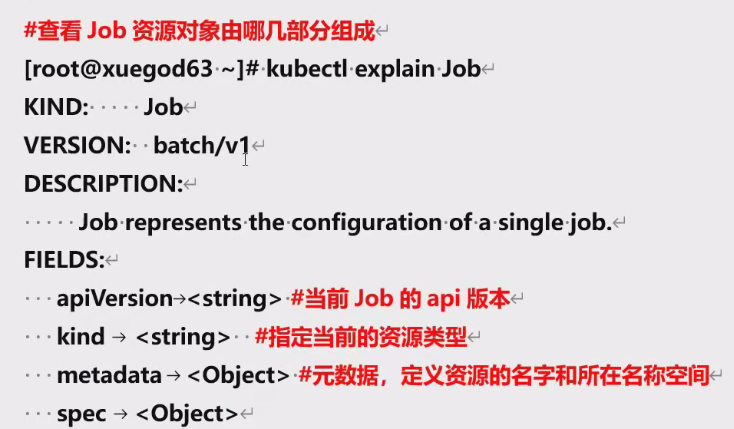
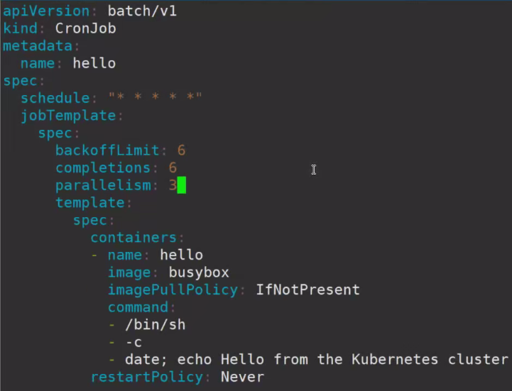

## 一、k8s控制器-Replicaset-Deployment-笔记

### 1. Replicaset概念，原理解读

1. Replica Set不断检查Pod副本数量符合指定数量。
2. 如果Pod数量少于指定数量，Replica Set会创建新的Pod。 
3. 如果Pod数量多于指定数量，Replica Set会删除多余的Pod。

#### 1.1 如何管理pod

1. Replica Set资源的主要字段包括template、replicas和selector。 
2. Template定义Pod的模板，包括容器镜像、标签等。 
3. Replicas指定要创建的Pod副本数量。 4.Selector用于选择要管理的Pod。

#### 1.2 Replicaset资源清单编写（kubectl explain rs）

1. 创建一个Replica Set资源，用于管理Pod的副本数量。
2. 通过yaml文件定义Replica Set资源，包括API version、metadata、spec等字段。
3. spec下定义 Replicas , Selector , template, template 包括 metadata 和 spec ，其中 spec 包含container、image、ports等字段。
4. Replicas指定要创建的Pod副本数量。 
5. Selector用于选择要管理的Pod。
6. 创建完成后，通过kubectl命令查看Replica Set和Pod的状态。

#### 1.3 高级功能

1. Replica Set支持扩容和缩容。（kubectl edit rs  或者修改完再kubectl apply）
2. 通过修改Replica Set资源的副本数，可以实现Pod的扩容和缩容。 
3. 更新Pod的镜像也需要手动删除旧的Pod，然后基于新的镜像重新创建。

### 2.Deployment控制器概念，原理解读

1. Deployment用于管理Replica Set，提供更多功能。 
2. Deployment可以自动更新Pod的镜像，并支持回滚。
3. Deployment还提供扩容和缩容功能。

原理：Deployment 通过创建和管理 ReplicaSet 和 Pod 来实现对应用的部署和管理。当Pod 需要更新时，Deployment 会根据新的 Pod 模板创建新的ReplicaSet，并逐步增加新的 Pod 副本，同时逐渐减少旧的 ReplicaSet 的 Pod 副本数量，直到新的 ReplicaSet中所有Pod副本都处于运行状态。

#### 2.1 Deployment资源清单编写

1. Deployment资源的主要字段包括metadata、spec、 spec .template和 spec .strategy。 
2. Metadata定义资源的名称和标签。 
3. Spec定义Deployment的规格，包括template、replicas、strategy等。 
4. Template定义Pod的模板，包括container、image、ports等字段。
5. Strategy定义更新策略，如滚动更新。

####  2.2 Deployment高级功能

1. 通过修改Deployment资源的副本数，可以实现Pod的扩容和缩容。 （kubectl edit deploy  或者修改完再kubectl apply ）
2. 更新Pod的镜像也需要自动删除旧的Pod，不需要手动删除了
3. 查看历史版本`kubectl rollout history deployment *******`
4. 回滚`kubectl rollout undo deployment *** --to-revision1`

####  2.3 Deployment节点反亲和性

根据pod反亲和性部署在不同节点

### 3 Kubectl常用命令补充

kubectl是k8s的命令行工具，用于管理k8s集群。 

1. 常用命令包括cordon（节点维护）、drain（节点排水）、scale（自动补全）等。 

2. cordon：对节点进行维护，保护节点不受新的pod调度影响。 

   `kubectl cordon nodename`

3. drain：除了设定此节点不可用之外，还会将节点上的pod驱逐走，适用于节点更新或维护场景。 

   `kubectl drain nodesname  `

4. scale：用于扩容和缩容，可以手动或自动调整pod副本数。不影响yaml文件，建议基于yaml文件扩容

   `kubectl scale --current-replicaset=2 --replicaset=3  deploy/myapp`

5. autoscale：autoscale 命令用于自动扩展确认，scale 需要手动执行，而 autoscale 则会根据负载进行调解。而这条命令则可以对 Deployment 进行设定，通过最小值和最大值的指定进行设定。`kubectl autoscale deployment myapp --min=2 --max=10` --max会对scale手动扩容最大副本数限制。如果需解除限制，，需要删除hpa。  `kubectl delete hpa`

   

## 二、k8s控制器-Daemonset-Job-笔记

### 1.Daemonset控制器：概念，原理解读

DaemonSet是Kubernetes 中的一种资源对象，它用于确保集群中的**每个节点都运行着一个相同的 Pod 副本**。与 Deployment或 ReplicaSet 不同，它们会尽量确保在每个节点上运行指定数量的 Pod副本。←

DaemonSet通常用于在集群的每个节点上运行一些特殊的系统级别任务，例如**日志收集、监控代理或网络插件**。它们还可用于确保集群中的每个节点都具有相同的配置或运行特定的系统服务。“

#### 1.1 Daemonset工作原理

1. 创建: 当你创建一个 DaemonSet对象时，Kubernetes 控制器会检查集群中的每个节点，并在每个节点上创建一个 Pod 副本。
2. 调度: Pod 的调度是由 Kubernetes 调度器处理的。调度器会根据节点的资源可用性和调度策略，将 Pod分配给适合的节点。通常情况下，每个节点只能运行一个 DaemonSet·Pod 副本。
3. 监控和自适应: 一旦 DaemonSet的 Pod 副本在节点上启动，Kubernetes 控制器会监视节点的状态。如果节点发生变化，比如节点故障、节点添加或移除，控制器将采取相应的措施来维持DaemonSet 的副本数量。例如，如果新节点加入集群，控制器将在新节点上创建一个 Pod 副本
4. 节点更新: 当集群中的节点需要进行系统更新或升级时，DaemonSet 可以与节点的更新流程进行集成。您可以设置 DaemonSet 的更新策略，以确保在节点更新时，Pod副本能够平滑地迁移到其他节点上，以保持集群的高可用性。

#### 1.2 Daemonset 与 Deployment的区别

1. Pod 副本的数量: 在 Deployment 中，你可以定义所需的 Pod 副本数量，Kubernetes 将确保在集群中运行指定数量的 Pod副本。而在 DaemonSet中，每个节点上只能运行一个 Pod 副本DaemonSet会自动在每个节点上创建Pod。
2. 调度策略: Deployment 的 Pod 可以在集群中的任何节点上进行调度，调度器会根据节点的可用性和资源情况来选择合适的节点。而 DaemonSet的 Pod只能在每个节点上运行一个副本，无法在同节点上运行多个相同的 Pod 副本。
3. 滚动更新: Deployment 支持滚动更新策略，可以控制 Pod 的版本升级过程，确保无中断地进行应用程序的更新。而 DaemonSet通常用于运行系统级别的任务，不涉及滚动更新。
4. 故障恢复和节点变化: Deployment 在节点故障或节点扩容时，会自动将 Pod 副本重新调度到其他可用节点上，以确保高可用性。而 DaemonSet 会在新节点加入集群或节点发生变化时，在新节点上创建一个 Pod 副本，以保持在每个节点上都运行一个 Pod 副本。

#### 1.3 Daemonset 资源清单编写

1. ```
   1. apiVersion:指定当前资源使用的·Kubernetes·AP·版本。在这个例子中，apiVersion 字段的值应该是一个字符串，表示该资源使用的API版本，通常是·“apps/v1"。
   2. kind:表示资源的类型。在这个例子中，kind 字段的值应该是一个字符串，表示该资源的类型，即:"DaemonSet"。
   3. metadata:包含关于资源的元数据，例如名称、命名空间、标签等。它是一个对象，其中可以包含以下字段:
      ​	`name: 指定·DaemonSet·的名称，是一个字符串。
      ​	`namespace: 指定·DaemonSet·所属的命名空间，是一个字符串。
      ​	`labels: 用于标识和组织资源的标签，是一个键值对的对象。
   4. spec:包含·DaemonSet·的规范定义，描述了容器的配置和部署。它是一个对象，其中可以包含以下字段:
      ​	template: 定义了要在每个节点上运行的·Pod·模板。包含了容器的规格、镜像、环境变量、挂载卷等配置。
      ​	selector: 用于选择将Pod分配给DaemonSet的节点的标签选择器。
      ​	updateStrategy:定义了·DaemonSet·的升级策略。这个字段是一个对象，其中可以包含以下字段:
       		type:指定升级策略的类型，可以是“RollingUpdate".或·“OnDelete”。
   5. status:包含有关资源的当前状态信息，由·Kubernetes·系统自动生成并更新，不能手动修改。它是一个对象，其中可以包含DaemonSet的运行状态、副本数、事件等信息。
   ```
   
   

### 2.Job和CronJob控制器：概念，原理解读

#### 2.1 Job概念、原理

在 Kubernetes 中，Job 是一种用于执行短暂任务的资源对象。它用于在集群中创建一个或多个Pod 来完成任务，确保任务成功完成后自动终止



```
spec字段下： 
1. activeDeadlineSeconds <integer>: 通过指定job存活时间，来结束一个job。当job 运行时间达到 activeDeadlineSeconds指定的时间后，job 会停止由它启动的所有任务(如:pod)，并设置job 的状态为 failed

2. backoffLimit  <integer>·#job 建议指定 pod 的重启策略为 never,如:.spec.template.spec.restartPolicy·=."Never"，然后通过job的 backoffLimit 来指定失败重试次数，在达到 backoffLimit 指定的次数后，job 状态设置为failed(默认为6次)

3. completions <integer> 指定job启动的任务(如:pod)成功运行completions次job 才算成功结束

4. <manualSelector> <boolean>

5. parallelism> <integer> 指定job同时运行的任务(如:pod)个数，Parallelism 默认为 1如果设置为 0，则job 会暂定
```

spec.template.spec.restartPolicy一般设为Never

#### 2.2 CronJob 概念、原理

CronJob 是Kubernetes 中的一种资源对象，用于调度周期性的任务。它基于类似于 Unix 系统的 cron 表达式来定义任务的执行时间和频率。CronJob 负责创建和管理与定期任务相关的Job



#### 2.3 实战:使用 CronJob 定期备份 MySQL 数据

CronJob 所描述的，正是定时任务。
1、在给定时间点只运行一次“
2、在给定时间点周期性地运行
一个CronJob 对象类似于 crontab (cron table)文件中的一行。它根据指定的预定计划周期性地运行一个 Job。在这里简单的说一下cron，是指 unix 中 cron 表达式。比如:"`*/1*****`"，这个Cron 表达式里`*/1` 中 *表示从0开始，/表示”每”，1表示偏移量，所以它的意思是:从0开始，每1个时间单位执行一次。Cron表达式中五个部分分别代表:分钟，小时，日，月，星期。所以上述这句Cron 表达式的意思是:从当前开始，每分钟执行一次。那么我们可以利用这个机制来指定创建 mysql备份任务的对象


## 三、k8s控制器-Statefulset-笔记

### 1.Statefulset控制器：概念，原理解读

#### 1.1 Statefulset原理

StatefulSet是Kubernetes 中的一种控制器(Controller)，<span class="red-text"><span style="color: red;">用于管理有状态应用程序的部署。</span></span>与Deployment控制器不同，StatefulSet为每个Pod实例分配了一个唯一的标识符，并确保这些标识符在 Pod 重新创建时保持不变。这为有状态应用程序提供了一些关键的功能和保证，例如稳定的网络标识符、有序的部署和扩展以及持久化存储。


下面是 StatefulSet 的一些基本介绍:

1. 唯一标识符: 每个 StatefulSet 管理的 Pod 实例都被分配了一个唯一的标识符，通常是一个整数索引。这个标识符可以用于在网络中唯一地标识每个 Pod 实例。
2. 稳定的网络标识符: StatefulSet 中的每个 Pod 实例都有一个稳定的网络标识符，<span class="red-text"><span style="color: red;">通常是一个DNS 名称。</span></span>这使得其他应用程序可以通过名称轻松地访问特定的 Pod实例，而不需要关注其具体的IP地址变化。
3. 有序的部署和扩展: StatefulSet 控制器确保 Pod 实例按照定义的顺序逐个启动和关闭。这对于依赖先前实例状态的应用程序非常重要。此外，扩展StatefulSet 时，新的 Pod 实例也会按照指定的顺序逐个创建。
4. 持久化存储: <span class="red-text"><span style="color: red;">StatefulSet 允许每个 Pod实例关联一个持久化卷(Persistent·Volume)，这使得有状态应用程序可以在 Pod 重新创建时保留其数据。</span></span>这为应用程序提供了持久化存储的能力，使得数据不会丢失或重置。

**备注:什么是有状态服务?**
有状态服务是指在服务运行过程中<span class="red-text"><span style="color: red;">需要维护和管理一些状态信息的服务。</span></span>与之相对的是无状态服务它们在处理请求时不依赖或不保存任何状态信息。

有状态服务的一个常见场景是在分布式系统中，当需要处理一系列相关的请求时，服务可能需要保留<span class="red-text"><span style="color: red;">先前请求的状态信息（会话保持）</span></span>。例如，一个在线购物网站的结账过程，每个请求都需要知道当前用户的购物车内容、支付状态等信息，这些信息需要在整个结账过程中保持一致性。又或者，在一个聊天应用中，服务需要跟踪每个用户的聊天历史记录以提供正确的会话。

为了实现有状态服务，可以采用以下方法之一:
**1、会话状态:** 在每个客户端和服务之间建立一个会话，<span class="red-text"><span style="color: red;">将状态信息存储在会话中。</span></span>客户端在每个请求中提供会话标识符，服务根据该标识符检索和更新相应的状态。常见的实现方式是使用会话标
识符和键值存储(如 Redis)来存储状态信息。

**2、数据库存储:** <span class="red-text"><span style="color: red;">将状态信息存储在数据库中。</span></span>服务可以将状态数据存储在关系型数据库(如MySQL)或 NoSQL数据库(如 MongoDB)中。<span class="red-text"><span style="color: red;">通过数据库查询和更新操作，服务可以管理状态的读取和修改。</span></span>

**3、分布式状态管理:** 分布式系统中，可以使用一些分布式管理工具(<span class="red-text"><span style="color: red;">例如zookeeper、etcd或 Consul</span></span>)来存储和管理状态信息。这些工具提供了分布式一致性保证，允许多个服务实例之间共享和同步状态。“

#### 1.2 Statefulset资源清单编写技巧

查看 StatefulSet 资源的字段定义，使用以下命令:kubectl·explain·statefulset

字段说明:

- apiVersion:定义 StatefulSet 资源需要使用的 API版本。

- kind:定义资源类型。

- metadata:元数据对象，包含StatefulSet的描述信息。

- spec:容器相关的信息，定义了 StatefulSet 中 Pod 的期望标识

    - podManagementPolicy: Pod 的管理策略。

    - replicas:副本数，定义StatefulSet中 Pod 的数量。

    - revisionHistoryLimit:保留的历史版本数。
    
    - selector:标签选择器，用于选择与之关联的 Pod。
    
    - serviceName:Headless·Service 的名称。
    
    - template:生成 Pod 的模板，用于描述将创建的 Pod 的属性。
    
    - updateStrategy:更新策略，定义如何更新Pod。
    
    - volumeClaimTemplatés:存储卷申请模板，定义 Pod 使用的存储卷。
    

案例：

须确保nfs-provisioner装好

```yaml
apiVersion: apps/v1
kind: StatefulSet
metadata:
  name: web
spec:
  replicas: 3
  selector:
    matchLabels:
      app: nginx
  serviceName: nginx-service
  template:
    metadata:
      labels:
        app: nginx
    spec:
      containers:
      - name: nginx
        image: nginx:latest
        ports:
        - containerPort: 80
          name: web
        volumeMounts:
        - name: www
          mountPath: /usr/share/nginx/html
  volumeClaimTemplates:
  - metadata:
      name: www
    spec:
      accessModes: ["ReadWriteOnce"]
      resources:
        requests:
          storage: 1Gi
```

#### 1.3 service和headless service的区别

普通service：即 `ClusterIP`、`NodePort` 或 `LoadBalancer` 类型的 Service。

Headless Service： 是 Service 的一个特殊类型。它的创建方式是：在 Service 的定义中将 clusterIP 字段设置为 None。

| 特性               | Service (普通 Service)                               | Headless Service (无头 Service)                              |
| ------------------ | ---------------------------------------------------- | ------------------------------------------------------------ |
| **Cluster IP**     | 有一个稳定的虚拟 Cluster IP                          | 没有 Cluster IP                                              |
| **代理与负载均衡** | `kube-proxy` 负责代理和负载均衡请求                  | 不进行代理和负载均衡，负载均衡由客户端或应用层处理           |
| **DNS 解析**       | 解析到 Service 的 Cluster IP                         | Service 名称解析为所有后端 Pods 的 IP 地址列表               |
| **客户端感知**     | 客户端通过 Service 的统一 IP 访问，隐藏后端 Pods     | 客户端直接获取并访问后端 Pods 的 IP 地址，暴露每个 Pod       |
| **典型用途**       | 无状态应用，需要统一入口和负载均衡 (Web 服务器、API) | 有状态应用，需要稳定网络标识和直接访问 Pod (数据库、ZooKeeper)，常与 StatefulSet 配合 |


## 四、k8s 配置管理中心-Configmap

#### 1. Configmap 概述

ConfigMap: Kubernetes的资源，<span style="color:red">是为了将应用程序的配置数据与容器镜像分离</span>，提供了一种集中管理和动态更新配置的机制。通过使用ConfigMap，可以在不重新构建或重新部署应用程序的情况下修改配置信息，从而增强了应用程序的可配置性和可维护性。

#### 2. ConfigMap 的创建方式

##### 	2.1 从文件创建：

从名为 `app.properties` 的文件创建

```json
database.url=jdbc:mysql://mysql-service:3306/mydb
app.port=8080
```

使用以下命令创建 ConfigMap：

```bash
kubectl create configmap app-config --from-file=app.properties
```

##### 	2.2 从目录创建：

一个目录中包含多个配置文件，可以一次性创建 ConfigMap

```bash
./config-files/
├── app.conf:{
	APP_ENV=production
	APP_DEBUG=false}
└── db.conf:{
	DB_HOST=localhost
	DB_PORT=5432}
```


```bash
kubectl create configmap my-config --from-dir=config-files/
```

将把 `config/` 目录下所有文件的内容作为独立的键值对存储到 ConfigMap 中，键为文件名，值为文件内容。

##### 	2.3 直接创建（从字面值创建）

```bash
kubectl create configmap my-config --from-literal=key1=value1 --from-literal=key2=value2
```

##### 	2.4 通过 YAML 文件创建：

```yaml
apiVersion: v1
kind: ConfigMap
metadata:
  name: my-app-config
data:
  # 直接定义键值对
  application.name: "My Awesome App"
  environment: "production"
# 或者存储文件内容
# 您也可以在这里定义多行字符串，模拟文件内容
  config.properties: |
    server.port=8080
    spring.datasource.url=jdbc:mysql://mysql-db:3306/myapp
    spring.datasource.username=user
    spring.datasource.password=password
```

保存为 `configmap.yaml` 后，执行 `kubectl apply -f configmap.yaml`。


#### 3. ConfigMap 在 Pod 中的使用

ConfigMap 的数据可以通过以下三种主要方式注入到 Pod 中：

##### 	3.1 作为环境变量：

```yaml
apiVersion: v1
kind: Pod
metadata:
  name: my-pod-env
spec:
  containers:
  - name: my-container
    image: nginx
    env:
    - name: APP_NAME
      valueFrom:
        configMapKeyRef:
          name: my-app-config # ConfigMap 的名称
          key: application.name # ConfigMap 中的键
    - name: ENV
      valueFrom:
        configMapKeyRef:
          name: my-app-config
          key: environment
```

##### 	3.2 作为卷中的文件:

这是最常用的方式，可以将 ConfigMap 中的键值对作为文件挂载到 Pod 的指定路径下。

```yaml
apiVersion: v1
kind: Pod
metadata:
  name: my-pod-volume
spec:
  containers:
  - name: my-container
    image: nginx
    volumeMounts:
    - name: config-volume
      mountPath: /etc/config # Pod 内部挂载的路径
  volumes:
  - name: config-volume
    configMap:
      name: my-app-config # ConfigMap 的名称
      # items: # 可以选择性地挂载 ConfigMap 中的特定键
      # - key: config.properties
      #   path: application.properties # 挂载到 /etc/config/application.properties
```

##### 	3.3 通过 `envFrom` 将所有数据作为环境变量：

将 ConfigMap 中的所有键值对都作为环境变量注入，可以使用 `envFrom`

```yaml
apiVersion: v1
kind: Pod
metadata:
  name: my-pod-envfrom
spec:
  containers:
  - name: my-container
    image: nginx
    envFrom:
    - configMapRef:
        name: my-app-config
```

