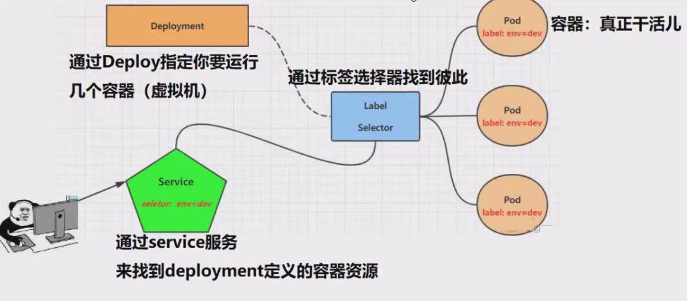

## 一、Kubernetes中的四层代理Service-笔记

## 1. Service 基本介绍

​		在Kubernetes中，四层代理(Layer·4·Proxy)是指基于网络层(传输层)的代理，用于将网络请求从一个源地址路由到一个目标地址。

​		Kubernetes 中的 **Service** 是实现四层代理（基于传输层的负载均衡和服务发现）的核心资源。它定义了一组具有相同标签的 Pod 的逻辑集合，并通过虚拟 IP（ClusterIP）提供统一的访问入口。Service 负责将客户端请求路由到后端 Pod，实现负载均衡和服务发现。

### 1.1 核心特性

- **四层代理**：基于网络传输层（TCP/UDP），实现请求路由。
- **虚拟 IP（ClusterIP）**：Service 自动分配的集群内部 IP，客户端通过 ClusterIP 访问后端 Pod。
- **端口映射**：将 Service 的端口映射到后端 Pod 的容器端口。
- **负载均衡**：通过 kube-proxy 将请求分发到多个后端 Pod，支持轮询或随机算法。
- **DNS 解析**：Service 自动注册到集群 DNS，格式为 <service-name>.<namespace>.svc.cluster.local，客户端可通过服务名访问。


### 1.2 Service 与 Pod 的关系




- **为什么需要 Service 而非直接访问 Pod IP？**
  1. Pod IP 动态变化（因重启、扩缩容等），直接访问不稳定。
  2. Service 通过标签选择器（Label Selector）关联 Pod，提供稳定的访问入口。
  3. Service 自动维护 Endpoint 对象，记录后端 Pod 的 IP 和端口，动态更新以适应 Pod 变化。
- **工作流程**：
  1. 客户端请求 Service 的 ClusterIP 和端口。
  2. kube-proxy 根据 Endpoint 对象选择后端 Pod。
  3. 请求通过负载均衡转发到目标 Pod。
- **查看 Service 信息**：
  - 使用 kubectl describe service <service-name> 查看 Service 详情，包括关联 Pod 的 IP 和端口。
  - Service 的 IP 和端口规则存储在 IPVS 或 iptables 中，由 kube-proxy 管理。

### 1.3 Kubernetes 中的 IP 地址类型

| 类型          | 描述                                                         |
| ------------- | ------------------------------------------------------------ |
| **Pod IP**    | 每个 Pod 分配的独立 IP，用于集群内部 Pod 间通信。            |
| **ClusterIP** | Service 的虚拟 IP，仅限集群内部访问，用于服务发现和负载均衡。 |
| **Node IP**   | 集群节点的 IP，用于外部访问（如 NodePort 类型）或与外部网络通信。 |

## 2. 创建 Service 资源

### 2.1 Service 关键字段

以下是 kubectl explain service.spec 中的主要字段：

| 字段                              | 类型              | 描述                                                         |
| --------------------------------- | ----------------- | ------------------------------------------------------------ |
| **allocateLoadBalancerNodePorts** | boolean           | 是否动态分配负载均衡器的节点端口（NodePort 类型）。          |
| clusterIP                         | string            | Service 的虚拟 IP，默认由系统自动分配。                      |
| clusterIPs                        | []string          | Service 的多个 ClusterIP 地址（支持多栈）。                  |
| externalIPs                       | []string          | 外部 IP 地址列表，用于集群外部访问 Service。                 |
| **externalName**                  | string            | 外部 DNS 名称，用于映射外部服务（ExternalName 类型）。       |
| externalTrafficPolicy             | string            | 外部流量策略（Local 或 Cluster）。                           |
| healthCheckNodePort               | integer           | 健康检查的节点端口（NodePort 类型）。                        |
| ipFamilies                        | []string          | 支持的 IP 地址族（IPv4/IPv6）。                              |
| ipFamilyPolicy                    | string            | IP 地址族策略（SingleStack 或 PreferDualStack）。            |
| loadBalancerIP                    | string            | 负载均衡器的固定 IP 地址（LoadBalancer 类型）。              |
| loadBalancerSourceRanges          | []string          | 允许访问负载均衡器的源 IP 范围。                             |
| **ports**                         | []Object          | Service 监听的端口映射（包括协议、端口、目标端口等）。       |
| **selector**                      | map[string]string | 标签选择器，用于选择关联的后端 Pod。                         |
| sessionAffinity                   | string            | 会话亲和性策略（None 或 ClientIP）。                         |
| sessionAffinityConfig             | Object            | 会话亲和性配置参数。                                         |
| topologyKeys                      | []string          | 服务拓扑感知的键列表。                                       |
| **type**                          | string            | Service 类型（ClusterIP、NodePort、LoadBalancer、ExternalName）。 |

### 2.2 Service 类型

Kubernetes 支持以下 Service 类型，适用于不同场景：

| 类型             | 描述                                                         | 应用场景                            |
| ---------------- | ------------------------------------------------------------ | ----------------------------------- |
| **ClusterIP**    | 默认类型，分配虚拟 ClusterIP，仅限集群内部访问。             | 集群内部服务发现和访问。            |
| **NodePort**     | 通过节点 IP 和固定端口（默认 30000-32767）暴露服务。<font color='red'>通过指定 NodePort 类型-Kubernetes 会为 Service 分配一个随机的高端口号</font> | 外部通过 <NodeIP>:<NodePort> 访问。 |
| **LoadBalancer** | 通过云提供商的负载均衡器暴露服务，分配公共 IP。<font color='red'>Kubernetes 将与云服务提供商	集成，自动创建外部负载均衡器</font> | 高可用性公网服务。                  |
| **ExternalName** | 将 Service 映射到外部 DNS 名称，无 ClusterIP，直接解析外部地址。<font color='red'>当集群内部的 Pod 或 Service 访问该 Service 时，DNS 解析将会直接返回该外部 DNS名称对应的IP 地址</font>。 | 集成外部服务或跨命名空间访问。      |

### 2.3 Service 端口配置

Service 的 ports 字段定义端口映射，包含以下关键参数：

| 字段       | 描述                                                        |
| ---------- | ----------------------------------------------------------- |
| protocol   | 协议类型（TCP、UDP、SCTP），默认 TCP。                      |
| port       | Service 监听的端口号，客户端通过此端口访问。                |
| targetPort | 后端 Pod 容器的端口号或名称，请求转发到此端口。             |
| nodePort   | NodePort 类型中节点暴露的端口号（若未指定，系统自动分配）。 |

**service完整的DNS名字：Service_name.svc_namespace.svc.cluster.local**

**示例 YAML**：

```yaml
apiVersion: v1
kind: Service
metadata:
  name: my-service
  namespace: default
spec:
  selector:
    app: my-app
  ports:
  - protocol: TCP
    port: 80
    targetPort: 8080
  type: ClusterIP
```

### 2.4 映射外部服务

- **方法**：创建 ExternalName 类型的 Service 或手动创建 Endpoint 对象，不关联 Pod。

- **示例（ExternalName）**：

  ```yaml
  apiVersion: v1
  kind: Service
  metadata:
    name: external-service
  spec:
    type: ExternalName
    externalName: example.com
  ```

- **手动 Endpoint 示例**：

  ```yaml
  apiVersion: v1
  kind: Endpoints
  metadata:
    name: external-service
  subsets:
  - addresses:
    - ip: 192.168.1.1
    ports:
    - port: 80
  ```

## 3. 总结

- **Service 作用**：提供稳定的访问入口，实现负载均衡和服务发现。
- **核心机制**：通过 ClusterIP、标签选择器和 Endpoint 对象管理 Pod 的动态变化。
- **关键组件**：kube-proxy 实现四层代理，基于 IPVS 或 iptables 转发流量。
- **应用场景**：根据 ClusterIP、NodePort、LoadBalancer 或 ExternalName 类型选择合适的访问方式。
