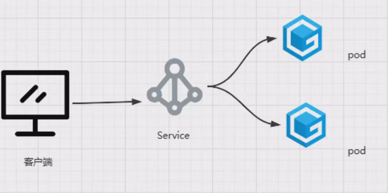

## 一、Kubernetes中的四层代理Service-笔记

### 1.Service的基本介绍

在Kubernetes中，四层代理(Layer·4·Proxy)是指基于网络层(传输层)的代理，用于将网络请求从一个源地址路由到一个目标地址。在Kubernetes中，Service(服务)作为四层代理的一种实现方式，用于实现服务的负载均衡和服务发现。Service 是 Kubernetes 中的一个资源对象，它定义了一组具有相同标签的 Pod 的逻辑集合，并为这组 Pod 分配了一个虚拟 IP(Cluster·IP)。Service 充当了网络终结点，客户端可以通过访问 Service的虚拟 IP 来访问后端的 Pod。

总结：1.四层代理基于网络层，实现网络请求的路由。

​			2.Kubernetes中的Service资源实现四层代理。 

​			3.Service通过标签选择器找到后端Pod，并将请求代理给它。

**Cluster·IP:** 每个 Service 都分配了一个 Cluster·IP，它是一个虚拟的内部IP 地址，用于在集群部进行访问。这个虚拟IP 是由Kubernetes 自动分配的，并且与Service 对象一一对应。

**端口映射:** Service 可以映射一个或多个端口到后端 Pod 的端口。这意味着客户端可以通过访问Service 的某个端口来访问后端 Pod 的应用程序。

**负载均衡:** Service 使用四层代理实现负载均衡，将来自客户端的请求均匀地分发到后端的 Pod。当多个 Pod 属于同一个 Service 时，Service 会自动将请求路由到可用的 Pod 上，以实现负载均衡。

**DNS 解析:** 每个 Service 都会自动注册到 Kubernetes 集群的内置 DNS 中，通过服务名称可以解析出 Service 的虚拟 IP。这样，客户端可以使用服务名称作为域名来访问 Service，而无需知道具体的虚拟 IP 地址

#### 1.1Service与pod之间的关系

**为什么不直接请求 Pod的ip?而是要创建 Service?**
1.Pod IP可能变化，直接访问Pod IP风险高。 
2.Kubernetes控制器会重新创建Pod，导致IP变化。
3.通过Service代理可以更好地管理Pod的变化。

在 Kubernetes 中创建 Service 时，会使用标签选择器(Label·Selector)来筛选符合条件的Pod，并为这些 Pod 创建与 Service 同名的 Endpoint对象。Endpoint 对象记录了 Service 所关联的后端 Pod 的网络地址信息，当 Pod 的地址发生变化时(例如 Pod 重启、扩缩容导致 Pod 重新调度等)，Endpoint 对象会相应地更新 Pod 地址。

当前端客户端发起请求到 Service 的虚拟 IP 时，Service 通过查找与其关联的 Endpoint对象寻获取到当前可用的后端 Pod 的地址列表。然后，由负载均衡组件(如kube-proxy)根据特定的负载均衡算法(例如轮询、随机等)从地址列表中选择一个目标 Pod，将请求转发到该 Pod 进行访问。

这样的架构使得前端客户端无需直接关注后端 Pod 的变化和调度情况，而是通过 Service 来访问后端应用程序。Service 提供了抽象和透明的方式来进行负载均衡和服务发现，确保了应用程序的高可用性和可伸缩性

 **1.通过kubectl describe命令查看Service的详细信息。** 

 **2.Service的详细信息包括与其关联的Pod的IP和端口。**

 **3.Service的IP和端口保存到IPVS规则或iptables规则中。**

#### 1.2 K8s集群中的IP地址

1. Pod IP：每个运行的 Pod 都会分配一个独立的IP 地址。Pod·IP 地址是集群内部的IP地址，用于 Pod 之间的通信。
2.  Service IP：Service 对象分配的虚拟IP 地址称为 Cluster·IP。Cluster·P 是集群内部的 IP 地址，用于在集群内部进行服务发现和访问。客户端可以通过访问 Service 的Cluster·IP 地址来访问与该 Service 相关联的一组 Pod
3.  Node IP：Node(节点)是Kubernetes 集群中的工作节点，每个节点都有一个 IP 地址。Node·P 地址用于与集群外部的网络进行通信，例如从外部访问集群中的服务。NodeIP 地址可以是物理节点的IP 地址或云提供商分配的虚拟IP地址

#### 1.3 创建service资源

**kubectl explain service.spce：**

**allocateLoadBalancerNodePorts·(boolean):** **表示是否动态分配负载均衡器的节点端口。**

**clusterlP·(string):** 表示Service的 Cluster·IP 地址，用于集群内部访问 Service，默认由系统自动分配。

**clusterlPs·([]string):** 表示Service的多个 Cluster·IP 地址，用于集群内部访问Service。

**externallPs·([]string):** 表示将 Service 公开到集群外部的外部 IP 地址列表。

**externalName·(string): 表示 Service 的外部名称，用于将 Service 映射到外部DNS 名称。**

**externalTrafficPolicy·(string):** 表示 Service 外部流量的负载均衡策略，可选为"Local"或"Cluster"。

**healthCheckNodePort·(integer):** 表示健康检查的节点端口

**ipFamilies·([]string):** 表示 Service 支持的IP 地址族列表。ipFamilyPolicy·(string):表示Service 的IP 地址族策略，可选值为"SingleStack'或"PreferDualStack"。

**loadBalancerlP.(string):** 表示分配给负载均衡器的IP 地址。

**loadBalancerSourceRanges·([]string)：**表示允许访问负载均衡器的源IP 地址范围。

**ports·([]Object): 定义 Service 监听的端口映射配置，包括协议、端口号和目标端口等。**

**publishNotReadyAddresses·(boolean):** 表示是否将未就绪的 Pod的地址也发布给 Service。

**selector·(map[string]string): 标签选择器，用于选择与 Service 关联的后端 Pod。**

**sessionAffinity·(string):** 表示会话亲和性的策略，可选值为"None"、"ClientlP"或'Clientlp"。

**sessionAffinityConfig·(Object):**会话亲和性的配置参数。topologyKeys·([]string):表示用于服务拓扑感知的键列表。

**topologyKeys·([]string):** 表示用于服务拓扑感知的键列表。

**type·(string):** **表示 Service 的类型，可选值为"Clusterlp"、"NodePort"'LoadBalancer"或"ExternalName"**

##### 1.3.1 service类型

Kubernetes 中的 Service 类型定义了不同的访问方式和应用场景。以下是几种常见的:Service 类型以及它们的应用场景:
1.**ClusterlP**:适用于集群内部访问。
	类型:ClusterlP是默认的 Service 类型。
	应用场景:适用于集群内部的服务发现和访问。ClusterlP 将为Service 分配一个虚拟的 ClusterIP 地址，只能在集群内部访问。通过该地址，其他Pod或Service 可以访问与之关联的一组 Pod。

2.**NodePort**:适用于在Kubernetes集群外部访问。
	类型:NodePort 类型将 Service 公开到集群节点上的某个固定端口。
	应用场景:适用于需要从集群外部访问 Service 的场景。通过指定 NodePort 类型-Kubernetes 会为 Service 分配一个随机的高端口号，并将该端口映射到每个节点上。从外部网络，可以通过`<NodelP>:<NodePort>`的方式访问Service。

3.**LoadBalancer**:适用于将服务映射到公网上。
	类型:LoadBalancer 类型通过云服务提供商的负载均衡器将 Service 公开到外部网络。“
	应用场景:适用于需要高可用性和负载均衡的场景。通过LoadBalancer 类型，Kubernetes 将与云服务提供商	集成，自动创建外部负载均衡器，并将流量分发到Service 关联的 Pod。外部客户端可以通过负载均衡器的公共IP 访问 Service。

4.**ExternalName**:适用于跨名称空间访问或代理外部服务。
	类型:ExternalName 类型是一种将 Service 映射到外部 DNS 名称的方式。
	应用场景:适用于将 Service 与外部服务集成的场景。通过 ExternalName 类型，Service 不会分配 ClusterIP 或 NodePort，而是直接映射到一个外部 DNS 名称。当集群内部的 Pod 或 Service 访问该 Service 时，DNS 解析将会直接返回该外部 DNS名称对应的IP 地址。

##### 1.3.2：service的port

**protocol**: 该字段可选，用于指定端口使用的协议，如TCP、UDP或SCTP。默认情况下，为TCP 协议。根据实际需求选择正确的协议。“

**port**: 该字段必需，用于定义 Service 监听的端口号。当其他 Pod或 Service 访问该 Service时，将使用此端口号。“

**targetPort**: 该字段必需，用于指定与该端口关联的 Pod 容器的端口号或名称。当请求到达Service 后，将使用此端口号将流量转发到后端 Pod 的容器端口。

**nodePort**: 该字段仅在 NodePort 类型的 Service 中可选。它用于指定在每个节点上公开的端口号。如果未指定，Kubernetes将自动分配一个端口号。

**service完整的DNS名字：Service_name.svc_namespace.svc.cluster.local**

1.3.3：映射外部服务

创建service不选择pod，单独创建endpoint。

