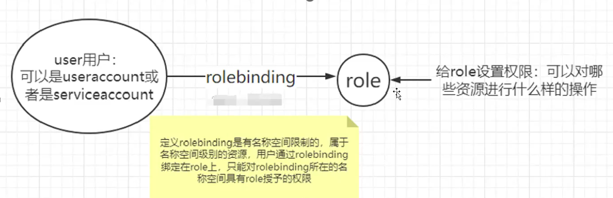
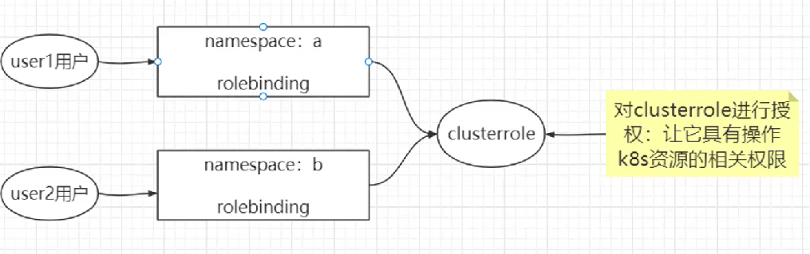
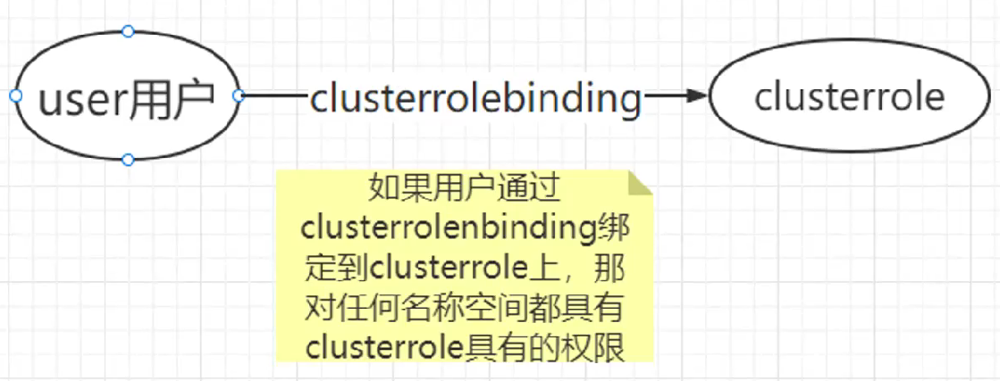

### 一、k8s-Apiserver安全机制之RBAC授权-笔记

#### 1·k8s·认证、授权、准入控制机制

Kubernetes (K8s) 在处理用户或服务对集群的操作请求时，会经历三个关键的安全阶段：**认证 (Authentication)**、**授权 (Authorization)** 和**准入控制 (Admission Control)**。

- **认证 (Authentication):** 这是请求进入集群的第一道防线。它的目标是**验证请求者的身份**。Kubernetes 支持多种认证方式，包括<span style="color:red">客户端证书</span>、用户名和密码、Bearer Token（例如服务账户的Token）、OpenID Connect (OIDC) 等。只有通过认证的请求，才会被认为是合法的，并进入下一个阶段。

- **授权 (Authorization):** 在请求者的身份被确认后，授权阶段会**判断该请求者是否有权限执行其请求的操作**。例如，用户“Alice”是否被允许在“default”命名空间中创建 Pod。如果请求者被授权，请求会继续；否则，请求会被拒绝。RBAC (Role-Based Access Control) 是 Kubernetes 最常用和推荐的授权机制。
- **准入控制 (Admission Control):** 这是请求进入集群的最后一道关卡。准入控制器是一组在请求被持久化到 Etcd 之前拦截请求的插件。它们可以用于**修改请求**（如注入 sidecar）、**验证请求**（如确保所有 Pod 都有资源限制）、甚至**拒绝请求**（如不允许创建特权容器）。准入控制提供了一种强大的方式来实施集群级别的策略。

#### 2·认证和授权基本介绍

##### 	2.1 Useraccount介绍

​	Kubernetes 本身**不管理用户账号**，它依赖外部系统（如证书、OAuth、令牌等）来识别用户身份

| 类型                           | 说明                                                         |
| ------------------------------ | ------------------------------------------------------------ |
| **UserAccount（普通用户）**    | UserAccounts 是为Kubernetes 集群外部的用户设计的，通常用于运维或集群管理人员 |
| **ServiceAccount（服务账号）** | 用于 Pod 或 Controller 内部访问 API 的账号（自动创建）       |

​	在使用kubeadm 安装Kubernetes时，默认的用户账号是**kubernetes-admin**。用户通过 Kubernetes 客户端(通常使用 kubectl)与 APIServer 进行交互用的就是kubernetes-admin。kubernetes-admin这个用户就是 useraccount，可通过以下命令查看

```bash
kubectl config view --kubeconfig./config
```

​	当 Pod 中的容器进程需要访问 APIServer 时，使用的就是 ServiceAccount 账户。ServiceAccount 仅在其所在的命名空间中有效。在每个命名空间创建时，都会自动创建一个名为"default"的 ServiceAccount。如果在创建 Pod 时没有指定 ServiceAccount， Pod 将使用默认的 ServiceAccount

##### 	2.2 授权

RBAC<span style="color:red">(基于角色的访问控制)</span>是Kubernetes中的一种授权机制，它允许用户扮演特定角色并获得相应的权限。在 RBAC中，权限被定义在角色(Role)中，用户被绑定到这些角色上，从而获得相应的权限。

| 项目               | **Role**                                | **ClusterRole**                                       | **RoleBinding**                                      | **ClusterRoleBinding**              |
| ------------------ | --------------------------------------- | ----------------------------------------------------- | ---------------------------------------------------- | ----------------------------------- |
| **作用**           | 定义命名空间内权限规则                  | 定义集群范围权限规则                                  | 把 Role/ClusterRole 授权给主体（用户、组或服务账号） | 同上，但作用于整个集群              |
| **作用范围**       | 某个命名空间                            | 所有命名空间或集群级资源                              | 某个命名空间                                         | 全集群                              |
| **资源类型支持**   | 命名空间资源（Pods、Services 等）       | 命名空间资源 + 集群资源（Nodes、Namespaces、CRDs 等） | 把权限授予命名空间内某主体                           | 把权限授予所有命名空间或集群级主体  |
| **绑定的角色类型** | Role 或 ClusterRole                     | ClusterRole                                           | Role 或 ClusterRole                                  | ClusterRole（只能绑定 ClusterRole） |
| **典型用途**       | 限制某用户只能读写某个命名空间中的资源  | 给管理员、监控程序或控制器设置跨命名空间/集群权限     | 授权命名空间内某个服务账号使用 Role/ClusterRole 权限 | 授权全局权限给用户或服务账号        |
| **常用对象类型**   | Pods、ConfigMaps、Secrets（命名空间内） | Nodes、Namespaces、PersistentVolumes、CRD 等          | ServiceAccount、User（绑定 Role）                    | 监控服务、系统组件、管理员账号      |

**创建role：**

```yaml
apiVersion: rbac.authorization.k8s.io/v1
kind: Role
metadata:
  name: pod-reader
  namespace: dev
rules:
- apiGroups: [""]
  resources: ["pods"]
  verbs: ["get", "list", "watch"]
```

**创建 ClusterRole：**

```yaml
apiVersion: rbac.authorization.k8s.io/v1
kind: ClusterRole
metadata:
  name: cluster-readonly
rules:
- apiGroups: [""]
  resources: ["pods", "services", "configmaps"]
  verbs: ["get", "list", "watch"]
- apiGroups: ["apps"]
  resources: ["deployments"]
  verbs: ["get", "list", "watch"]
```

**附加说明：常见的 API Group 对应资源**

| `apiGroups` 值                | 包含的资源示例                                     |
| ----------------------------- | -------------------------------------------------- |
| `""`（空字符串）              | pods, services, configmaps, secrets, namespaces    |
| `"apps"`                      | deployments, daemonsets, statefulsets, replicasets |
| `"batch"`                     | jobs, cronjobs                                     |
| `"rbac.authorization.k8s.io"` | roles, clusterroles, rolebindings                  |
| `"networking.k8s.io"`         | ingress, networkpolicies                           |
| `"apiextensions.k8s.io"`      | customresourcedefinitions（CRD）                   |

###### 2.2.1 如果用户通过 RoleBinding 绑定到 Role，那么用户只会在该 Role 所在的名称空间中拥有权



```bash
kubectl create rolebinding read-pods-binding \      # read-pods-binding：新建的 RoleBinding 名称
  --role=pod-reader \							    # 绑定的角色（Role 或 ClusterRole）
  --serviceaccount=dev:my-sa \					    # 授予 dev 命名空间下的 my-sa 服务账号
  --namespace=dev									# 作用范围是 dev 命名空间
```


###### 	2.2.2 如果用户通过 RoleBinding 绑定到 ClusterRole，用户仅在 RoleBinding 所在的名称空间中拥有相应的权限。



###### 	2.2.3 通过 ClusterRoleBinding 绑定ClusterRole

通过 ClusterRoleBinding 将用户绑定到 ClusterRole，用户将在整个集群中拥有相应的权限。



kubernetes-admin可以通过ClusterRoleBinding绑定到ClusterRole上的，根据下面命令查看

```bash
kubectl get clusterrole
#NAME                                                                   CREATED AT
#admin                                                                  2025-06-19T06:58:43Z
kubectl get clusterrole cluster-admin -o yaml
#kind: ClusterRole
#metadata:
#  annotations:
#    rbac.authorization.kubernetes.io/autoupdate: "true"
#  creationTimestamp: "2025-06-19T06:58:43Z"
#  labels:
#   kubernetes.io/bootstrapping: rbac-defaults
#  name: cluster-admin
#  resourceVersion: "72"
#  uid: 595a8c69-577a-484b-976d-d30a8a0d10a7
#rules:
#- apiGroups:
#  - '*'
#  resources:
#  - '*'
#  verbs:
#  - '*'
#- nonResourceURLs:
#  - '*'
#  verbs:
#  - '*'
```


#### 3·RBAC 认证授权策略

#### 4·对 Service·Account 的授权管理

#### 5·限制不同的用户操作 k8s 集群

kubectl config view --kubeconfig./config