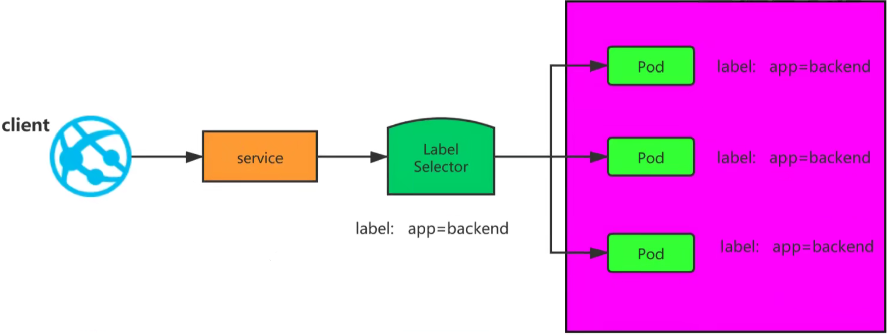
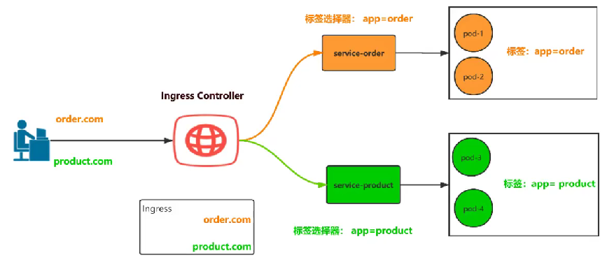

### 一、k8s-七层代理Ingress-笔记

### 1. 如何在 k8s 中实现应用的负载均衡？

在 Kubernetes (k8s) 中实现应用的负载均衡，核心思想是将外部请求或内部服务间的流量均匀地分发到多个应用实例（Pod）上，以提高应用的可用性、可伸缩性和性能。Kubernetes 提供了多种机制来实现负载均衡，主要可以分为以下几种：

1. **Service（服务）**: 这是 Kubernetes 最基本和最核心的负载均衡机制。`Service` 定义了一组 Pods 的逻辑抽象以及访问它们的策略。它为这组 Pods 提供了一个稳定的 IP 地址和 DNS 名称，并将流入 Service 的流量分发到其背后的一组 Pods。它主要工作在网络协议的第四层（传输层），即 TCP 或 UDP 协议。

   1.1. **Service 的工作原理：**

   当您创建一个 `Service` 对象时，Kubernetes 会为它分配一个稳定的 Cluster IP（集群内部 IP 地址）。`kube-proxy` 组件在每个节点上监听 `Service` 和 `Endpoints` 对象的变化。

   - `Endpoints` 对象：由 Kubernetes 自动创建和管理，它包含了 `Service` 所代理的所有后端 Pods 的 IP 地址和端口信息。
   - `kube-proxy` 根据 `Service` 和 `Endpoints` 的信息，在节点上配置网络规则（通常是 `iptables` 或 `IPVS`）。当有流量发送到 `Service` 的 Cluster IP 和端口时，这些规则会将流量转发到 `Endpoints` 中列出的某个后端 Pod。
   
   
   
   1.2. **Service 的类型：**
   
   ​	Kubernetes 的`Service` 支持几种不同的类型，以适应不同的负载均衡需求：
   
     - **ClusterIP（默认）**: 这是最常见的 Service 类型。它为 Service 分配一个集群内部的 IP 地址。Service 只能从集群内部访问。通常用于集群内部服务间的通信。
       - **示例场景**: 微服务之间相互调用。
     - **NodePort**: 在每个节点上暴露一个静态端口（NodePort）。外部流量可以通过 `NodeIP:NodePort` 访问 Service。
       - **示例场景**: 简单地从外部访问集群内部应用，但通常不建议生产环境直接使用，因为它需要手动管理端口并可能与节点端口冲突。
     - **LoadBalancer**: 如果您在支持外部负载均衡器的云环境（如 AWS ELB, GCP Load Balancer, Azure Load Balancer）中运行 Kubernetes，`LoadBalancer` 类型的 Service 会在云提供商处创建一个外部负载均衡器，并将外部流量路由到您的 Service。
       - **示例场景**: 将 Web 应用暴露给外部用户。
     - **ExternalName**: 将 Service 映射到 DNS 名称，而不是 IP 地址。它不涉及代理，只是返回一个 CNAME 记录。
       - **示例场景**: 内部服务需要访问外部数据库或服务。
   
   | Service 类型                 | 是否暴露到集群外 | 访问方式                             | 使用场景                       | 特点说明                             |
   | ---------------------------- | ---------------- | ------------------------------------ | ------------------------------ | ------------------------------------ |
   | **ClusterIP（默认）**        | ❌ 否             | 仅集群内：`ClusterIP:Port`           | Pod 之间通信、微服务内部调用   | 默认类型，不对外提供服务             |
   | **NodePort**                 | ✅ 是             | `NodeIP:NodePort`（30000-32767）     | 简单对外访问、测试环境         | 所有节点暴露同一个端口，外部可访问   |
   | **LoadBalancer**             | ✅ 是             | 云提供商自动分配公网 IP              | 云环境中对外暴露服务           | 自动创建云负载均衡器，用户友好       |
   | **ExternalName**             | ✅ 是（间接）     | 返回外部 DNS 名称                    | 将服务指向外部系统（如数据库） | 不做负载均衡，仅做 DNS 名称映射      |


2. **Ingress（入口）**: 主要用于为集群内部的 Service 提供外部访问。Ingress 可以在应用层（七层）实现负载均衡，例如基于 URL 路径或主机名的路由。它通常需要一个 Ingress Controller 来具体实现其功能。

   **工作原理**: 基于应用层协议（如 HTTP、HTTPS）的请求内容进行转发。它可以检查 HTTP 请求头、URL 路径、Cookie、请求方法等信息，从而实现更智能的路由。

   **优点**:
   
   - **智能路由**: 可以根据请求的详细信息进行路由，例如将 `/api` 的请求转发到 API 服务，将 `/images` 的请求转发到图片服务。
   - **高级功能**: 支持 SSL 终止（SSL Termination）、内容缓存、请求重写、A/B 测试、金丝雀发布等高级功能。
   - **更灵活的会话保持**: 可以基于 Cookie 或 HTTP 头实现更可靠的会话保持。
   
   **缺点**:
   
   - **性能开销大**: 需要解析应用层协议，处理速度相对较慢，资源消耗较高。
   - **配置复杂**: 配置通常比四层负载均衡更复杂。
   - **协议特定**: 只能针对特定的应用层协议（如 HTTP）。
   
   **适用场景**:
   
   - Web 应用（HTTP/HTTPS）。
   - API 网关。
   - 需要根据内容进行路由分发的复杂应用。
   
   **Kubernetes 中的实现**: 主要通过 `Ingress` 和 `Ingress Controller` 实现。



### 2. 四层和七层负载均衡区别:

1、四层负载均衡工作在传输层，七层负载均衡工作在应用层

2、四层的负载均衡就是基于IP+端口的负载均衡:在三层负载均衡的基础上，通过发布三层的IP 地址(VIP)，然后加四层的端口号，来决定哪些流量需要做负载均衡，对需要处理的流量进行 NAT 处理转发至后台服务器，并记录下这个TCP 或者 UDP 的流量是由哪台服务器处理的，后续这个连接的所有流量都同样转发到同一台服务器处理。

3、七层的负载均衡就是基于虚拟的 URL 或主机IP 的负载均衡：在四层负载均衡的基础上(没有四层是绝对不可能有七层的)，再考虑应用层的特征，比如同一个Web 服务器的负载均衡，除了根据 VIP加 80 端口辨别是否需要处理的流量，还可根据七层的 URL、浏览器类别、语言来决定是否要进行负载均衡。举个例子，如果你的 Web 服务器分成两组，一组是中文语言的，一组是英文语言的，那么七层负载均衡就可以当用户来访问你的域名时，自动辨别用户语言，然后选择对应的语言服务器组进行负载均衡处理。

OSl七层模型:

- **应用层**：协议有:HTTP、FTP、TFTP、SMTP、SNMP、DNS、TELNET、HTTPS、POP3DHCP
- **表示层**：数据的表示、安全、压缩。格式有，JPEG、ASCI、DECOIC、加密格式等
- **会话层**：建立、管理、终止会话。对应主机进程，指本地主机与远程主机正在进行的会话
- **传输层**：定义传输数据的协议端口号，以及流控和差错校验。协议有:TCP、UDP，数据包一旦离开钢卡即进入网络传输层
- **网络层**：进行逻辑地址寻址，实现不同网络之间的路径选择。协议有:ICMP、IGMP、IP(IPV4 IPV6) 、ARP、RARP
- **数据链路层**：建立逻辑连接、进行硬件地址寻址、差错校验等功能。将比特组合成字节进而组合成帧，用MAC地址访问介质，错误发现但不能纠正。
- **物理层**：建立、维护、断开物理连接。

| 特性              | **四层负载均衡（传输层）**                   | **七层负载均衡（应用层）**                                  |
| ----------------- | -------------------------------------------- | ----------------------------------------------------------- |
| **工作协议**      | TCP、UDP                                     | HTTP、HTTPS、WebSocket 等                                   |
| **转发依据**      | IP 地址、端口                                | URL、Host、HTTP Header、Cookie 等                           |
| **性能**          | 高性能（数据包层转发，开销小）               | 相对较低（需解析应用层协议，资源消耗更大）                  |
| **功能**          | 简单、快速、透明                             | 智能路由、SSL 卸载、内容重写、灰度发布、A/B 测试等          |
| **配置复杂度**    | 较低                                         | 较高（涉及规则、证书、路由策略等）                          |
| **会话保持能力**  | 基于 IP 哈希、端口等简单方式                 | 基于 Cookie、Header 等更灵活方式                            |
| **典型 K8s 实现** | Service（ClusterIP、NodePort、LoadBalancer） | Ingress + Ingress Controller（如 Nginx、Traefik、Istio 等） |


### 3. Ingress 和 Ingress Controller 深度解读

#### 3.1、**Ingress**

- **定义**: Ingress 是 Kubernetes API 对象，它管理从集群外部到集群内部 Service 的 HTTP 和 HTTPS 路由。它提供了一个单一的外部访问点，用于路由到集群内部的多个 Service。

- **核心功能**:

  - **基于域名的虚拟主机**: 将不同的域名路由到不同的 Service。
  - **基于 URL 路径的路由**: 将同一域名下不同路径的请求路由到不同的 Service。
  - **SSL/TLS 终止**: 在 Ingress 层处理 HTTPS 请求的加密和解密，将加密流量转换为内部的 HTTP 流量发送到后端 Service，减轻后端 Service 的负担。
  - **负载均衡**: Ingress 本身并不直接进行负载均衡，但它定义了负载均衡的规则，由 Ingress Controller 来实现。Ingress 只是**路由规则的声明（配置）**，真正执行转发的是背后的 **Ingress Controller**。

  

#### 3.2、**Ingress Controller**

- **定义**: Ingress Controller 是一个运行在 Kubernetes 集群中的控制器，它实现了 Ingress API。它负责监听 Kubernetes API Server 中 Ingress 资源的变化，并根据这些定义来配置实际的负载均衡器。

- **工作原理**:

  1. 用户创建或更新一个 `Ingress` 对象。
  2. `Ingress Controller` 持续监听 Kubernetes API Server，发现 `Ingress` 对象的变化。
  3. 当检测到变化时，`Ingress Controller` 根据 `Ingress` 规则动态配置其内部的负载均衡器（例如 Nginx、HAProxy、Envoy 等）。
  4. 外部流量到达 `Ingress Controller`，`Ingress Controller` 根据配置的规则将流量路由到相应的后端 `Service`，再由 `Service` 将流量转发到具体的 Pod。

  

```yaml
apiVersion: networking.k8s.io/v1
kind: Ingress
metadata:
  name: my-ingress
spec:
  rules:
  - host: myapp.example.com # 基于域名的路由
    http:
      paths:
      - path: /api # 基于路径的路由
        pathType: Prefix
        backend:
          service:
            name: api-service # 路由到名为 api-service 的 Service
            port:
              number: 80
      - path: /images
        pathType: Prefix
        backend:
          service:
            name: image-service # 路由到名为 image-service 的 Service
            port:
              number: 80
  tls: # SSL/TLS 终止配置
  - hosts:
    - myapp.example.com
    secretName: my-tls-secret # 包含TLS证书和私钥的Secret           
             
             ┌────────────┐
   Internet  │            │
────────────▶ Ingress LB  │
             │ (入口IP)    │
             └────┬───────┘
                  │
        ┌─────────▼─────────┐
        │ Ingress Controller│（如 nginx-ingress）
        └─────────┬─────────┘
                  │
     ┌────────────┴────────────┐
     │     Ingress Resource    │（URL 路由配置）
     └────────────┬────────────┘
                  │
        ┌─────────▼──────────┐
        │     K8s Service    │
        └─────────┬──────────┘
                  │
              ┌───▼────┐
              │  Pod   │
              └────────┘
```


### 4.  使用Ingress Controller 代理 k8s 内部应用的流程

#### (1)部署 Ingress Controller（Nginx）

#### (2)创建 Pod 应用，可以通过控制器创建 pod

```yaml
apiVersion: apps/v1
kind: Deployment
metadata:
  name: myapp
spec:
  replicas: 2  # 创建两个副本的 Pod
  selector:
    matchLabels:
      app: myapp
  template:
    metadata:
      labels:
        app: myapp  # 标签是 Service 匹配的关键
    spec:
      containers:
        - name: myapp
          image: nginx  # 示例应用：nginx
          ports:
            - containerPort: 80
```

#### (3)创建Service（内部访问），用来分组 pod

Pod 是临时的，IP 会变，**Service 是 Kubernetes 中暴露应用的“统一入口”**，会自动把请求转发到后端的 Pod（根据标签选择器匹配）。

```yaml
apiVersion: v1
kind: Service
metadata:
  name: myapp-svc
spec:
  selector:
    app: myapp  # 匹配 Deployment 中的 label
  ports:
    - protocol: TCP
      port: 80         # 对外暴露端口
      targetPort: 80   # 容器中的端口
  type: ClusterIP      # 内部访问，默认类型
```

#### (4)创建Ingress http，测试通过 http 访问应用

```yaml
apiVersion: networking.k8s.io/v1
kind: Ingress
metadata:
  name: myapp-ingress
  annotations:
    nginx.ingress.kubernetes.io/rewrite-target: /
spec:
  ingressClassName: nginx  # 指定使用 nginx ingress controller
  rules:
    - host: myapp.example.com  # 外部访问域名
      http:
        paths:
          - path: /
            pathType: Prefix
            backend:
              service:
                name: myapp-svc
                port:
                  number: 80
```

**本地测试方式：**

1. 获取 Nginx Ingress Controller 的外部 IP（如果是 NodePort 可用 Node IP + 端口）：

   ```sh
   kubectl get svc -n ingress-nginx
   ```

2. 本地 `/etc/hosts` 添加解析：

   ```
   <Ingress-Controller-IP> myapp.example.com
   ```

3. 在浏览器访问：

   ```
   http://myapp.example.com
   ```

#### (5)创建lngress https，测试通过 https 访问应用

在 HTTP 的基础上，**启用 TLS 加密通信**，让用户通过 HTTPS 安全地访问服务。

**第一步：创建 TLS Secret（包含证书）**

```
kubectl create secret tls myapp-tls-secret --cert=cert.pem --key=key.pem
```

- `cert.pem`：证书文件
- `key.pem`：私钥文件

**第二步：创建支持 HTTPS 的 Ingress 资源**

```yaml
yaml复制编辑apiVersion: networking.k8s.io/v1
kind: Ingress
metadata:
  name: myapp-ingress-tls
  annotations:
    nginx.ingress.kubernetes.io/rewrite-target: /
spec:
  ingressClassName: nginx
  tls:
    - hosts:
        - myapp.example.com
      secretName: myapp-tls-secret
  rules:
    - host: myapp.example.com
      http:
        paths:
          - path: /
            pathType: Prefix
            backend:
              service:
                name: myapp-svc
                port:
                  number: 80
```

剩下步骤同上