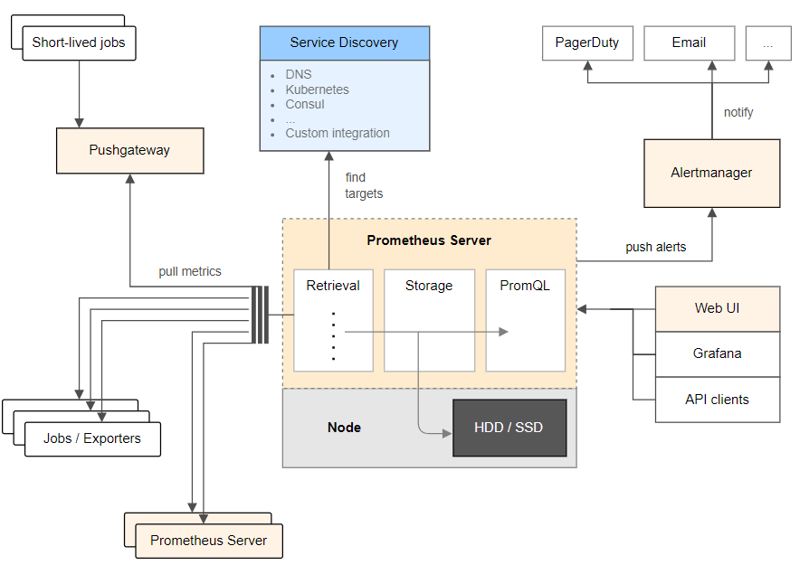

## 一、k8s-结合Prometheus构建监控告警

### 1. 深度解读Prometheus

Prometheus 配置文件参考地址：https://prometheus.io/docs/prometheus/latest/configuration/configuration/

Prometheus 监控组件对应的exporter 部署地址：https://prometheus.io/docs/instrumenting/exporters/

Prometheus 基于k8s 服务发现参考：https://github.com/prometheus/prometheus/tree/main/documentation/examples/prometheus-kubernetes.yaml

Prometheus 是一个开源的系统监控和警报工具，用于收集、存储和查询时间序列数据。它专注于监控应用程序和基础设施的性能和状态，并提供丰富的查询语言和灵活的告警机制。

#### 1. Prometheus 核心功能概述

- Prometheus 核心功能简要概括：
  - **数据模型：** 基于**时间序列**，用**指标名和标签**唯一标识数据点，适合高频监控。
  - **数据采集：** 主要通过 **HTTP 拉取 (Pull)** 指标，支持从程序直接采集，或通过 **Exporter** 从系统/网络采集。
  - **存储与查询：** 数据存**本地磁盘**。提供强大的 **PromQL 查询语言**，用于实时分析和报告。
  - **告警和规则：** 根据**表达式、阈值**等条件配置规则，满足时**自动触发告警**并通知。
  - **可视化与集成：** 自带基础界面，常与 **Grafana** 集成，实现丰富的**仪表盘展示**。

#### 2. Prometheus 的核心特点

##### 2.1. 多维数据模型

- Prometheus 采用**标签化的时间序列模型**：
  - 每个数据点由 **指标名称 + 标签键值对 + 时间戳 + 数值** 组成。
  - 支持在同一指标下根据标签区分多个实例（如同一服务在不同主机上的表现）。
- 灵活的数据结构使得查询、分组和聚合非常强大，适合复杂监控需求。

##### 2.2. 高效数据采集

- 主要采用 **拉取（Pull）模式**，Prometheus 主动周期性从目标服务的 `/metrics` 接口拉取数据。
- 支持多种采集目标，包括：
  - 应用程序、自定义 exporter
  - 系统组件（如 node_exporter）
  - 网络设备、中间件、数据库等
- 还支持 **Pushgateway**，用于短生命周期任务的数据上报。

##### 2.3. 强大的查询语言（PromQL）

- 提供功能丰富的 **PromQL（Prometheus Query Language）**：
  - 支持 **聚合、筛选、计算、预测、比值分析、时间范围查询** 等操作。
  - 可实现实时监控、异常检测、趋势分析、报表生成等功能。
- 查询语法直观、功能强大，能处理大规模时间序列数据。

##### 2.4. 动态监控与自动服务发现

- 支持多种 **服务发现机制**，可自动识别新服务实例，无需手动更新配置：
  - Kubernetes（Pod、Service、Endpoints）
  - Consul、EC2、DNS 等
- 配合标签选择器和 `relabel_configs`，可以灵活过滤和重写采集目标。

##### 2.5. 灵活的告警机制

- 内置告警系统与 Alertmanager 配合使用，具备以下特点：
  - 基于 PromQL 表达式定义告警规则
  - 支持告警分组、静默、去重、抑制等处理机制
  - 多种通知方式：Email、Slack、Webhook、微信企业通知等
- 可灵活配置不同环境、级别、分组的告警策略。

##### 2.6. 丰富的生态系统与可视化集成

- 与广泛的工具和平台集成，包括：
  - **Grafana**：最常用的可视化展示工具
  - **Thanos、Cortex**：用于远程存储和高可用扩展
  - 各类 Exporter，如 node_exporter、mysql_exporter、blackbox_exporter 等
- 开源社区活跃，文档丰富，生态完善，维护和扩展成本低。


#### 3.Prometheus 生态系统包含的组件

Prometheus 的组件：

1. **Prometheus Server (普罗米修斯服务器)**：核心，负责**拉取(Pull)** 指标、**存储**数据、**评估**规则和执行 **PromQL 查询**。
2. **Service Discovery (服务发现)**：帮助 Prometheus **自动找到**需要监控的动态目标（如 Kubernetes Pods）。
3. **Jobs / Exporters (作业 / 导出器)**：提供指标数据来源。`Jobs` 是自带 Prometheus 接口的应用；`Exporters` 是将其他系统（如操作系统、数据库）的指标**转换成 Prometheus 格式**并暴露的工具。
4. **Pushgateway (推送网关)**：为**短暂运行的作业**提供一个地方，让它们能**推送**指标，然后 Prometheus 再从 Pushgateway 拉取。
5. **Alertmanager (告警管理器)**：接收 Prometheus Server 发出的告警，负责**去重、分组、抑制**和**路由通知**到各种渠道（邮件、短信等）。
6. **Web UI / Grafana / API clients (用户界面 / 客户端)**：用于**查询、可视化** Prometheus 收集的指标数据。Grafana 是最常用的可视化工具



### 整体数据流和协作关系：

1. **指标生成与暴露：** 应用程序 (`Jobs`) 或 `Exporters` 在各自的服务器上生成并暴露 Prometheus 格式的指标。短暂作业则将指标推送到 `Pushgateway`。

2. **目标发现：** `Service Discovery` 模块帮助 Prometheus Server 找到所有需要抓取的指标端点。

3. **指标抓取与存储：** `Prometheus Server` 的 `Retrieval` 模块根据 `Service Discovery` 提供的信息，定期从 `Jobs / Exporters` 和 `Pushgateway` 拉取指标数据，并存储到 `Storage` (TSDB) 中。

4. **查询与告警：**

   - 用户通过 `Web UI`、`Grafana` 或 `API clients` 使用 `PromQL` 查询 `Storage` 中的数据进行分析和可视化。
   - `Prometheus Server` 内部的 `Rule Evaluation` 根据预设规则对数据进行计算，一旦达到告警条件，就将告警信息 `push` 给 `Alertmanager`。

5. **告警处理与通知：** `Alertmanager` 接收到告警后，进行去重、分组等处理，最终通过配置的渠道（如 `PagerDuty`、`Email`）通知相关人员。

   

### 2. 安装Prometheus组件

node-exporter 官方网站：https://prometheus.io/docs/guides/node-exporter/
node-exporter 的 github 地址：https://github.com/prometheus/node-exporter/

#### 2.1 Node Exporter 基本介绍

Node Exporter 是Prometheus 的一个官方 Exporter，用于收集和暴露有关操作系统和硬件资源的指标数据。它在目标主机上运行，并提供了各种系统级别的指标，例如CPU利用率、内存使用情况、磁盘空间、网络流量等。

#### 2.2 通过Prometheus Operator 安装

Prometheus Operator 是在 Kubernetes 上高效运行和管理 Prometheus 监控系统的**最佳实践和工具**。自动化了在 Kubernetes 上**部署、管理和运行 Prometheus、Alertmanager 和相关的监控组件**。

**安装 Helm**：如果你还没有安装 Helm，请根据你的操作系统安装它。Helm 是 Kubernetes 的包管理器。

- **MacOS/Linux:** `curl https://raw.githubusercontent.com/helm/helm/master/scripts/get-helm-3 | bash`

**部署步骤**

##### 2.2.1. 添加 Prometheus 社区 Helm 仓库

```bash
helm repo add prometheus-community https://prometheus-community.github.io/helm-charts
helm repo update
```

查看

```sh
helm show chart prometheus-community/prometheus
# 或
helm show chart prometheus-community/kube-prometheus-stack
```

#### 2. 安装 kube-prometheus-stack

使用 Helm 来安装 `kube-prometheus-stack`， `kube-prometheus-stack`相比`prometheus`默认启用多了Grafana和Prometheus Operator，其中Prometheus Operator作为Kubernetes Operator，管理Prometheus和Alertmanager实例的生命周期

首先创建一个命名空间

```sh
kubectl create namespace monitoring
```

安装 Helm Chart，Helm Chart 不仅会安装 Prometheus Operator 本身，还会一并部署好：

- Prometheus Server
- Alertmanager
- Grafana (可视化仪表盘)
- kube-state-metrics (用于生成 Kubernetes 对象的指标)
- Node Exporter (用于收集节点指标，作为 DaemonSet 部署)
- 以及所有必要的 Kubernetes RBAC 规则、Custom Resource Definitions (CRDs) 等

```sh
helm install prometheus prometheus-community/kube-prometheus-stack --namespace monitoring  --create-namespace 
```

如果网络不通，就下载到本地再进行安装

```sh
helm install prometheus-stack ./kube-prometheus-stack-75.6.1.tgz  -n monitoring --create-namespace -f Prometheus-values.yaml
```

其中yaml文件如下

```yaml
grafana:
  enabled: true
  adminPassword: admin
  service:
    type: NodePort
    nodePort: 30030
  nodeSelector:
    node-role.kubernetes.io/control-plane: ""
  tolerations:
    - key: "node-role.kubernetes.io/control-plane"
      operator: "Exists"
      effect: "NoSchedule"
  resources:
    requests:
      memory: "200Mi"
      cpu: "100m"
    limits:
      memory: "500Mi"
      cpu: "300m"
  persistence:
    enabled: true
    type: pvc
    storageClassName: local-monitor-storage
    accessModes:
      - ReadWriteOnce
    size: 5Gi

prometheus:
  service:
    type: NodePort
    nodePort: 30090
  prometheusSpec:
    nodeSelector:
      node-role.kubernetes.io/control-plane: ""
    tolerations:
      - key: "node-role.kubernetes.io/control-plane"
        operator: "Exists"
        effect: "NoSchedule"
    retention: "3d"
    resources:
      requests:
        memory: "500Mi"
        cpu: "250m"
      limits:
        memory: "1Gi"
        cpu: "500m"
    storageSpec:
      volumeClaimTemplate:
        spec:
          storageClassName: local-monitor-storage 
          accessModes: ["ReadWriteOnce"]
          resources:
            requests:
              storage: 10Gi 

alertmanager:
  service:
    type: NodePort
    nodePort: 30093
  alertmanagerSpec:
    nodeSelector:
      node-role.kubernetes.io/control-plane: ""
    tolerations:
      - key: "node-role.kubernetes.io/control-plane"
        operator: "Exists"
        effect: "NoSchedule"
    resources:
      requests:
        memory: "100Mi"
        cpu: "50m"
      limits:
        memory: "300Mi"
        cpu: "200m"
    storage:
      volumeClaimTemplate:
        spec:
          storageClassName: local-monitor-storage 
          accessModes: ["ReadWriteOnce"]
          resources:
            requests:
              storage: 5Gi

prometheusOperator:
  nodeSelector:
    node-role.kubernetes.io/control-plane: ""
  tolerations:
    - key: "node-role.kubernetes.io/control-plane"
      operator: "Exists"
      effect: "NoSchedule"

kubeStateMetrics:
  nodeSelector:
     kubernetes.io/hostname: k8s-master
  tolerations:
    - key: "node-role.kubernetes.io/control-plane"
      operator: "Exists"
      effect: "NoSchedule"

nodeExporter:
  # 每个节点都部署，不限制在哪个节点
  tolerations:
    - key: "node-role.kubernetes.io/control-plane"
      operator: "Exists"
      effect: "NoSchedule"
```

使用本地local--storage，标识我们的本地存储


```yaml

apiVersion: storage.k8s.io/v1
kind: StorageClass
metadata:
  name: local-monitor-storage
provisioner: kubernetes.io/no-provisioner 
volumeBindingMode: WaitForFirstConsumer
---
apiVersion: v1
kind: PersistentVolume
metadata:
  name: grafana-pv
spec:
  capacity:
    storage: 5Gi 
  volumeMode: Filesystem
  accessModes:
    - ReadWriteOnce
  persistentVolumeReclaimPolicy: Retain 
  storageClassName: local-monitor-storage 
  local:
    path: /data/monitor_data/grafana 
  nodeAffinity:
    required:
      nodeSelectorTerms:
      - matchExpressions:
        - key: node-role.kubernetes.io/control-plane
          operator: In
          values:
          - ""
---
apiVersion: v1
kind: PersistentVolume
metadata:
  name: prometheus-pv
spec:
  capacity:
    storage: 10Gi 
  volumeMode: Filesystem
  accessModes:
    - ReadWriteOnce
  persistentVolumeReclaimPolicy: Retain
  storageClassName: local-monitor-storage
  local:
    path: /data/monitor_data/prometheus 
  nodeAffinity:
    required:
      nodeSelectorTerms:
      - matchExpressions:
        - key: node-role.kubernetes.io/control-plane
          operator: In
          values:
          - ""
---
apiVersion: v1
kind: PersistentVolume
metadata:
  name: alertmanager-pv
spec:
  capacity:
    storage: 5Gi 
  volumeMode: Filesystem
  accessModes:
    - ReadWriteOnce
  persistentVolumeReclaimPolicy: Retain
  storageClassName: local-monitor-storage
  local:
    path: /data/monitor_data/alertmanager 
  nodeAffinity:
    required:
      nodeSelectorTerms:
      - matchExpressions:
        - key: node-role.kubernetes.io/control-plane
          operator: In
          values:
          - ""
```

验证部署，检查 `monitoring` 命名空间下的 Pod 和 Service：

```sh
kubectl get pods -n monitoring
kubectl get svc -n monitoring
kubectl get prometheus -n monitoring # 检查 Prometheus CRD 实例
kubectl get alertmanager -n monitoring # 检查 Alertmanager CRD 实例
```

### ✅ 对应访问地址说明：

如果部署在云服务器，那么外部访问地址为：

- **Prometheus**：`http://IP:30090`
- **Alertmanager**：`http://IP:30093`
- **Grafana**：`http://IP:30030`
  - 默认的 Grafana 用户名是 `admin`。
  - 默认密码通常会存储在一个 Kubernetes Secret 中。你可以通过以下命令获取：

```sh
kubectl get secret prometheus-grafana -n monitoring -o jsonpath="{.data.admin-password}" | base64 --decode
```

使用一下命名查看安装情况

```sh
helm list -n monitoring
```

如需重新安装，需要卸载

```sh
helm uninstall prometheus-stack -n monitoring
```

