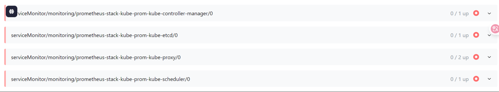

## 一、k8s-结合Prometheus构建监控告警

### 1. 深度解读Prometheus

Prometheus 配置文件参考地址：https://prometheus.io/docs/prometheus/latest/configuration/configuration/

Prometheus 监控组件对应的exporter 部署地址：https://prometheus.io/docs/instrumenting/exporters/

Prometheus 基于k8s 服务发现参考：https://github.com/prometheus/prometheus/tree/main/documentation/examples/prometheus-kubernetes.yaml

Prometheus 是一个开源的系统监控和警报工具，用于收集、存储和查询时间序列数据。它专注于监控应用程序和基础设施的性能和状态，并提供丰富的查询语言和灵活的告警机制。

#### 1.1. Prometheus 核心功能概述

- Prometheus 核心功能简要概括：
  - **数据模型：** 基于**时间序列**，用**指标名和标签**唯一标识数据点，适合高频监控。
  - **数据采集：** 主要通过 **HTTP 拉取 (Pull)** 指标，支持从程序直接采集，或通过 **Exporter** 从系统/网络采集。
  - **存储与查询：** 数据存**本地磁盘**。提供强大的 **PromQL 查询语言**，用于实时分析和报告。
  - **告警和规则：** 根据**表达式、阈值**等条件配置规则，满足时**自动触发告警**并通知。
  - **可视化与集成：** 自带基础界面，常与 **Grafana** 集成，实现丰富的**仪表盘展示**。

#### 1.2. Prometheus 的核心特点

##### 1.2.1. 多维数据模型

- Prometheus 采用**标签化的时间序列模型**：
  - 每个数据点由 **指标名称 + 标签键值对 + 时间戳 + 数值** 组成。
  - 支持在同一指标下根据标签区分多个实例（如同一服务在不同主机上的表现）。
- 灵活的数据结构使得查询、分组和聚合非常强大，适合复杂监控需求。

##### 1.2.2. 高效数据采集

- 主要采用 **拉取（Pull）模式**，Prometheus 主动周期性从目标服务的 `/metrics` 接口拉取数据。
- 支持多种采集目标，包括：
  - 应用程序、自定义 exporter
  - 系统组件（如 node_exporter）
  - 网络设备、中间件、数据库等
- 还支持 **Pushgateway**，用于短生命周期任务的数据上报。

##### 1.2.3. 强大的查询语言（PromQL）

- 提供功能丰富的 **PromQL（Prometheus Query Language）**：
  - 支持 **聚合、筛选、计算、预测、比值分析、时间范围查询** 等操作。
  - 可实现实时监控、异常检测、趋势分析、报表生成等功能。
- 查询语法直观、功能强大，能处理大规模时间序列数据。

##### 2.4. 动态监控与自动服务发现

- 支持多种 **服务发现机制**，可自动识别新服务实例，无需手动更新配置：
  - Kubernetes（Pod、Service、Endpoints）
  - Consul、EC2、DNS 等
- 配合标签选择器和 `relabel_configs`，可以灵活过滤和重写采集目标。

##### 1.2.5. 灵活的告警机制

- 内置告警系统与 Alertmanager 配合使用，具备以下特点：
  - 基于 PromQL 表达式定义告警规则
  - 支持告警分组、静默、去重、抑制等处理机制
  - 多种通知方式：Email、Slack、Webhook、微信企业通知等
- 可灵活配置不同环境、级别、分组的告警策略。

##### 1.2.6. 丰富的生态系统与可视化集成

- 与广泛的工具和平台集成，包括：
  - **Grafana**：最常用的可视化展示工具
  - **Thanos、Cortex**：用于远程存储和高可用扩展
  - 各类 Exporter，如 node_exporter、mysql_exporter、blackbox_exporter 等
- 开源社区活跃，文档丰富，生态完善，维护和扩展成本低。


#### 1.3.Prometheus 生态系统包含的组件

Prometheus 的组件：

1. **Prometheus Server (普罗米修斯服务器)**：核心，负责**拉取(Pull)** 指标、**存储**数据、**评估**规则和执行 **PromQL 查询**。
2. **Service Discovery (服务发现)**：帮助 Prometheus **自动找到**需要监控的动态目标（如 Kubernetes Pods）。
3. **Jobs / Exporters (作业 / 导出器)**：提供指标数据来源。`Jobs` 是自带 Prometheus 接口的应用；`Exporters` 是将其他系统（如操作系统、数据库）的指标**转换成 Prometheus 格式**并暴露的工具。
4. **Pushgateway (推送网关)**：为**短暂运行的作业**提供一个地方，让它们能**推送**指标，然后 Prometheus 再从 Pushgateway 拉取。
5. **Alertmanager (告警管理器)**：接收 Prometheus Server 发出的告警，负责**去重、分组、抑制**和**路由通知**到各种渠道（邮件、短信等）。
6. **Web UI / Grafana / API clients (用户界面 / 客户端)**：用于**查询、可视化** Prometheus 收集的指标数据。Grafana 是最常用的可视化工具


整体数据流和协作关系：

1. **指标生成与暴露：** 应用程序 (`Jobs`) 或 `Exporters` 在各自的服务器上生成并暴露 Prometheus 格式的指标。短暂作业则将指标推送到 `Pushgateway`。

2. **目标发现：** `Service Discovery` 模块帮助 Prometheus Server 找到所有需要抓取的指标端点。

3. **指标抓取与存储：** `Prometheus Server` 的 `Retrieval` 模块根据 `Service Discovery` 提供的信息，定期从 `Jobs / Exporters` 和 `Pushgateway` 拉取指标数据，并存储到 `Storage` (TSDB) 中。

4. **查询与告警：**

   - 用户通过 `Web UI`、`Grafana` 或 `API clients` 使用 `PromQL` 查询 `Storage` 中的数据进行分析和可视化。
   - `Prometheus Server` 内部的 `Rule Evaluation` 根据预设规则对数据进行计算，一旦达到告警条件，就将告警信息 `push` 给 `Alertmanager`。

5. **告警处理与通知：** `Alertmanager` 接收到告警后，进行去重、分组等处理，最终通过配置的渠道（如 `PagerDuty`、`Email`）通知相关人员。

   

### 2. 安装Prometheus组件

#### 2.1 通过Prometheus Operator 安装

Prometheus Operator 是在 Kubernetes 上高效运行和管理 Prometheus 监控系统的**最佳实践和工具**。自动化了在 Kubernetes 上**部署、管理和运行 Prometheus、Alertmanager 和相关的监控组件**。

**安装 Helm**：如果你还没有安装 Helm，请根据你的操作系统安装它。Helm 是 Kubernetes 的包管理器。

- **MacOS/Linux:** `curl https://raw.githubusercontent.com/helm/helm/master/scripts/get-helm-3 | bash`

**部署步骤**

##### 2.1.1. 添加 Prometheus 社区 Helm 仓库

```bash
helm repo add prometheus-community https://prometheus-community.github.io/helm-charts
helm repo update
```

查看

```sh
helm show chart prometheus-community/prometheus
# 或
helm show chart prometheus-community/kube-prometheus-stack
```

##### 2.1.2 安装 kube-prometheus-stack

使用 Helm 来安装 `kube-prometheus-stack`， `kube-prometheus-stack`相比`prometheus`默认启用多了Grafana和Prometheus Operator。其中Prometheus Operator作为Kubernetes Operator，管理Prometheus和Alertmanager实例的生命周期，简单来说，它就像一个**专门负责管理 Prometheus、Alertmanager 等的“管理员”**。可以创建 `ServiceMonitor` 或 `PodMonitor` 这两个**自定义资源 (Custom Resources)** 来，提供了一种声明式的方式，让你在 Kubernetes 中以“Kubernetes 原生”的方式定义要监控的目标。

首先创建一个命名空间

```sh
kubectl create namespace monitoring
```

安装 Helm Chart，Helm Chart 不仅会安装 Prometheus Operator 本身，还会一并部署好：

- Prometheus Server
- Alertmanager
- Grafana (可视化仪表盘)
- kube-state-metrics (用于生成 Kubernetes 对象的指标)
- Node Exporter (用于收集节点指标，作为 DaemonSet 部署)
- 以及所有必要的 Kubernetes RBAC 规则、Custom Resource Definitions (CRDs) 等

```sh
helm install prometheus prometheus-community/kube-prometheus-stack --namespace monitoring  --create-namespace 
```

如果网络不通，就下载到本地再进行安装

```sh
helm install prometheus-stack ./kube-prometheus-stack-75.6.1.tgz  -n monitoring --create-namespace -f Prometheus-values.yaml
```

其中yaml文件如下

```yaml
grafana:
  enabled: true
  adminPassword: admin
  service:
    type: NodePort
    nodePort: 30030
  nodeSelector:
    node-role.kubernetes.io/control-plane: ""
  tolerations:
    - key: "node-role.kubernetes.io/control-plane"
      operator: "Exists"
      effect: "NoSchedule"
  resources:
    requests:
      memory: "200Mi"
      cpu: "100m"
    limits:
      memory: "500Mi"
      cpu: "300m"
  persistence:
    enabled: true
    type: pvc
    storageClassName: local-monitor-storage
    accessModes:
      - ReadWriteOnce
    size: 5Gi
    selector:
      matchLabels:
        app: grafana  # 核心：添加 selector 来匹配 PV 的 label

prometheus:
  service:
    type: NodePort
    nodePort: 30090
  prometheusSpec:
    nodeSelector:
      node-role.kubernetes.io/control-plane: ""
    tolerations:
      - key: "node-role.kubernetes.io/control-plane"
        operator: "Exists"
        effect: "NoSchedule"
    retention: "3d"
    resources:
      requests:
        memory: "500Mi"
        cpu: "250m"
      limits:
        memory: "1Gi"
        cpu: "500m"
    storageSpec:
      volumeClaimTemplate:
        spec:
          storageClassName: local-monitor-storage 
          accessModes: ["ReadWriteOnce"]
          resources:
            requests:
              storage: 10Gi 
          selector:
            matchLabels:
              app: prometheus

alertmanager:
  service:
    type: NodePort
    nodePort: 30093
  alertmanagerSpec:
    nodeSelector:
      node-role.kubernetes.io/control-plane: ""
    tolerations:
      - key: "node-role.kubernetes.io/control-plane"
        operator: "Exists"
        effect: "NoSchedule"
    resources:
      requests:
        memory: "100Mi"
        cpu: "50m"
      limits:
        memory: "300Mi"
        cpu: "200m"
    storage:
      volumeClaimTemplate:
        spec:
          storageClassName: local-monitor-storage 
          accessModes: ["ReadWriteOnce"]
          resources:
            requests:
              storage: 5Gi
          selector:
            matchLabels:
              app: alertmanager

prometheusOperator:
  nodeSelector:
    node-role.kubernetes.io/control-plane: ""
  tolerations:
    - key: "node-role.kubernetes.io/control-plane"
      operator: "Exists"
      effect: "NoSchedule"

kubeStateMetrics:
  nodeSelector:
     kubernetes.io/hostname: k8s-master
  tolerations:
    - key: "node-role.kubernetes.io/control-plane"
      operator: "Exists"
      effect: "NoSchedule"

nodeExporter:
  # 每个节点都部署，不限制在哪个节点
  tolerations:
    - key: "node-role.kubernetes.io/control-plane"
      operator: "Exists"
      effect: "NoSchedule"
```

使用本地local--storage，标识我们的本地存储

```yaml

apiVersion: storage.k8s.io/v1
kind: StorageClass
metadata:
  name: local-monitor-storage
provisioner: kubernetes.io/no-provisioner 
volumeBindingMode: WaitForFirstConsumer
---
apiVersion: v1
kind: PersistentVolume
metadata:
  name: grafana-pv
  labels:
    app: grafana # 核心：添加这个标签，防止错位绑定
spec:
  capacity:
    storage: 5Gi 
  volumeMode: Filesystem
  accessModes:
    - ReadWriteOnce
  persistentVolumeReclaimPolicy: Retain 
  storageClassName: local-monitor-storage 
  local:
    path: /data/monitor_data/grafana 
  nodeAffinity:
    required:
      nodeSelectorTerms:
      - matchExpressions:
        - key: node-role.kubernetes.io/control-plane
          operator: In
          values:
          - ""
---
apiVersion: v1
kind: PersistentVolume
metadata:
  name: prometheus-pv
  labels:
    app: prometheus
spec:
  capacity:
    storage: 10Gi 
  volumeMode: Filesystem
  accessModes:
    - ReadWriteOnce
  persistentVolumeReclaimPolicy: Retain
  storageClassName: local-monitor-storage
  local:
    path: /data/monitor_data/prometheus 
  nodeAffinity:
    required:
      nodeSelectorTerms:
      - matchExpressions:
        - key: node-role.kubernetes.io/control-plane
          operator: In
          values:
          - ""
---
apiVersion: v1
kind: PersistentVolume
metadata:
  name: alertmanager-pv
  labels:
    app: alertmanager
spec:
  capacity:
    storage: 5Gi 
  volumeMode: Filesystem
  accessModes:
    - ReadWriteOnce
  persistentVolumeReclaimPolicy: Retain
  storageClassName: local-monitor-storage
  local:
    path: /data/monitor_data/alertmanager 
  nodeAffinity:
    required:
      nodeSelectorTerms:
      - matchExpressions:
        - key: node-role.kubernetes.io/control-plane
          operator: In
          values:
          - ""
```

验证部署，检查 `monitoring` 命名空间下的 Pod 和 Service：

```sh
kubectl get pods -n monitoring
kubectl get svc -n monitoring
kubectl get prometheus -n monitoring # 检查 Prometheus CRD 实例
kubectl get alertmanager -n monitoring # 检查 Alertmanager CRD 实例
```

##### 2.1.3 对应访问地址：

如果部署在云服务器，那么外部访问地址为：

- **Prometheus**：`http://IP:30090`
- **Alertmanager**：`http://IP:30093`
- **Grafana**：`http://IP:30030`
  - 默认的 Grafana 用户名是 `admin`。
  - 默认密码通常会存储在一个 Kubernetes Secret 中。你可以通过以下命令获取：

```sh
kubectl get secret prometheus-grafana -n monitoring -o jsonpath="{.data.admin-password}" | base64 --decode
```

使用一下命名查看安装情况

```sh
helm list -n monitoring
```

如需重新安装，需要卸载

```sh
helm uninstall prometheus-stack -n monitoring
```

#### 2.3 Prometheus中target 解决部分down的问题



##### 2.3.1 kube-controller-manager
找到**` kube-controller-manager`** 的静态 Pod 定义文件。
位于 `/etc/kubernetes/manifests/kube-controller-manager.yaml`
修改参数：`--bind-address=0.0.0.0`

##### 2.3.2 kube-scheduler

**`kube-scheduler` (`prometheus-stack-kube-prom-kube-scheduler`)：** 
 检查文件：`/etc/kubernetes/manifests/kube-scheduler.yaml`
 修改参数：`--bind-address=0.0.0.0`

##### 2.3.3 etcd

**`etcd` (`prometheus-stack-kube-prom-etcd`)：** etcd 的情况稍微不同。它的指标端口由 `--listen-metrics-urls` 控制。

 检查文件：`/etc/kubernetes/manifests/etcd.yaml` 寻找 `listen-metrics-urls。`

 修改 `listen-metrics-urls`为 `http://0.0.0.0:2379`。

##### 2.3.4  kube-proxy 

首先执行 `ss -tnlp | grep 10249`，结果为

```
tcp        0      0 127.0.0.1:10249         0.0.0.0:*               LISTEN      446200/kube-proxy
```

说明当前 `kube-proxy` 进程 **确实在监听 `10249` 端口**，**但仅限本地回环地址（`127.0.0.1`）**

修改 kube-proxy 的监听地址为 `0.0.0.0`，执行

```sh
kubectl -n kube-system edit cm kube-proxy
```

将`metricsBindAddress: " " `修改为`metricsBindAddress: 0.0.0.0:10249`

重启 kube-proxy DaemonSet

```sh
kubectl -n kube-system rollout restart ds kube-proxy
```


#### 2.4 组件说明

##### 2.4.1 node-exporter 说明

node-exporter 官方网站：https://prometheus.io/docs/guides/node-exporter/
node-exporter 的 github 地址：https://github.com/prometheus/node-exporter/

Node Exporter 是Prometheus 的一个官方 Exporter，用于收集和暴露有关操作系统和硬件资源的指标数据。它在目标主机上运行，并提供了各种系统级别的指标，例如CPU利用率、内存使用情况、磁盘空间、网络流量等。

在监控和可观测性领域，你提到的这些组件是构建一个强大的监控系统（尤其是在 Kubernetes 环境下）的核心。它们协同工作，负责指标的收集、存储、告警和可视化。

**Node Exporter (用于收集节点指标，作为 DaemonSet 部署)**：**Node Exporter** 是一个 Prometheus 官方提供的 Exporter，用于收集 Linux/Unix 主机（例如 Kubernetes 集群中的每个节点）的系统级指标。

- **部署方式：** 在 Kubernetes 环境中，Node Exporter 通常作为 **DaemonSet** 部署。这意味着集群中的每个节点都会运行一个 Node Exporter 实例，从而确保所有节点的指标都被收集到。
- **收集的指标：** Node Exporter 收集的指标非常广泛，包括：
  - **CPU 使用率：** 各个 CPU 核心的使用情况、系统、用户、空闲时间等。
  - **内存使用率：** 总内存、可用内存、已用内存、缓存等。
  - **磁盘 I/O：** 读写速度、磁盘空间使用率。
  - **网络 I/O：** 网络接口的发送和接收字节数、错误包数量。
  - **文件系统信息：** 挂载点、可用空间、总空间。
  - **系统负载：** 1分钟、5分钟、15分钟的平均负载。
  - **进程信息：** 运行中的进程数、阻塞的进程数等。
- **暴露方式：** Node Exporter 暴露一个 HTTP 端点（通常是 9100 端口）供 Prometheus Server 拉取指标。
- **价值：** Node Exporter 提供了对底层硬件和操作系统性能的深入洞察，是排查节点层面问题、监控资源瓶颈和进行容量规划的基础。

##### 2.4.2 kube-state-metrics说明

**kube-state-metrics (用于生成 Kubernetes 对象的指标)**：**kube-state-metrics (KSM)** 是一个专门为 Kubernetes 设计的组件，它监听 Kubernetes API Server 并生成关于 Kubernetes 各种对象的指标。

- **关注 Kubernetes 对象状态：** KSM 不关心资源使用情况（CPU、内存等），而是侧重于 Kubernetes 资源的**当前状态**。
- **指标类型：** 它暴露的指标包括：
  - Pod 状态（运行中、待定、失败等）
  - Deployment、DaemonSet、StatefulSet 的副本数和状态
  - Node 状态（就绪、不可用等）
  - PersistentVolume 和 PersistentVolumeClaim 的状态
  - Service、Ingress 等的网络对象状态
- **如何工作：** KSM 以 Deployment 形式部署在 Kubernetes 集群中，通过 Kubernetes API 获取集群中所有对象的信息，然后将其转换为 Prometheus 可识别的指标格式并暴露出来。
- **价值：** 这些指标对于理解 Kubernetes 集群的健康状况和进行容量规划至关重要。例如，你可以通过 KSM 的指标来监控有多少 Pod 处于 Pending 状态、Deployment 的可用副本数是否达到预期等。


### 3.  Alertmanager告警发送

在alertmanager添加以下配置

```yaml
alertmanager:
  config:
    global:
      smtp_smarthost: 'smtp.example.com:587'
      smtp_from: 'alertmanager@example.com'
      smtp_auth_username: 'alertmanager@example.com'
      smtp_auth_password: 'your_password_here'

    route:
      group_by: ['alertname']
      group_wait: 10s
      group_interval: 5m
      repeat_interval: 3h
      receiver: 'email-alert'

    receivers:
      - name: 'email-alert'
        email_configs:
          - to: 'your_email@example.com'
```

 

通过 `kube-prometheus-stack` 这样的 Helm Chart 完成），如果你想要添加新的告警规则，最推荐和最标准的做法就是**创建一个新的 `PrometheusRule` 自定义资源（Custom Resource）**。

具体步骤如下：

1. **编写 `PrometheusRule` YAML 文件：** 创建一个 `.yaml` 文件（例如 `my-new-alerts.yaml`），在其中定义你的告警组和具体的告警规则。每个规则包含一个 PromQL 表达式 (`expr`)，一个持续时间 (`for`)，以及标签 (`labels`) 和注解 (`annotations`) 等信息。

   YAML

   ```yaml
   apiVersion: monitoring.coreos.com/v1
   kind: PrometheusRule
   metadata:
     name: my-new-application-rules # 给你的告警规则集起个有意义的名字
     labels:
       prometheus: k8s # 这是Prometheus Operator识别的默认标签
       role: alert-rules # 自定义标签，方便管理
   spec:
     groups:
     - name: my-application-critical-alerts # 告警组名称
       rules:
       - alert: HighAPILatency # 告警名称
         expr: histogram_quantile(0.99, rate(api_requests_duration_seconds_bucket[5m])) > 0.5 # 如果99%的API请求延迟超过0.5秒
         for: 2m # 持续2分钟
         labels:
           severity: critical
           team: backend
         annotations:
           summary: "API 延迟过高"
           description: "应用程序的API请求P99延迟在过去2分钟内持续高于500ms。"
   ```

2. **应用 `PrometheusRule` 到 Kubernetes：** 使用 `kubectl apply` 命令将这个 YAML 文件提交到你的 Kubernetes 集群：

   Bash

   ```sh
   kubectl apply -f my-new-alerts.yaml -n monitoring # Prometheus部署的monitoring命名空间
   ```

   请确保将 `-n monitoring` 替换为你的 Prometheus 和 Prometheus Operator 所在的实际命名空间。

3. **Prometheus Operator 自动加载：** 一旦你应用了这个 `PrometheusRule` 对象，**Prometheus Operator 会自动检测到它**。它会负责将这个新的规则配置加载到运行中的 Prometheus 实例中，无需你手动重启 Prometheus Pod。

4. **Prometheus 开始评估：** 加载完成后，Prometheus 就会开始根据你新添加的规则评估你的指标数据。一旦告警条件满足，它就会将告警发送给 Alertmanager。
