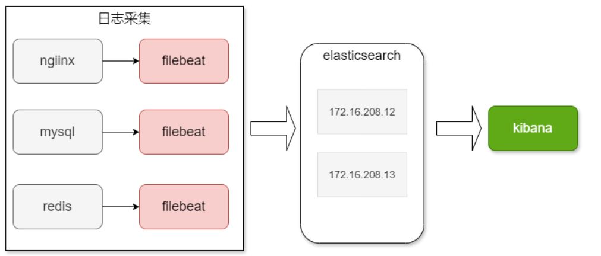
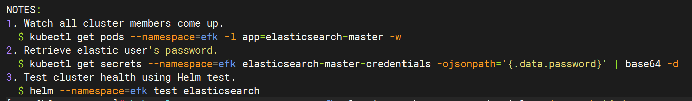
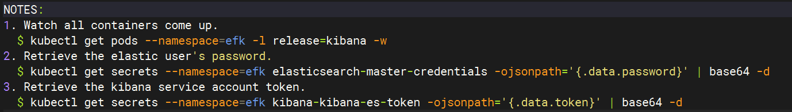

## 七、K8s部署智能化日志采集平台

### 1.日志采集的背景

#### 1.1.为什么要收集日志

收集日志的主要目的是帮助定位和解决问题。日志记录了应用程序、系统和服务的运行状态、事件和错误信息。以下是为什么收集日志的一些主要原因:

- **故障排查:** 当应用程序或系统出现问题时，日志是诊断和排查故障的重要工具。通过分析日志可以追踪问题发生的原因，找到错误的根源。
- **性能监测:** 日志可以提供关于应用程序和系统性能的有用信息。通过分析日志，可以确定潜在的性能瓶颈，并采取相应的措施进行优化。
- **安全审计:** 日志记录了系统的活动和事件，可以用于安全审计和监测。通过分析日志，可以检测潜在的安全威胁和异常行为。
- **统计和分析:** 日志可以用于生成统计数据和分析报告，从而了解应用程序和系统的使用情况、用户行为和趋势等信息。

#### 1.2.k8s 集群应该采集哪些日志

- **K8S 系统组件日志:** 包括apiserver、scheduler、kubelet 等组件的日志。这些日志可以提供有关集群管理和调度的信息，如节点状态、Pod 调度、API请求等。
- **Pod 日志:** 每个运行在 Kubernetes 集群中的 Pod 都可以生成自己的日志。可以采集各个Pod 的容器日志，以了解应用程序在容器内的运行状态、事件和错误信息。
- **节点系统日志:** 采集Kubernetes 集群节点的系统日志是监视节点的健康状态和系统级事件的关键。通过采集节点系统日志，可以了解节点的资源使用情况、运行状况以及与节点相关的故障和问题。
- **应用程序日志:** 在Kubernetes 集群中部署的应用程序生成的日志也是需要采集和监控的。这些日志记录应用程序的运行状态、事件和错误信息，帮助诊应用程序级别的问题。（**K8s内部等同于pod日志**）

#### 1.3. 日志采集方案

**Filebeat、fluentd(日志采集工具)/Logstash(数据处理引擎)+Elasticserch(数据存储、全文检索、分布式搜索引擎)+Kibana(展示数据、绘图、搜索)**

**ELK** = **Elasticsearch + Logstash + Kibana**

**EFK** = **Elasticsearch + Fluentd + Kibana**

| 功能     | ELK 组件                     | EFK 组件                          | 说明                   |
| -------- | ---------------------------- | --------------------------------- | ---------------------- |
| 日志收集 | **Logstash**（占用资源较高） | **Fluentd**（性能好，资源占用小） | 日志采集、过滤、转发器 |
| 日志存储 | Elasticsearch                | Elasticsearch                     | 分布式搜索与分析引擎   |
| 日志展示 | Kibana                       | Kibana                            | 数据可视化界面         |


### 2.分布式搜索引擎 elasticsearch 深度解

**Elasticsearch** 是一个开源的分布式搜索和分析引擎，基于 Apache Lucene 构建。您可以将其理解为一个极其快速、高度可扩展的数据库，专为搜索海量文本和结构化数据而设计。

**核心优势:**

- **分布式特性：** 与传统单服务器数据库不同，Elasticsearch 可以将数据分散到集群中的多个服务器（节点）上。这使得它能够以惊人的速度和可靠性处理海量数据和搜索查询。即使一个节点发生故障，其他节点也能接管工作。
- **实时搜索：** 它能够几乎即时地索引数据，这使其非常适合需要实时搜索和分析信息的应用，比如日志或传感器数据。
- **全文搜索：** 除了简单的关键词匹配，Elasticsearch 凭借 Lucene 的强大功能，擅长处理复杂的全文搜索，包括模糊匹配、短语搜索等。
- **强大的聚合能力:** 支持丰富的聚合操作，可以对日志数据进行多维度、深层次的统计和分析，例如计算请求次数、分析错误率、统计响应时间分布等。
- **JSON 格式：** 它以无模式的 JSON 格式存储数据，为各种数据类型提供了灵活性。
- **RESTful API：** 您可以使用简单的 RESTful API 与 Elasticsearch 进行交互，这使得它易于与其他应用程序集成。

**工作原理（简化版）：**

1. **索引 (Indexing)：** 当您将数据输入 Elasticsearch 时，它会对其进行处理，将其分解为可搜索的**倒排索引 (inverted index)**。这个索引类似于书本末尾的索引，列出了文档中所有唯一的词语以及它们出现的位置。
2. **分片 (Shards) 与副本 (Replicas)：** 数据被分成多个**分片 (shards)**，每个分片都是一个独立的 Lucene 实例，可以在集群中的不同节点上存储。为了容错和提高读性能，每个分片还可以有多个**副本 (replicas)**。
3. **查询 (Querying)：** 当您执行搜索查询时，Elasticsearch 会并行地在所有相关分片上执行查询，然后将结果聚合返回。


### 3.高效的日志收集组件：Fluentd 原理

**Fluentd** 是一个开源的数据收集器，专为统一日志数据而设计。它能够从各种数据源收集日志，进行解析、过滤、转换，然后将其可靠地传输到各种目的地。

**Fluentd 的核心特点：**

- **统一日志层：** Fluentd 的目标是提供一个统一的日志层，将来自不同来源、不同格式的日志数据标准化。
- **插件化架构：** 它拥有丰富的插件生态系统，支持从几十种输入源（如文件、系统日志、应用日志、消息队列等）收集数据，并输出到几十种目的地（如 Elasticsearch、Kafka、S3、数据库等）。
- **灵活性和可扩展性：** 通过简单的配置，您可以定义日志的输入、解析规则、过滤条件以及输出目标，以适应各种复杂的日志处理需求。
- **可靠性：** Fluentd 提供缓冲、重试机制，确保在网络或目标系统故障时数据不会丢失。

**工作原理：**

Fluentd 的工作流程通常遵循“输入 (Input) -> 解析 (Parse) -> 过滤 (Filter) -> 路由 (Match) -> 输出 (Output)”的模式：

1. **输入插件 (Input Plugin)：** 负责从各种来源收集数据。例如，`tail` 插件可以监控文件变化，`http` 插件可以接收 HTTP 请求。
2. **解析器 (Parser)：** 接收到的原始日志数据通常是字符串，需要通过解析器将其转换为结构化的数据（通常是 JSON）。
3. **过滤插件 (Filter Plugin)：** 对解析后的数据进行进一步处理，例如添加字段、删除敏感信息、转换数据类型等。
4. **路由 (Match)：** 根据自定义的标签 (tag) 规则，将处理后的数据路由到不同的输出目的地。
5. **输出插件 (Output Plugin)：** 负责将数据发送到最终目的地，例如 Elasticsearch、Kafka 或其他存储系统。

**Filebeat、Logstash、Fluentd** 三者的详细对比

| 工具名       | 简介                                                         | 定位                   | 消息处理能力               | 性能 / 内存开销      | 状态缓存 / 重试机制       |
| ------------ | ------------------------------------------------------------ | ---------------------- | -------------------------- | -------------------- | ------------------------- |
| **Filebeat** | 轻量级日志采集器，官方提供，常用于将日志发送到 Logstash 或 Elasticsearch。 | 轻量采集器             | 弱（基本格式）             | 极低（适合边缘节点） | 支持 checkpoint、文件偏移 |
| **Logstash** | 强大的日志处理器，支持过滤、转化、解析等复杂 ETL 操作。      | 中间处理引擎（ETL）    | 强（复杂过滤、解析、聚合） | 高（资源占用明显）   | 支持 pipeline 重试        |
| **Fluentd**  | CNCF 项目，灵活的日志收集器和处理器，适合云原生、容器环境。  | 采集 + 处理 + 转发一体 | 强（支持路由、过滤、转化） | 中等偏低             | 具备更灵活的缓冲/重试机制 |


### 4. 数据的探索和可视化分析：Kibana

**Kibana** 是一个开源的数据可视化和探索工具，专门用于与 Elasticsearch 配合使用。提供了一个直观的 Web 界面，可以轻松地搜索、分析和可视化 Elasticsearch 中存储的数据。

**Kibana 的主要功能：**

- **数据探索 (Discover)：**  Kibana 的核心功能之一，允许以原始文档的形式浏览 Elasticsearch 中的数据，并进行关键词搜索、字段过滤等操作，快速定位感兴趣的日志或事件。
- **可视化 (Visualize)：** Kibana 提供了各种图表类型（如折线图、柱状图、饼图、热力图、地理图等），可以将 Elasticsearch 中的数据以图形化的方式呈现，从而更容易发现趋势和模式。
- **仪表板 (Dashboard)：** 可以将多个可视化图表组合成一个**仪表板 (dashboard)**，提供数据的全面概览。这对于监控系统性能、业务指标或进行故障排查非常有用。
- **报告和警报：** Kibana 还可以用于创建报告和设置警报规则，当数据达到特定阈值时进行通知。


 ### 5.  EFK日志处理流程

1. filebeat/fuentd 从各个节点的 Docker 容器中提取日志信息
2. filebeat/fluentd 将日志转发到 ElasticSearch 进行索引和保存
3. Kibana 负责分析和可视化日志信息




### 6.  安装EFK组件

#### 使用 Helm 安装 EFK 步骤

使用 Helm 安装 EFK 是最推荐的方式，因为它能简化复杂的部署过程。

##### **步骤 1: 添加 Helm 仓库**

首先，需要添加包含 EFK 组件的 Helm 仓库。Elastic 官方提供了一系列经过良好维护的 Helm Chart。

```bash
helm repo add elastic https://helm.elastic.co
helm repo update
```

##### **步骤 2: 安装 Elasticsearch**

安装 Elasticsearch 是 EFK 栈中最关键的一步，因为它负责数据的存储。你可能需要根据集群的实际情况调整资源请求/限制、持久化存储等配置。

```bash
# 创建一个 Namespace 来存放 EFK 组件 (可选但推荐)
kubectl create namespace efk 
# 安装 Elasticsearch
helm install elasticsearch elastic/elasticsearch -n efk  -f ESvalues.yaml
```

value.yaml如下：

```yaml
# 注意: 这里的配置只是一个基础示例。在生产环境中，你可能需要更详细的配置，
# 例如: replicas、resources、storageClass 等。
replicas: 1
volumeClaimTemplate:
  accessModes: ["ReadWriteOnce"]
  resources:
    requests:
      storage: 30Gi
  storageClassName: elasticsearch-manual
resources:
  requests:
    memory: "1Gi"
    cpu: "1"
nodeSelector:
  kubernetes.io/hostname: "k8s-worker"
```

**重要配置项解释：**

- `replicas`: Elasticsearch 集群中的节点数量。生产环境通常至少为 3 个，以确保高可用性。
- `resources.requests.storage`: 持久卷的大小。
- `resources.requests.memory` / `resources.requests.cpu`: 为 Elasticsearch Pod 请求的内存和 CPU 资源。

storageclass和PV如下如下（）：

```yaml
apiVersion: storage.k8s.io/v1
kind: StorageClass
metadata:
  name: elasticsearch-manual
provisioner: kubernetes.io/no-provisioner
volumeBindingMode: Immediate 
---
# elasticsearch-pv.yaml
apiVersion: v1
kind: PersistentVolume
metadata:
  name: elasticsearch-pv-manual # PV 的名称
  labels:
    type: local
spec:
  capacity:
    storage: 10Gi
  accessModes:
    - ReadWriteOnce 
  persistentVolumeReclaimPolicy: Delete 
  storageClassName: elasticsearch-manual # 这是一个自定义的 StorageClass 名称，用于手动绑定
  hostPath:
    path: "/data/elasticsearch" # 这是你在 k8s-worker 上创建的实际路径
```

**等待 Elasticsearch 启动：**

```sh
kubectl get pods -n efk -l app.kubernetes.io/name=elasticsearch
```

启动完成之后可以使用一下命令查看和验证，第二个命令用于生成密钥**Elasticsearch 8.x 开始（你用的是 8.5.1）**，默认启用了：

- TLS（HTTPS）
- 身份验证（用户名密码）



测试

```sh
curl -k -u elastic:你的密码 https://svcIP:9200
```

（Elasticsearch 本身**不带 UI 界面**，它只是一个搜索和数据存储引擎，主要通过 REST API 访问和操作）。添加用户名密码认证（默认是 `elastic`），密码使用上图命令生成


##### **步骤 3: 安装 Kibana**

Elasticsearch 启动并运行后，就可以安装 Kibana 了。Kibana 需要能够访问 Elasticsearch。

```sh
# 安装 Kibana
# 注意: `elasticsearchHosts` 应该指向你的 Elasticsearch Service 地址
helm install kibana elastic/kibana -n efk \
  --set env.ELASTICSEARCH_HOSTS="http://elasticsearch-master:9200" \
  --set service.type=NodePort \
  --set resources.requests.memory="1Gi" \
  --set resources.requests.cpu="0.5" \
  --set tolerations[0].key="node-role.kubernetes.io/control-plane" \
  --set nodeSelector."kubernetes\.io/hostname"="k8s-master"

```

**重要配置项解释：**

- `env.ELASTICSEARCH_HOSTS`: **非常重要！** 这配置了 Kibana 连接的 Elasticsearch 地址。默认情况下，Elasticsearch Helm Chart 会创建一个名为 `elasticsearch-master` 的 Service，端口为 9200。
- `service.type`: Kibana Service 的类型。`NodePort` 可以让你通过任意节点的 IP 和指定端口访问 Kibana；`LoadBalancer` 则会在云环境中创建一个负载均衡器（如果你的云提供商支持）。

安装错误的话，执行

```sh
kubectl get serviceaccount,configmap,all,role,rolebinding   -n efk
```

将configmap，serviceaccount，role删除在重新安装

**访问 Kibana：**

Kibana 启动后，你可以通过以下命令获取其访问地址：

```sh
kubectl get svc -n efk kibana-kibana
```

如果 `service.type` 是 `NodePort`，通常会看到一个端口映射，例如 `30000:80/TCP`。你可以通过任意 Kubernetes 节点 IP:`30000` 访问 Kibana



**登录凭据：**

- **用户名：** 默认情况下，通常是 **`elastic`**。
- **密码：** 这个密码是在部署 Elasticsearch 时设置的。通过上图第二条命令获得

##### **步骤 4: 安装  Fluent Bit**

最后是日志收集器。Fluentd 适合更复杂的日志处理，而 Fluent Bit 更轻量级，适合资源受限的环境。Elastic 官方也提供了 Fluent Bit 的 Helm Chart，通常在 Kubernetes 环境中更推荐使用 Fluent Bit。

**使用 Fluent Bit (推荐)**

```sh
# 添加 Fluent Bit 仓库 (如果之前没有)
helm repo add fluent https://fluent.github.io/helm-charts
helm repo update

# 安装 Fluent Bit
# 这会将 Fluent Bit 作为 DaemonSet 部署到每个节点
helm install fluent-bit fluent/fluent-bit -n efk -f flunet-values.yaml
```

value.yaml文件如下

```yaml
config:
  service: |
    [SERVICE]
        Daemon Off
        Flush 1
        Log_Level info
        Parsers_File /fluent-bit/etc/parsers.conf
        Parsers_File /fluent-bit/etc/conf/custom_parsers.conf
        HTTP_Server On
        HTTP_Listen 0.0.0.0
        HTTP_Port 2020
        Health_Check On

  inputs: |
    [INPUT]
        Name tail
        Path /var/log/containers/*.log
        Parser docker
        Tag kube.*
        Refresh_Interval 5
        Skip_Long_Lines On
        DB /var/log/flb_kube.db

  outputs: |
    [OUTPUT]
        Name es
        Match kube.*
        Host elasticsearch-master
        Port 9200
        Index kubernetes_logs
        Type _doc
        Logstash_Format On
        Logstash_Prefix fluentbit
        Suppress_Type_Name On
        tls  On
        tls.verify  On
        tls.ca_file  /etc/fluent-bit/certs/ca.crt
        HTTP_User elastic
        HTTP_Passwd h9DkGuT5TOXeojLS
        
tolerations:
  - key: node-role.kubernetes.io/control-plane
    operator: Exists
    effect: NoSchedule
    
extraVolumes: 
  - name: es-ca-certs-volume
    secret:
      secretName: elasticsearch-master-certs
      items:
        - key: ca.crt
          path: ca.crt

extraVolumeMounts: 
  - name: es-ca-certs-volume
    mountPath: /etc/fluent-bit/certs
    readOnly: true
```

**重要配置项解释：**

- `config.inputs`: 定义 Fluent Bit 从哪里收集日志。这里配置了从 `/var/log/containers/*.log` 收集 Docker 容器日志。
- `config.outputs`: 定义日志发送到哪里。这里配置了发送到 Elasticsearch，并指定了 Elasticsearch 的 Service 地址 (`host` 和 `port`) 以及索引前缀 (`Logstash_Prefix`)。

##### 步骤 5: 验证安装

当所有组件都安装并运行后，你可以执行以下步骤来验证 EFK 栈是否正常工作：

1. **检查 Pod 状态：** 确保所有 EFK 相关的 Pod 都处于 `Running` 状态。

   Bash

   ```
   kubectl get pods -n efk
   ```

2. **检查 Service 状态：** 确保 Elasticsearch 和 Kibana 的 Service 正常运行，并且 Kibana 可以被访问。

   Bash

   ```
   kubectl get svc -n efk
   ```

3. **访问 Kibana：** 在浏览器中打开 Kibana 的 URL。

4. **在 Kibana 中配置索引模式：**

   - 首次访问 Kibana 时，它会引导你设置一个**数据视图(Data Views)**。
   - 在左侧导航栏找到 "Stack Management" -> "Data Views"。
   - 点击 "Create Data Views"。
   - 通常，你会输入一个模式，例如 `fluentbit-*` (如果 Fluent Bit 的索引前缀是 `fluentbit`) 或 `logstash-*` (如果是传统的 Logstash 配置)。
   - 选择你的时间字段（通常是 `@timestamp` 或 `time`）。
   - 点击 "Create Data Views"。

5. **在 Discover 页面查看日志：**

   - 导航到 Kibana 的 "Discover" 页面。
   - 如果你看到日志数据流，并能进行搜索和过滤，那么EFK 栈已经成功在你的 Kubernetes 集群中运行了
