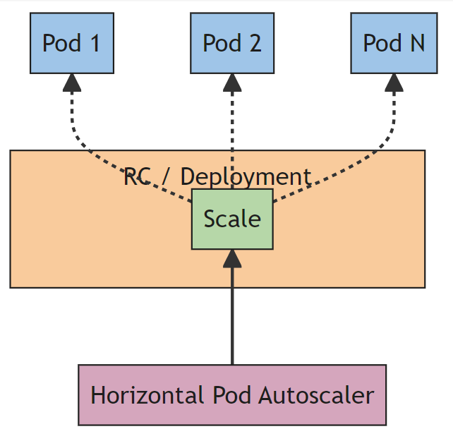
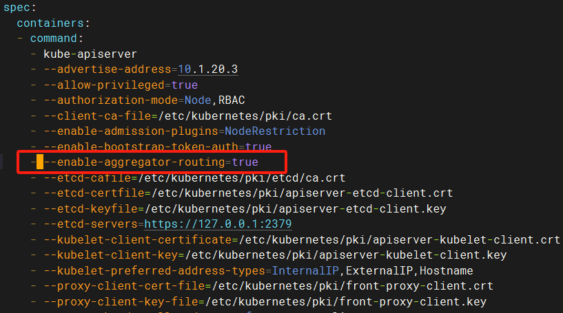

## 八、pod自动扩缩容

### 1. 为什么需要自动扩缩容

在实际业务场景中，服务负载会因以下情况发生变化，需要动态调整实例数量或资源：

- **高负载场景**：如压力测试、电商平台秒杀活动或大促期间，流量激增需增加实例。
- **低负载场景**：资源紧张或工作负载降低时，减少实例以优化资源利用率。

Kubernetes 提供两种层面的扩缩容机制：

#### 1.1 节点层面（Node）

- **问题**：如何确定集群节点规模以满足应用需求？
- **解决方案**：**Cluster Autoscaler (CA)** 动态调整节点数量。
  - **功能**：根据 Pod 调度需求，自动添加或删除节点。
  - **适用场景**：应对峰值流量，优化容器资源池。
  - **工作原理**：监控 Pod 调度状态和节点利用率，与云提供商 API 交互调整节点规模。

#### 1.2 Pod 层面

- **问题**：固定副本数（如 Deployment 的 replicas 设置为 10）无法适应流量波动。
  - 低流量时，浪费资源；高流量时，Pod 数量不足。
- **解决方案**：通过手动或自动扩缩容动态调整 Pod 副本数。
  - **手动模式**：
    - 使用 kubectl scale 命令调整副本数。
    - 缺点：需人工操作，无法实时响应流量变化。
    - 示例：kubectl scale deployment myapp --replicas=5
  - **自动模式**：
    - 根据 Pod 负载（如 CPU、内存使用率）自动调整副本数。
    - 优点：无需人工干预，适应动态负载变化。

### 2. 自动扩缩容的方案有哪些

Kubernetes 提供以下自动扩缩容方案，针对不同场景：

| 方案                                | 描述                                                         | 适用场景                          | 限制                                 |
| ----------------------------------- | ------------------------------------------------------------ | --------------------------------- | ------------------------------------ |
| **Horizontal Pod Autoscaler (HPA)** | 根据监控指标（如 CPU、内存使用率或自定义指标）自动调整 Pod 副本数。 | 无状态应用，动态流量管理。        | 依赖 Metrics Server 或外部监控系统。 |
| **Knative Pod Autoscaler (KPA)**    | 基于请求数（如 QPS）自动调整 Pod 副本数，支持事件驱动架构。  | 事件驱动应用（如 Knative 服务）。 | 不支持 CPU 指标，仅限请求数。        |
| **Vertical Pod Autoscaler (VPA)**   | 自动调整 Pod 的资源请求和限制（CPU、内存），优化资源分配。   | 资源敏感型应用，单 Pod 优化。     | 通常需重启 Pod，可能影响可用性。     |

#### 2.1 Horizontal Pod Autoscaler (HPA)

- **功能**：根据 CPU、内存或自定义指标（如 QPS）动态调整 Pod 副本数。
- **工作原理**：
  1. 监控系统（如 Metrics Server 或 Prometheus）收集 Pod 指标。
  2. HPA 控制器根据阈值（如 CPU 使用率 70%）计算目标副本数。
  3. 更新 Deployment/StatefulSet 的副本数。

#### 2.2 Knative Pod Autoscaler (KPA)

- **功能**：基于请求数（如 HTTP 请求或队列长度）调整 Pod 副本数，适合事件驱动场景。
- **适用场景**：Knative 应用、消息队列处理。
- **限制**：不支持 CPU 或内存指标，需 Knative 环境支持。

#### 2.3 Vertical Pod Autoscaler (VPA)

- **功能**：根据 Pod 历史资源使用情况，自动调整 CPU 和内存的 requests 和 limits。
- **工作原理**：
  1. 分析 Pod 资源使用数据。
  2. 推荐或自动调整资源配置。
  3. 通常需重启 Pod 以应用新配置。
- **适用场景**：资源敏感型应用，优化单 Pod 性能。

### 3. 如何实现 k8s 中的应用自动扩缩容 

#### 3.1 基于 Horizontal Pod Autoscaler (HPA)

**HPA（Horizontal Pod Autoscaler）** 通过监控指标（如 CPU、内存或自定义指标）动态调整 Pod 副本数量，适用于无状态应用（如 Deployment），不适用于无法缩放的对象（如 DaemonSet）。

##### 3.1.1 关键考虑点

1. **指标选择**：
   - **HPA v1**：支持基于 CPU 使用率进行扩缩容。
   - **HPA v2**：支持自定义指标（如每秒请求数 RPS、队列长度），适合 Web 应用处理突发流量。
   - **适用场景**：CPU 和内存适合通用场景；RPS 等自定义指标更适合流量驱动的应用。
2. **指标采集**：
   - **Metrics Server**：默认采集节点和 Pod 的 CPU 和内存指标，适用于基础监控。
     - 部署方式：通过 YAML 文件部署（自 Kubernetes 1.8 起支持）。
     - 示例命令：kubectl top pods
   - **Prometheus**：基于拉模型，定期从数据源或 Exporter 采集自定义指标（如 RPS）。
     - 需部署 Prometheus 和适配器（如 prometheus-adapter）以集成 HPA。

##### 3.1.2 工作原理

- **控制器**：HPA 控制器周期性（默认 15 秒）获取指标，与目标值比较，调整 Deployment 的副本数。
- **指标来源**：通过 Metrics API（自 Kubernetes 1.8 起）获取 CPU、内存等数据。
- **流程**：
  1. Metrics Server 或 Prometheus 收集 Pod 资源使用数据。
  2. HPA 比较当前指标与目标值（如 CPU 使用率 70%）。
  3. 更新 Deployment 的 replicas 字段，触发 Pod 扩缩容。

##### 3.1.3 配置示例

```yaml
apiVersion: autoscaling/v2
kind: HorizontalPodAutoscaler
metadata:
  name: my-app-hpa
spec:
  scaleTargetRef:
    apiVersion: apps/v1
    kind: Deployment
    name: my-app
  minReplicas: 2
  maxReplicas: 10
  metrics:
  - type: Resource
    resource:
      name: cpu
      target:
        type: Utilization
        averageUtilization: 70
```

#### 3.2 基于 Knative Pod Autoscaler (KPA)

**KPA（Knative Pod Autoscaler）** 基于并发请求数进行 Pod 自动扩缩容，适合事件驱动场景。

##### 3.2.1 关键特性

1. **基于并发请求数**：
   - 根据每秒请求数（RPS）或队列长度动态调整 Pod 数量。
   - 适合突发流量场景（如 Knative 服务）。
2. **扩缩容边界**：
   - 设置最小和最大 Pod 数量，控制扩缩容范围。
   - 示例：minScale: 2, maxScale: 10。

##### 3.2.2 限制

- 不支持基于 CPU 或内存指标。
- 需运行在 Knative 环境中，依赖 Knative 服务框架。

##### 3.2.3 配置示例

```yaml
apiVersion: serving.knative.dev/v1
kind: Service
metadata:
  name: my-knative-service
spec:
  template:
    metadata:
      annotations:
        autoscaling.knative.dev/minScale: "2"
        autoscaling.knative.dev/maxScale: "10"
    spec:
      containers:
      - image: my-app:latest
```

#### 3.3 基于 Vertical Pod Autoscaler (VPA)

**VPA（Vertical Pod Autoscaler）** 自动调整 Pod 的 CPU 和内存资源请求/限制，优化单 Pod 资源分配。

##### 3.3.1 关键特性

- **功能**：根据 Pod 资源使用情况，推荐或自动调整 requests 和 limits。
- **工作原理**：
  1. 分析 Pod 历史资源使用数据。
  2. 若当前节点资源不足，驱逐 Pod 并重新部署到资源充足的节点。
- **模式**：
  - **推荐模式**：提供资源建议，需手动调整。
  - **自动模式**：自动调整资源（需重启 Pod，谨慎用于生产环境）。

##### 3.3.2 注意事项

- VPA 可能导致 Pod 重启，影响服务可用性。
- 目前为实验性功能，建议在生产环境中使用推荐模式。
- 参考文档：https://github.com/kubernetes/autoscaler/tree/master/vertical-pod-autoscaler

##### 3.3.3 配置示例

```yaml
apiVersion: autoscaling.k8s.io/v1
kind: VerticalPodAutoscaler
metadata:
  name: my-app-vpa
spec:
  targetRef:
    apiVersion: apps/v1
    kind: Deployment
    name: my-app
  updatePolicy:
    updateMode: "Auto" # 或 "Off"（推荐模式）
```

### 4. 利用 HPA 基于 CPU 指标实现 pod 自动扩缩容

#### 4.1 概述

**HPA（Horizontal Pod Autoscaler）** 基于 CPU 使用率（或其他指标）动态调整 Deployment 中的 Pod 副本数，适用于无状态应用。



#### 4.2 前置条件

- **API Server配置修改**：

  - ```sh
    vim /etc/kubernetes/manifests/kube-apiserver.yaml
    ```

  - 添加--enable-aggregator-routing=true启用API扩展功能

    
    
  - 在每个节点上重启kubelet，`systemctl restart kubelet.service`

- **Metrics Server**：

  - 功能：聚合集群中节点和 Pod 的 CPU 和内存指标。

  - 部署：通过 YAML 文件部署（自 Kubernetes 1.8 起支持）。

    ```bash
    wget https://github.com/kubernetes-sigs/metrics-server/releases/latest/download/components.yaml -O metrics-components.yaml
    ```

  - 修改yaml文件，args下添加  `- --kubelet-insecure-tls`

  - 执行`kubectl apply -f metrics-components.yaml`

  - 验证：`kubectl top pods`

- **Deployment 配置**：

  - 确保 Pod 模板定义了 CPU requests 和 limits。

  - 示例：

    ```yaml
    apiVersion: apps/v1
    kind: Deployment
    metadata:
      name: my-app
    spec:
      replicas: 2
      selector:
        matchLabels:
          app: my-app
      template:
        metadata:
          labels:
            app: my-app
        spec:
          containers:
          - name: my-container
            image: nginx:latest
            resources:
              requests:
                cpu: "200m"
              limits:
                cpu: "500m"
    ```

#### 4.3 配置 HPA

- **YAML 示例**：

  ```yaml
  apiVersion: autoscaling/v2
  kind: HorizontalPodAutoscaler
  metadata:
    name: my-app-hpa
  spec:
    scaleTargetRef:
      apiVersion: apps/v1
      kind: Deployment
      name: my-app
    minReplicas: 2
    maxReplicas: 10
    metrics:
    - type: Resource
      resource:
        name: cpu
        target:
          type: Utilization
          averageUtilization: 70
  ```

#### 4.4 工作流程

1. Metrics Server 收集 Pod 的 CPU 使用率。
2. HPA 控制器每 15 秒（默认）比较当前 CPU 使用率与目标值（如 70%）。
3. 根据计算结果调整 Deployment 的 replicas 字段，触发 Pod 扩缩容。

#### 4.5 验证与调试

- 查看 HPA 状态：kubectl describe hpa my-app-hpa
- 模拟负载（如使用 stress 工具）触发扩容。
- 监控副本数：kubectl get deployments


### 5. 利用 HPA 基于内存指标实现 pod 自动扩缩容 

