## 九、基于Jenkins和k8s构建企业级DevOps容器云平台

### **1、什么是 DevOps?**

**DevOps**（Development + Operations）是一种**文化、实践与工具的结合体**，旨在**缩短开发与运维之间的鸿沟**，实现软件的**持续集成（CI）、持续交付（CD）和自动化运维**。DevOps整个流程包括敏捷开发->持续集成->持续交付->持续部署。


#### 1.1敏捷开发 

​	提高开发效率，及时跟进用户需求，缩短开发周期。敏捷开发包括编写代码和构建代码两个阶段，可以使用git 或者 svn 来管理代码，用 maven 对代码进行构建。

​	敏捷开发以用户的需求进化为核心，采用迭代，循序渐进的方法进行软件开发。在敏捷开发中，软件项目在构建初期被切分成多个子项目，各个子项目的成果都经过测试，具备可视、可集成和可运行使用的特征。换言之，就是把一个大项目分为多个相互联系，但也可独立运行的小项目，并分别完成，在此过程中软件一直处于可使用状态

#### 1.2 CI/CD（持续集成/持续交付或持续部署）

##### 2.1.1. **持续集成（CI, Continuous Integration）**

持续集成强调开发人员频繁地将代码变更合并到共享代码库（如Git仓库）中，通常每天多次。每次代码提交都会触发自动化构建和测试流程，确保新代码不会破坏现有功能。

- 核心目标：

  - 尽早发现和修复代码中的错误。代码集成到主干前通过自动化测试验证，有问题则回滚
  - 提高代码质量，减少集成问题。
  - 自动化测试（单元测试、集成测试等）确保代码可靠性。

- 典型流程：

  1. 开发者提交代码到版本控制系统（如GitHub、GitLab）。
  2. CI服务器（如Jenkins、GitHub Actions、CircleCI）检测到代码变更。
  3. 自动触发构建（编译代码）和运行测试（单元测试、静态分析等）。
  4. 反馈结果给开发团队，快速定位问题。

  持续集成流程：代码提交→自动拉取→编译构建→单元测试→集成到主干

##### 2.1.2. **持续交付（CD, Continuous Delivery）**

持续交付在CI的基础上，进一步自动化软件的发布流程。代码通过测试后，会自动部署到类生产环境（如测试或预生产环境），但需要人工批准才能发布到生产环境。

- 核心目标：
  - 确保代码随时可以安全部署到生产环境。
  - 缩短发布周期，提升交付速度。
- 典型流程：
  1. CI完成后，代码自动部署到测试或预生产环境。
  2. 运行更广泛的测试（如端到端测试、性能测试）。
  3. 团队手动批准后，代码可部署到生产环境。

##### 2.1.3. **持续部署（Continuous Deployment）**

持续部署是CD的进一步扩展，所有通过测试的代码变更都会自动部署到生产环境，无需人工干预。

- 核心目标：
  - 实现完全自动化的发布流程。
  - 快速向用户交付新功能或修复。
- 要求：
  - 高度可靠的自动化测试覆盖。
  - 强大的监控和回滚机制，以应对潜在问题。


### 2. k8s在DevOps中可实现的功能

#### 2.1 自动化部署

Kubernetes 通过自动化容器化应用的部署、更新和管理，显著提升 DevOps 流水线的效率，支持从**持续交付**到**持续部署**的转型：

- **持续交付**：通过与 CI/CD 工具（如 Jenkins、GitLab CI、ArgoCD）集成，Kubernetes 自动执行代码构建、测试和部署到测试或预生产环境。滚动更新和蓝绿部署策略确保零宕机发布，人工审批后可快速上线。
- **持续部署**：通过完善的自动化测试和监控，Kubernetes 可将通过测试的代码变更直接部署到生产环境，无需人工干预。金丝雀发布进一步降低风险，逐步验证新版本稳定性。
- **优势**：缩短发布周期，减少手动操作，提升交付速度和可靠性。

#### 2.2 多集群管理

Kubernetes 提供灵活的集群管理能力，满足不同客户需求，支持多环境隔离和资源优化：

- **多集群部署**：为开发、测试、生产环境分别部署独立的 Kubernetes 集群，每套集群使用独立的物理资源，互不干扰，确保高隔离性和稳定性。
- **命名空间隔离**：在单一 Kubernetes 集群内，通过命名空间（Namespace）为不同环境（如开发、测试、生产）分配资源，实现逻辑隔离，降低成本并简化管理。
- **联邦集群（Federation）**：跨区域或跨云管理多集群，实现统一配置和负载分配，适合全球化应用部署。
- **优势**：灵活适配客户需求，提供高可用性和资源高效利用。

#### 2.3 多环境一致性

Kubernetes 基于 Docker 容器编排，通过不可变镜像确保多环境一致性：

- **容器镜像特性**：镜像封装了操作系统、业务代码、运行环境、程序库和目录结构，存储在私有镜像仓库（如 Harbor、AWS ECR）。用户从仓库拉取镜像，确保开发、测试、生产环境完全一致。
- **环境标准化**：通过 Kubernetes 的声明式配置（YAML/JSON），统一管理容器部署，消除环境差异导致的“在我机器上能跑”问题。
- **优势**：提高应用可移植性，简化环境管理，降低部署错误率。


### 3. DevOps容器云平台工作流程

基于 Jenkins 和 Kubernetes 集成的 CI/CD 流程，具体来说是利用 Jenkins 的 Kubernetes 插件（Kubernetes Plugin） 实现动态从节点（Agent）管理的自动化构建和部署流程。

具体步骤如下：

1. Jenkins 主节点（Master）：
   - 负责维护和管理 CI/CD 流水线（Pipeline），包括定义构建、测试、部署等步骤（通常通过 Jenkinsfile 或图形化界面配置）。
   - 监听用户触发的构建请求（如手动点击“立即构建”或通过代码提交触发）。
2. 触发构建：
   - 当用户在 Jenkins 主节点上触发“立即构建”时，主节点根据 Pipeline 配置，调用 Kubernetes API Server。
3. 动态创建 Jenkins 从节点（Agent）：
   - Jenkins 主节点通过 **Kubernetes 插件**与 Kubernetes 集群交互，请求在 Kubernetes 集群中动态创建一个 Pod 作为临时的 Jenkins 从节点。
   - 该 Pod 基于预定义的 Pod 模板（Pod Template），包含运行构建所需的工具和环境（如 JDK、Maven、Docker 等）。
4. 运行 Pipeline 步骤：
   - Jenkins 主节点将 Pipeline 中的步骤（例如代码拉取、编译、测试、打包、部署等）分配给动态创建的 Jenkins 从节点（Pod）。
   - 所有步骤在从节点的容器化环境中执行，隔离性强，环境一致。
5. 构建完成与清理：
   - 构建完成后，Kubernetes 自动销毁临时的从节点 Pod，释放资源。
   - Jenkins 主节点收集构建结果（日志、状态等）并反馈给用户。


### 4、Devops流水线----搭建Harbor

创建一台新的虚拟机，内网ip为10.1.12.10，命名为harbor.cn

**Harbor** 是一个由 VMware 开源的**企业级容器镜像仓库**，它是在 Docker Registry 基础上增强的解决方案，用于**存储、管理、扫描、签名容器镜像和 Helm Chart**，并提供完整的用户权限控制和审计能力。**强烈建议将 Harbor 作为独立服务部署在一台物理机或专属虚拟机上**，并定期做数据备份。

#### 4.1 关闭 SELinux和防火墙

```sh
# 临时关闭
sudo setenforce 0
# 永久关闭（需重启）
sudo vim /etc/selinux/config
SELINUX=disabled
# 关闭防火墙
systemctl stop firewalld && systemctl disable firewalld
```

#### 4.2 配置yum源

```sh
yum install yum-utils -y
yum-config-manager --add-repo http://mirrors.aliyun.com/docker-ce/linux/centos/docker-ce.repo
```

#### 4.3 配置时间同步

```sh
yum install chrony -y
#配置时间同步服务器
vim /etc/chrony.conf
#添加 NTP 服务器地，改为阿里云 NTP（或你的内网NTP）
server ntp.aliyun.com iburst
```

启动并启用 chronyd 服务

```sh
# 启动服务
sudo systemctl start chronyd
# 设置开机启动
sudo systemctl enable chronyd
```

#### 4.4 内核参数修改

 **内核参数修改**，其实**不是为了 Harbor 本身**，而是为后续部署 **Kubernetes（或 Docker 网络相关功能）做好准备**。

```sh
modprobe br_netfilter

cat <<EOF > /etc/sysctl.d/k8s.conf
net.bridge.bridge-nf-call-ip6tables = 1
net.bridge.bridge-nf-call-iptables  = 1
net.ipv4.ip_forward                  = 1
EOF

sysctl --system
```

#### 4.5 安装harbor

##### 4.5.1 修改host文件，（所有节点都做）

```sh
vim /etc/hosts
```

添加以下内容（根据你的实际 IP 和主机名修改）：

```sh
10.1.20.3 k8s-master
10.1.20.14 k8s-worker
10.1.12.10 harbor.cn
```

##### 4.5.2 配置免密

```sh
# 生成没有密码的密钥对
ssh-keygen -t rsa -b 2048 -f ~/.ssh/id_rsa -N ""
# 复制到远程
ssh-copy-id root@10.1.12.10
# 测试是否免密登录成功
ssh root@10.1.12.10
```

##### 4.5.3 为 Harbor 自签发证书

```sh
#创建证书存放目录
mkdir -p /data/cert
cd /data/cert
#生成私钥和证书请求（CSR）
openssl genrsa -out ca.key 3072
openssl req -new -x509 -days 3650 -key ca.key -out ca.pem
```

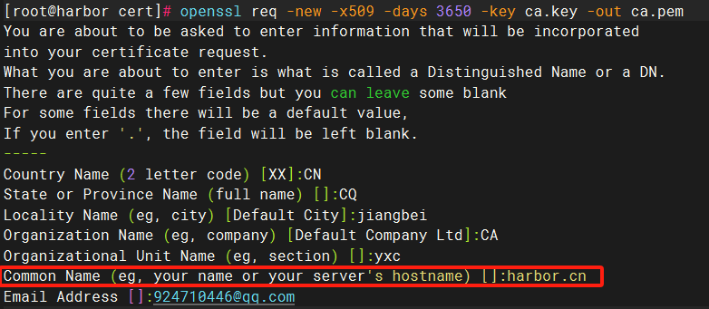

```sh
#生成 Harbor 的私钥和证书请求（CSR）
openssl genrsa -out harbor.key 3072
openssl req -new -key harbor.key -out harbor.csr 
openssl x509 -req -days 3650 -in harbor.csr -CA ca.pem -CAkey ca.key -CAcreateserial -out harbor.pem
```

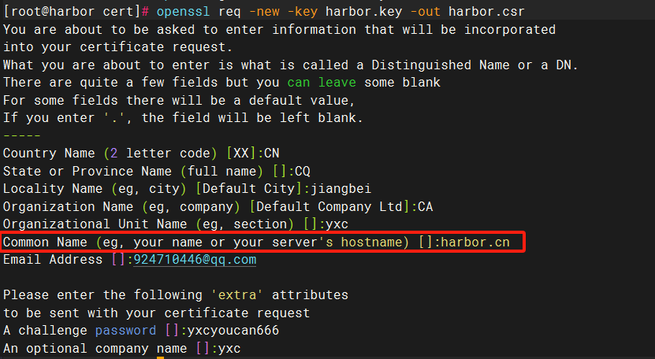

Common Name (CN) 不能乱写！

##### 4.5.4 Docker 安装

```sh
# 安装 Docker CE（社区版），-y 表示自动确认
yum install docker-ce -y
# 启动 Docker 服务并设置为开机自启
systemctl start docker && systemctl enable docker
```

配置 Docker 镜像加速器

```sh
# 编辑 Docker 配置文件
vim /etc/docker/daemon.json
```

在 `/etc/docker/daemon.json` 中写入以下内容：

```json
{
  "registry-mirrors": [
    "https://rsbud4vc.mirror.aliyuncs.com",
    "https://registry.dockercn.com",
    "https://docker.mirrors.ustc.edu.cn",
    "https://dockerhub.azk8s.cn",
    "http://hub.mirror.c.163.com",
    "https://docker.1ms.run"
  ],
  "insecure-registries": [
    "10.1.12.10",
    "harbor.cn"
  ]
}
```

然后重启docker

```sh
systemctl restart docker
```

- registry-mirrors：配置镜像加速器地址，使用阿里云、中科大、网易等镜像源加速 Docker 镜像拉取。
- insecure-registries：指定私有仓库地址（如 192.168.1.62 和 harbor.cn），允许使用 HTTP 或未受信任的 HTTPS 访问

##### 4.5.5 安装 Docker Compose

```sh
curl -L https://github.com/docker/compose/releases/latest/download/docker-compose-$(uname -s)-$(uname -m) -o /usr/local/bin/docker-compose
chmod +x /usr/local/bin/docker-compose
```


##### 4.5.6 安装harbor

下载 Harbor 安装包

```sh
wget https://github.com/goharbor/harbor/releases/download/v2.13.2/harbor-offline-installer-v2.13.2.tgz
tar -zxvf harbor-offline-installer-v2.13.2.tgz
cd harbor
```

复制一份默认配置：

```sh
cp harbor.yml.tmpl harbor.yml
vim harbor.yml
```


安装harbor

```sh
./prepare         # 检查并生成 Docker Compose 配置
./install.sh      # 开始部署
```

验证服务

- 浏览器访问 `https://harbor.cn`（或你的主机 IP）
- 默认账号：admin，密码是你配置的（如 Harbor12345）

```sh
#如何停掉harbor
cd /root/harbor
docker-compose stop
#如何启动harbor:
cd /root/harbor
docker-compose up -d
```


#### 4.6 在k8s节点上测试使用 harbor 镜像仓库

在节点的`/etc/docker/daemon.json`下添加以下内容，如果为k8s容器进行时为containerd则不用修改

```yaml
"insecure-registries": [
    "10.1.20.2",
    "harbor.cn"
  ]
```

或在10.1.20.2本机测试，

```sh
#首先登录 输入用户名和密码
docker login harbor.cn
#修改镜像标签
docker tag SOURCE_IMAGE[:TAG] harbor.cn/library/REPOSITORY[:TAG]
#推送至harbor
docker push harbor.cn/library/REPOSITORY[:TAG]
```

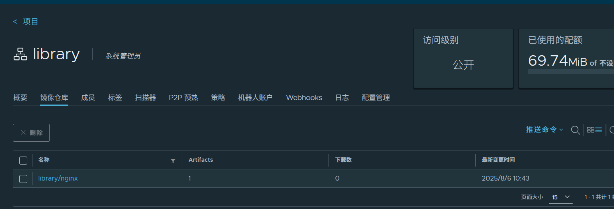

### 5、Jenkins+k8s+Git 构建企业级 DevOps 自动化容器云平台

#### 5.1 安装Jenkins

可用如下两种方法：
- 通过 docker 直接下载jenkins 镜像，基于镜像启动服务
- 在 k8s 中部署 Jenkins 服务（本次使用）

#### 5.2 安装nfs

```sh
yum install -y nfs-utils && systemctl start nfs-server && systemctl enable nfs-server
```

服务端（任意一个节点）创建共享目录

```sh
mkdir -p /data/nfs
chmod -R 777 /data/nfs
#编辑导出配置：
echo "/data/nfs *(rw,sync,no_root_squash)" >> /etc/exports
# 刷新配置
exportfs -r   
```

#### 5.3 安装jenkins

创建命名空间（可选）

```sh
kubectl create ns jenkins-k8s
```

定义一个 PersistentVolume (PV) 用于 Jenkins 在 Kubernetes 集群中的持久化存储

```yaml
apiVersion: v1
kind: PersistentVolume
metadata:
  name: jenkins-k8s-pv
  namespace: jenkins-k8s
spec:
  capacity:
    storage: 10Gi
  accessModes:
    - ReadWriteMany
  nfs:
    server: 10.1.12.10 NFS服务端ip
    path: /data/nfs
```

定义一个 PersistentVolumeClaim (PVC) 用于 Jenkins 在 Kubernetes 集群中的存储请求

```yaml
apiVersion: v1
kind: PersistentVolumeClaim
metadata:
  name: jenkins-k8s-pvc
  namespace: jenkins-k8s
spec:
  resources:
    requests:
      storage: 10Gi
  accessModes:
    - ReadWriteMany
```

创建一个 sa 账号 `kubectl create sa jenkins-k8s-sa -n jenkins-k8s`

把sa 账号做 rbac 授权

```sh
kubectl create clusterrolebinding jenkins-k8s-sa-cluster \
  --clusterrole=cluster-admin \
  --serviceaccount=jenkins-k8s:jenkins-k8s-sa
```

目的：让 Jenkins Pod 使用 `jenkins-k8s-sa` 这个账号，并拥有整个 Kubernetes 集群的完全控制权限


创建 Jenkins Deployment + Service

```yaml
# jenkins-deployment.yaml
apiVersion: v1
kind: Deployment
metadata:
  name: jenkins
  namespace: jenkins-k8s
spec:
  replicas: 1
  selector:
    matchLabels:
      app: jenkins
  template:
    metadata:
      labels:
        app: jenkins
    spec:
      serviceAccpont: jenkins-k8s-sa
      containers:
      - name: jenkins
        image: docker.io/jenkins/jenkins:lts
        imagePullPolicy: IfNotPresent
        ports:
        - containerPort: 8080
          name: web
          protocol: TCP
        - containerPort: 50000
          name: agent
          protocal: TCP
        volumeMounts:
        - name: jenkins-volume
          subpath: jenkins-home
          mountPath: /var/jenkins_home
      volumes:
      - name: jenkins-volume
        persistentVolumeClaim:
          claimName: jenkins-pvc
---
apiVersion: v1
kind: Service
metadata:
  name: jenkins
  namespace: jenkins-k8s
  labels:
    app: jenkins
spec:
  selector: 
    app: jenkins
  type: NodePort
  ports:
    - name: web
      port: 8080 
      targetPort: web
      nodePort: 30088  # 可通过任意节点IP:30080 访问 Jenkins
    - name: agent
      port: 5000
      targetPort: agent

```

然后通过http://ip:30088/访问

#### 5.4 配置k8s 基于 containerd 从 harbor 镜像仓库找镜像运行 pod

对每一个节点机器，都需要修改`/etc/containerd/config.toml`文件，如下

```ABAP
[plugins."io.containerd.grpc.v1.cri".registry]
      config_path = ""

      [plugins."io.containerd.grpc.v1.cri".registry.auths]

      [plugins."io.containerd.grpc.v1.cri".registry.configs]

        [plugins."io.containerd.grpc.v1.cri".registry.configs."10.1.12.10".tls]
                 insecure_skip_verify = true
        [plugins."io.containerd.grpc.v1.cri".registry.configs."10.1.12.10".auth]
                username = "admin"
                password = "Harbor12345"
      [plugins."io.containerd.grpc.v1.cri".registry.headers]

      [plugins."io.containerd.grpc.v1.cri".registry.mirrors]
        [plugins."io.containerd.grpc.v1.cri".registry_mirrors."10.1.12.10"]
                endpoint = ["https://10.1.12.10:443"]
        [plugins."io.containerd.grpc.v1.cri".registry_mirrors."docker.io"]
                endpoint = ["https://docker.1ms.run", "https://registry.docker-cn.com"]
```

修改完成之后重启containerd

```sh
systemctl restart containerd
```

创建服务尝试拉镜像

```yaml
apiVersion: apps/v1
kind: Deployment
metadata:
  name: nginxweb # 部署的名称
spec:
  replicas: 2  # 设置副本数量为2
  selector:
    matchLabels:
      app: nginxweb1 # 用于选择匹配的Pod标签
  template:
    metadata:
      labels:
        app: nginxweb1 # Pod的标签
    spec:
      containers:
      - name: nginxwebc # 容器名称
        image: harbor.cn/library/nginx:v1 # 镜像拉取地址，换成阿里云的，不然会拉取失败
        imagePullPolicy: IfNotPresent # 镜像拉取策略，如果本地没有就拉取
        ports:
        - containerPort: 80 # 容器内部监听的端口
---
apiVersion: v1
kind: Service
metadata:
  name: nginxweb-service # 服务的名称
spec:
  externalTrafficPolicy: Cluster # 外部流量策略设置为集群
  selector:
    app: nginxweb1 # 用于选择匹配的Pod标签
  ports:
  - protocol: TCP # 使用TCP协议
    port: 80 # 服务暴露的端口
    targetPort: 80 # Pod中容器的端口
    nodePort: 30079 # 在每个Node上分配的端口，用于外部访问
  type: NodePort # 服务类型，使用NodePort
```

成功从harbor上拉取镜像

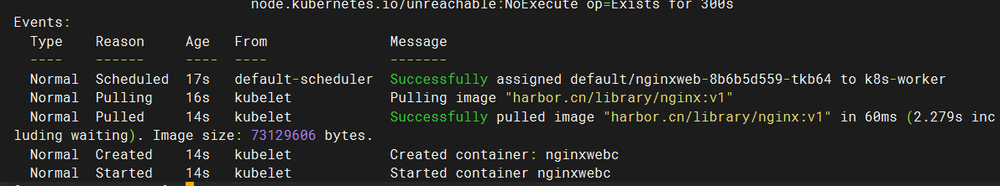

harbor日志

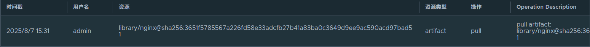

#### 5.5测试jenkins的CI/CD

##### 5.5.1 登录harbor，创建一个项目，名为jenkins-demo

##### 5.5.2 在Jenkins 中安装kubernetes 插件

(1)在jenkins 中安装k8s插件
Manage Jnekins------>插件管理------>可选插件------>搜索kubernetes------>出现如下

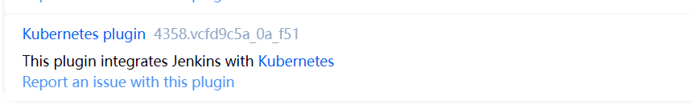

安装后重启jenkins

（2)配置jenkins连接k8s集群

访问http://IP:30088/configureClouds，或者点击系统管理------>Clouds，进入以下界面

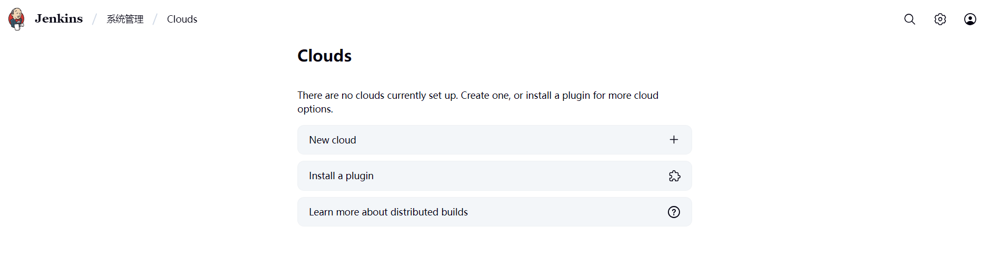

​	点击New cloud，填写信息

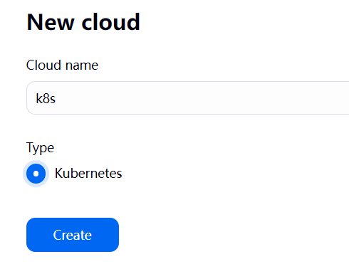

点击创建，继续填写信息

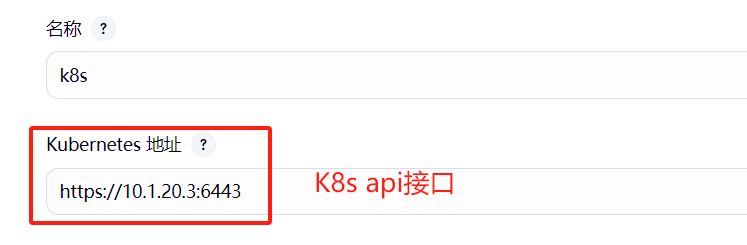

填写命名空间，然后测试与集群的连接

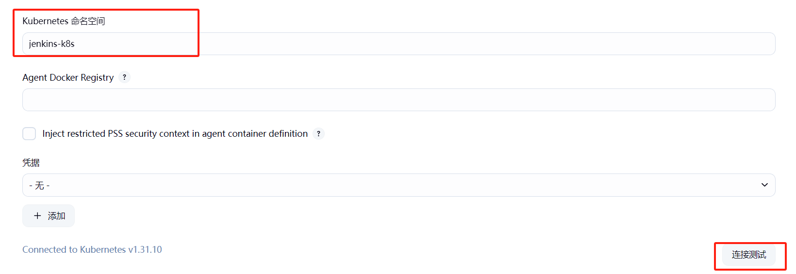

配置jenkins服务地址

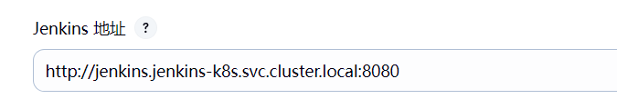


保存，然后点击名称继续配置pod模板

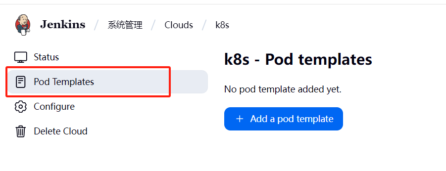

配置信息

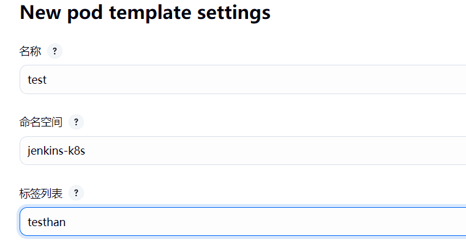

容器信息如下：

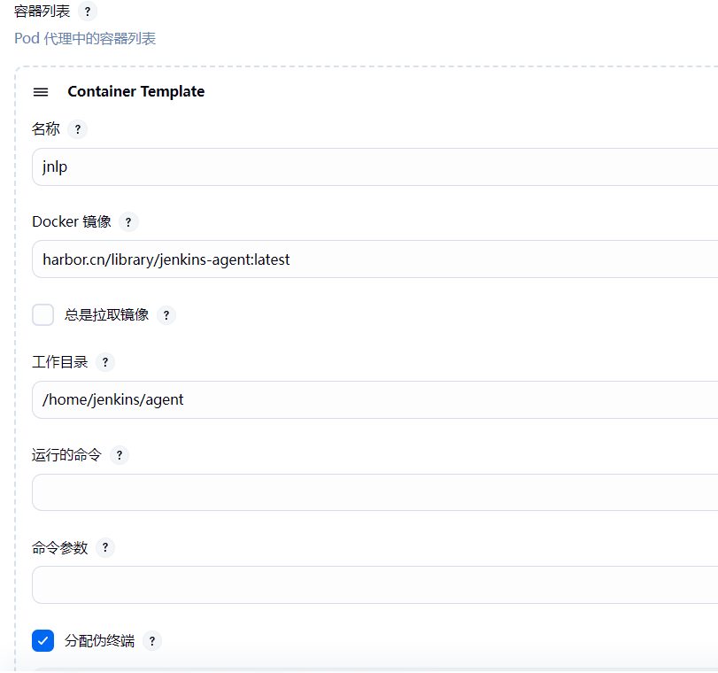

配置SA

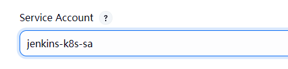

配置存储卷


### 附： 将10.1.12.10作为docker服务器

k8s节点不装docker，节点通过 TCP 连接远程 Docker Daemon

#### 1、生成 TLS 证书（自签名）

在10.1.12.10上生成服务器私钥和证书请求（CSR）：

```sh
cd /data/cert
openssl genrsa -out docker-key.pem 3072
openssl req -new -key docker-key.pem -out docker.csr -subj "/CN=harbor.cn"
```

生成服务器证书（用 CA 签名）**必须在证书里使用 SAN (Subject Alternative Name)** 才能被验证通过：

​	创建一个 `extfile.cnf` 文件（告诉 openssl 添加 SAN）：

```sh
cat > extfile.cnf <<EOF
subjectAltName = DNS:harbor.cn,IP:192.168.1.100
EOF
```

- `DNS:harbor.cn` 是你访问 Docker 守护进程时用的域名
- `IP:10.1.12.10` 是远程 Docker 守护进程的 IP

```sh
openssl x509 -req -in docker.csr   -CA ca.pem -CAkey ca.key -CAcreateserial   -out docker-cert.pem -days 3650 -sha256   -extfile extfile.cnf
```

生成客户端私钥和证书请求：

```sh
openssl genrsa -out client-key.pem 3072
openssl req -new -key client-key.pem -out client.csr -subj "/CN=client"
```

生成客户端证书（用 CA 签名）：

```sh
openssl x509 -req -in client.csr -CA ca.pem -CAkey ca.key -CAcreateserial -out client-cert.pem -days 3650 -sha256
```

#### 2、配置 Docker 守护进程使用证书

把生成的证书放到目录，比如 `/etc/docker/cert/` 下,然后编辑 `/etc/docker/daemon.json`：

```json
{
  "hosts": ["unix:///var/run/docker.sock", "tcp://0.0.0.0:2376"],
  "tls": true,
  "tlsverify": true,
  "tlscacert": "/data/cert/ca.pem",
  "tlscert": "/etc/docker/cert/docker-cert.pem",
  "tlskey": "/etc/docker/cert/docker-key.pem"
}
```

然后找到`/usr/lib/systemd/system/docker.service`,将其中的`ExecStart=/usr/bin/dockerd -H fd:// --containerd=/run/containerd/containerd.sock`修改成`ExecStart=/usr/bin/dockerd`

重启 Docker 服务：

```sh
systemctl daemon-reload
systemctl restart docker
```

#### 3.在k8s节点上操作docker

将`ca.pem`，`client-cert.pem`，`client-key.pem`拷贝到k8s节点的/etc/docker/cert目录下

```sh
curl --cacert /etc/docker/cert/ca.pem --cert /etc/docker/cert/client-cert.pem --key /etc/docker/cert/client-key.pem https://harbor.cn:2376/version
```

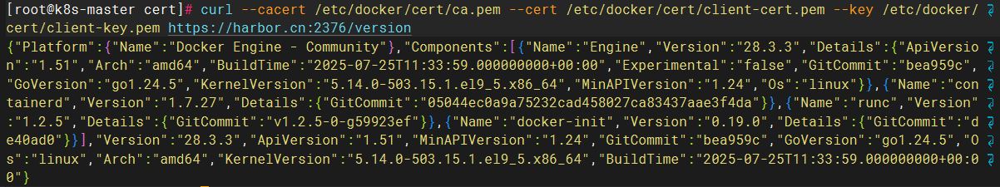

然后再k8s节点上装docker cli

```sh
yum-config-manager --add-repo https://download.docker.com/linux/centos/docker-ce.repo
yum install docker-ce-cli
```

执行docker命令

```sh
docker --tlsverify   --tlscacert=/etc/docker/cert/ca.pem   --tlscert=/etc/docker/cert/client-cert.pem   --tlskey=/etc/docker/cert/client-key.pem   -H=tcp://harbor.cn:2376 images
```

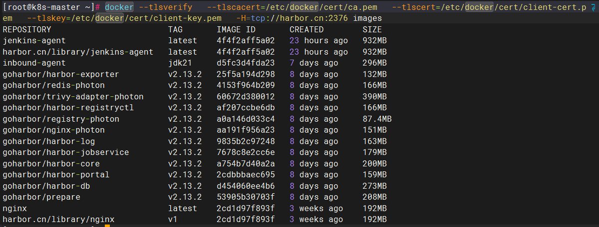

配置环境变量，可以是

```
export DOCKER_CA_CERT="/etc/docker/cert/ca.pem" 
export DOCKER_CLIENT_CERT="/etc/docker/cert/client-cert.pem" 
export DOCKER_CLIENT_KEY="/etc/docker/cert/client-key.pem"
```

